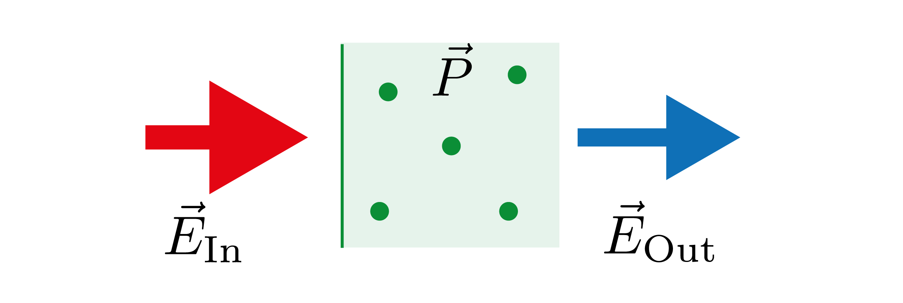

---
author:
  - Fred Jendrzejewski
order: 10
title: Lecture 10 - Propagation of light in dielectric media
---

In this lecture we will study the propagation of light through a
dielectric medium like atomic gases. We will see that it is
characterized by the susceptibility and discuss the case of two-level
atoms. This sets the stage for the laser.

Until now we focused on the properties of atoms and how can control them
through external fields. In this lecture, we will focus much more on the
properties of the light passing through a medium.

## Introduction

We would like to study the propagation of a electric field through an
ensemble of atoms as visualized in Fig.
[1](#fig-dielectric). We assume a
mono-chromatic plane wave to come in, such that we can write down the
electric field as:

$$
\vec{E}_{in}= E_0 \vec{\epsilon}e^{i kz -i\omega_L t}
$$

This incoming field will polarize the gas of dipoles.

<figure id="fig-dielectric">

<figcaption>Propagation of a light field through a dielectric medium. </figcaption>
</figure>

For the propagation we will do the following assumptions:

- The atoms are independent.
- We can describe them as small dipoles.
- We can describe the light in the semi-classical approximation.

We have already employed this picture in in the slightly abstract
formulation in Lecture 4, where we studied the evolution of the atoms in
electric fields and in Lecture 6
concerning the transition rules in hydrogen. This allows us to calculate
the expectation value of the dipole operator through:

$$
\langle \vec{D}\rangle = \left\langle\psi\right|\vec{D}\left|\psi\right\rangle
$$

As already discussed in Lecture 6 we can then write it down as:

$$
\langle \vec{D}\rangle = E_0 \vec{\alpha}
$$

We call $\alpha$ the **polarizability**. For a large gas
with a constant density of dipoles $n$, we obtain a macroscopic
polarization of:

$$
\vec{P} = n \langle \vec{D}\rangle\\
= n \vec{\alpha} E_0
$$

This leads us then to identify the susceptibility of the
dielectric medium:

$$

\vec{P} = \epsilon_0 \chi \vec{E}\\
\chi = \frac{n \alpha}{\epsilon_0}
$$

To notes to this relation:

1.  The linear relationship between polarization and electric field is
    only valid for weak electric fields. For stronger fields, higher
    order terms become important. They are the fundamental ingredient of
    non-linear optics. In general, we can write:

$$
    P_i = \epsilon_0 \sum_{j}\chi_{ij}^{1}E_j+\epsilon_0 \sum_{jk}\chi_{ijk}^{2}E_jE_k + ...

$$

2.  Given that $\chi$ and $\alpha$ are proportional to
    $\langle D \rangle$, they can be complex. We will see that real and
    imaginary part have very different interpretations.

## Propagation of light

At this stage we would like to understand the propagation of an electric
field through such a polarized medium. The general Maxwell equation
actually reads:

$$

\nabla^2 \vec{E}-\frac{1}{c^2}\frac{\partial^2 \vec{E}}{\partial t^2}= \frac{1}{\epsilon_0 c^2}\frac{\partial^2 \vec{P}}{\partial t^2}
$$

This equation can be massively simplified by only
looking at a slowly-evolving envelope $\mathcal{E}(r,t)$ and
$\mathcal{P}(r,t)$, which are defined through:

$$
\vec{E} = \mathcal{E} e^{ikz-i \omega_L t}\\
\vec{P} = \mathcal{P} e^{ikz-i \omega_L t}\\
$$

As shown in more detail in [Chapter 4 of Lukin](http://lukin.physics.harvard.edu/wp-uploads/Papers/285b_notes_2005-1.Lily.pdf), the Maxwell equation reduces then to:

$$
\frac{\partial}{\partial z}\mathcal{E}+\frac{1}{c}\frac{\partial}{\partial t}\mathcal{E} = \frac{ik}{2\epsilon_0}\mathcal{P}
$$

This equation becomes especially transparent, if we investigate it for
very long times, such that we can perform a Fourier transformation and
obtain:

$$
\frac{\partial}{\partial z}\mathcal{E}= i\frac{\omega}{c}\mathcal{E} +\frac{ik}{2\epsilon_0}\mathcal{P}
$$

Finally, we can use the definition of the susceptibility to write:

$$
\frac{\partial}{\partial z}\mathcal{E}= i\left(\frac{\omega}{c} +\frac{k}{2} \chi(\omega)\right) \mathcal{E}\\
\mathcal{E}(\omega, z) =E_0 e^{i\left(\frac{\omega}{c} +\frac{k}{2}\chi(\omega)\right)z}
$$

### Absorption and refraction

The meaning of the susceptibility becomes especially clear for a
continuous wave, where $\omega\rightarrow 0$ and we obtain:

$$
\mathcal{E}(\omega\rightarrow 0, z) =E_0 e^{i\frac{k\chi(0)}{2} z}
$$

We can then see that:

- The imaginary part of the susceptibility leads to absorption on a
  scale $l^{-1} = \frac{k}{2}\text{Im}(\chi(0))$

- The real part describes a phase shift. The evolution of the electric
  field can be seen as propagating with a wavevector
  $k \rightarrow k +\frac{k}{2}\text{Re}(\chi(0))$, so the dielectric
  medium has a refractive index $n = 1 + \frac{\text{Re}(\chi(0))}{2}$

### Dispersion

If the electric field has a certain frequency distribution, we might
have to perform the proper integral to obtain the time evolution, i.e.:

$$
\mathcal{E}(t, z) =\int d\omega e^{-i\omega t}\mathcal{E}(\omega,0) e^{i\left(\frac{\omega}{c} +\frac{k}{2}\chi(\omega)\right)z}
$$

To solve the problem we can develop the susceptibility:

$$
\chi(\omega) = \chi(0)+\frac{d\chi}{d\omega}\omega
$$

And we obtain:

$$
\mathcal{E}(t, z) =e^{izk\chi(0)/2}
\mathcal{E}(t-z/v_g, 0)\\
v_g = \frac{c}{1+\frac{\omega_L}{2}\frac{d\chi}{d\omega}}
$$

So the group velocity is controlled by the derivative of the
susceptibility !

## Two level system

After this rather general discussion, we will now employ it to
understand the action of two-level systems on the travelling beam. So we
will now focus on the influence of the atoms on the field in comparision
with the previous discussions. Further, we will have to take into
account the finite lifetime of the excited states in a phenomenological
manner. For a two level system with excited state
$\left|e\right\rangle$ and groundstate
$\left|g\right\rangle$, we can directly write down the
wavefunction as:

$$
\left|\psi\right\rangle = \gamma_g\left|g\right\rangle+ \gamma_e\left|e\right\rangle
$$

In this basis, the dipole element reads:

$$
\langle D\rangle = \left\langle e\right|D\left|g\right\rangle \gamma_e^*\gamma_g\\
= d \sigma_{eg}
$$

In the second line we introduced the notations:

- $d = \left\langle e\right|D\left|g\right\rangle$

- The product $\gamma_e^*\gamma_g$ can identified with the
  off-diagonal component of the density operator
  $\sigma=\left|\psi\right\rangle\left\langle\psi\right|$.
  We will often call it **coherence**.

The Hamiltonian of this model reads then in the rotating
wave-approximation:

$$
\hat{H} = 0\left|g\right\rangle\left\langle g\right|+\hbar\delta \left|e\right\rangle\left\langle e\right| + \hbar\Omega\left[\left|e\right\rangle\left\langle g\right|+\left|g\right\rangle\left\langle e\right|\right]\\
\Omega = d E/\hbar
$$

This is exactly the model that we discussed in the
lectures 3 and 4 [@Jendrzejewskib; @Jendrzejewskia]. We then found that
the time evolution might be described via:

$$
i\dot{\gamma}_g(t) = \Omega \gamma_e\\
i\dot{\gamma}_e(t) = \delta \gamma_e +\Omega \gamma_g\\
$$

We can combine them to the components of the density
operator, which then read:

$$
\sigma_{ij} = c_{i}^*c_j
$$

From these coefficients, we can now obtain the evolution
of the populations:

$$
\dot{N}_g = \dot{\sigma}_{gg} = \dot{\gamma}_{g}^*\gamma_g+ \gamma_{g}^*\dot{\gamma}_g\\
= i\Omega(\sigma_{eg}-\sigma_{ge})\\
\dot{N}_e = -\dot{N}_g
$$

So the total number of atoms stays automatically
conserved. As for the coherences we obtain:

$$
\dot{\sigma}_{eg} = \dot{\gamma}_{e}^*\gamma_g+ \gamma_{e}^*\dot{\gamma}_g\\
= i\delta \sigma_{eg}+i (N_g-N_e)\Omega\\
\dot{\sigma}_{ge}= -i\delta \sigma_{ge}-i (N_g-N_e)\Omega
$$

This density operator approach allows us to introduce spontaneous decay
in a very straight-forward fashion:

- The time evolution of the excited state gets an additional term
  $-\Gamma N_e$.

- Atoms coming from the excited state relax to the ground state, so we
  add a term $\Gamma N_e$.

- The coherence decays also through a term $-\Gamma_2 \sigma_{ge}$. We
  will use here for simplicity the limit of $\Gamma_2 = \Gamma/2$

So the full equations read now:

$$
\dot{N}_g = i\Omega(\sigma_{eg}-\sigma_{ge})+\Gamma N_e\\
\dot{\sigma}_{ge}= -i\delta \sigma_{ge}-i (N_g-N_e)\Omega-\Gamma_2\sigma_{ge}
$$

At this stage we can find the steady-state solutions by setting
$\dot{N}_g = \dot{\sigma}_{ge} = 0$. This leads too:

$$

N_e = \frac{1}{2}\frac{\Omega^2 \frac{\Gamma_2}{\Gamma}}{(\omega_0-\omega_L)^2+\Gamma_2^2+\Omega^2\frac{\Gamma_2}{\Gamma}}
$$

$$

\sigma_{ge} = i\frac{\Omega}{2}\frac{\Gamma_2-i(\omega_L-\omega_0)}{\Gamma_2^2+(\omega_0-\omega_L)^2+\Omega^2\Gamma_2/\Gamma}
$$

In the next lecture we will employ those results to
study the laser.
