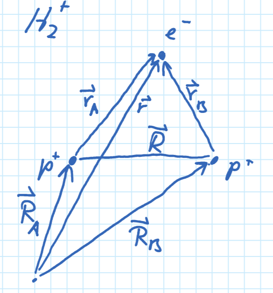
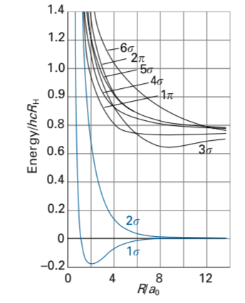
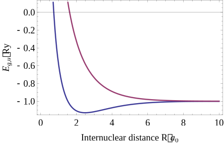

---
author:
  - Fred Jendrzejewski
  - Selim Jochim
  - Matthias Weidemüller
order: 15
title: Lecture 15 - Diatomic molecules
---

In this lecture we will start to put atoms together to build simple
molecules. We will first use the Born-Oppenheimer approximation, to
eliminate slow processes from the study of the fast electron dynamics.
Then, we will study simple mechanisms of binding atoms.

# Introduction

Molecules add a new layer of complexity to the system. In atoms, we had
different combinations of nuclei and electrons, leading to different
kinds of atoms. In this lecture, we will use atoms as basic building
block of more complex structures, the molecules. While this complexity
makes it necessary to introduce new approximations, it also allows us to
study new processes in nature.

So we will start out with the simplest of all molecules, barely a
molecule, the $H_2^+$ ion. We start out with a discussion of the
Born-Oppenheimer approximation. Detailled discussions can be found in
[Chapter 8 of Atkins](https://books.google.de/books?id=9KEPAQAAMAAJ), [Chapter 9 of Demtröder](http://dx.doi.org/10.1007/978-3-642-10298-1) and
[Chapter 10 of Bransden](https://books.google.de/books?id=i5IPWXDQlcIC).

# Molecular hydrogen ion

In molecular hydrogen we have only three ingredients. A single electron,
which is bound to two nuclei as shown in Fig.
[1](#fig-hydrogen-ion).

<figure id="fig-hydrogen-ion">

<figcaption>The molecular hydrogen ion as discussed in the main text.</figcaption>
</figure>

The full Hamiltonian of the system at study would read:

$$\hat{H} = - \frac{1}{2}\nabla_\mathbf{r}^2 - \frac{1}{2M}\left(\nabla_{\mathbf{R}_\mathrm{A}}^2 +\nabla_{\mathbf{R}_\mathrm{B}}^2\right) + V(\mathbf{r}, \mathbf{R}_\mathrm{A}, \mathbf{R}_\mathrm{B})$$
We will further introduce the short-hand notations:

$$
\hat{T}_e = - \frac{1}{2}\nabla_\mathbf{r}^2 \\
\hat{T}_n = - \frac{1}{2M}\left(\nabla_{\mathbf{R}_\mathrm{A}}^2 +\nabla_{\mathbf{R}_\mathrm{B}}^2\right)
$$

In a stark difference to atoms, we now have two charged nuclei. The
relative distance between them and between the electron will be of major
importance. Most importantly, we should answer the question, why this
configuration should be stable at all given that the two protons repel
each other. To handle the problem, we will once again separate out
energy scales.

## The Born-Oppenheimer approximation

The idea of the **Born-Oppenheimer approximation** is to separate the
fast electronic motion from the slow motion of the heavy nuclueus
($M=1836$). So we will

1.  Solve the electronic motion with the nuclear coordinates fixed.

2.  Solve the nuclear motion, assuming that the electron wavefunction
    adapts instantaneously.

So the ansatz is:
$$\Psi(\mathbf{R}_\mathrm{A}, \mathbf{R}_\mathrm{B}, \mathbf{r}) = \psi_e(\mathbf{R}_\mathrm{A}, \mathbf{R}_\mathrm{B}, \mathbf{r})\cdot \psi_n(\mathbf{R}_\mathrm{A}, \mathbf{R}_\mathrm{B})$$

We will plug this into the Schrödinger equation to obtain:
$$\psi_n\hat{T}_e\psi_e +\psi_e\hat{T}_n\psi_n + V(\mathbf{r}, \mathbf{R}_\mathrm{A}, \mathbf{R}_\mathrm{B})\psi_e \psi_n + W = E \psi_e\psi_n$$

This transformation introduced the _non-adiabatic_ effects:
$$W = -\frac{1}{2M}\sum_{i=A,B} \left[(\nabla_{\mathbf{R}_i}\psi_e)\cdot(\nabla_{\mathbf{R}_i}\psi_n)+\psi_n \nabla_{\mathbf{R}_i}^2 \psi_e\right]$$

In the following we will neglect these effects. And obtain:
$$\psi_e \hat{T}_n\psi_n + \left(\hat{T}_e\psi_e+V\psi_e\right)\psi_n = E \psi_e\psi_n$$
So we will first solve the _electronic motion_:
$$\left(\hat{T}_e+\hat{V}\right)\psi_e = E_e(\mathbf{R}_\mathrm{A}, \mathbf{R}_\mathrm{B}) \psi_e$$
To be explicit we obtain for the ionic hydrogen:

$$

H_e = -\frac{1}{2} \nabla_\mathbf{r}^2-\frac{1}{r_A}-\frac{1}{r_B}+\frac{1}{R}
$$

At this stage we can just focus on the electronic part to understand the
structure of simple diatomic molecules, while assuming that $R$ is an
independent parameter. Most importantly, we will focus at usual on
symmetries, which will tell us more about the allowed states in the
system.

In the second step we will solve the nuclear motion:
$$\hat{T}_n\psi_n + E_e \psi_n = E \psi_n$$

This nuclear motion will be at the origin of rotational and vibrational
levels, which will be discussed in on of the next lectures.

# Symmetries of the electronic wavefunction

This discussion follows along similiar lines as for the hydrogen atom
and the helium atom. We basically can categorize the different states by
their properties. This will help us later enormously to understand
allowed transition etc.

## Angular momentum

For any (diatomic) molecule we break the spherical symmetry that we
relied on for the atomic systems. This means that angular momentum is
not a conserved quantity anymore.

However, the full Hamiltonian is invariant under the rotation around the
axis of the diatomic molecule. One can verify that this implies that:

$$
[H_e, L_z] = 0\\
\Rightarrow L_z \psi_e = \pm \Lambda \psi_e (a.u.)
$$

The reason is that
$\hat{L}_z =\frac{1}{i}\partial_\varphi$ depends solely on the angle
$\varphi$ and not on $R$. Here the quantum number can have the integer
values $\Lambda= 0, 1, 2 , \cdots$. We also note them
$\Sigma, \Pi, \Delta, \Phi$ or $\sigma, \pi, \delta, \phi$ for single
electrons.

## Parity

We further have symmetry under parity operation for _homo-nuclear,
diatomic_ molecules $A_2$. This means that we have once more:
$$\hat{P}\psi_e(\mathbf{r}) = \pm\psi_e(\mathbf{r})$$ In the same way as
in the lecture on the Helium atom we distinguish the states by _gerade_
and _ungerade_. So we then end up with something like
$\Lambda_{u,g}^\pm$.

## Spin

If the system does not have explicit spin-orbit coupling, the total spin
$S$ of the system will be conserved. So the full notation for electronic
states is typically: $$^{2S+1}\Lambda^{\pm}_{g,u}$$ Most of the time the
ground state of the system is $^{1}\Sigma^{+}_{g}$.

# Stability of the ground state molecule

We have now studied the symmetries that the system should have, but
until now we did not discuss the most important question: Is this
molecule stable ? Within the Born-Oppenheimer approximation, we can
actually solve the ionic hydrogen molecule analytically (see [Chapter 9 of
Demtröder](http://dx.doi.org/10.1007/978-3-642-10298-1)). The resulting **molecular potential curves** are
shown in Fig. [2](#fig-potentials).

<figure id="fig-potentials">

<figcaption>Molecular potential curves for the molecular hydrogen ion. Figure is
taken from <a href="https://global.oup.com/academic/product/molecular-quantum-mechanics-9780199541423">here</a>.</figcaption>
</figure>

## Linear combination of atomic orbitals

The analytical solutions are rather bulky and not particularly
instructive. One powerful idea, and very good approximation, is to
decompose the molecule wavefunction over the atomic orbitals of its
components. Going back to Fig. [1](#fig-hydrogen-ion) we could make the simple Ansatz:
$$\psi_e(\mathbf{r})= c_1 \psi_{1s}(\mathbf{r}_\mathrm{A})+c_2 \psi_{1s}(\mathbf{r}_\mathrm{B})$$

Note, that we made a very simple Ansatz at this stage and we could
decompose the system over a much larger set of excited states. But for
pedagogical reason we will stick to the simple model at this stage.
Going through the symmetry requirements, we find that we can write the
full wavefunction as:

$$
\psi_{g,u}(\mathbf{r})= \frac{1}{\sqrt{2\pm2S}}\left(\psi_{1s}(\mathbf{r}_\mathrm{A})\pm \psi_{1s}(\mathbf{r}_\mathrm{B})\right)
$$

The contribution $S$ describes the overlap of the two atomic orbitals
$$S =  \int d\mathbf{r}\psi_{1s}^*(\mathbf{r}_\mathrm{A})\psi_{1s}(\mathbf{r}_\mathrm{B})$$
We can then evaluate the energy of the two states through the
variational principle:

$$
E_{g,u} = \left\langle\psi_{g,u}\right|\hat{H}_e\left|\psi_{g,u}\right\rangle\\
 = \frac{1}{2\pm2S}\left(\left\langle\psi_A\right|\pm \left\langle\psi_B\right|\right)\hat{H}_e\left(\left|\psi_A\right\rangle\pm \left|\psi_B\right\rangle\right)\\
 = \frac{E_{AA}\pm E_{AB}}{1\pm S}\\
$$

The resulting energy surfaces are shown in Fig. [3](#fig-lcao). In the most
simplistic interpretation the gerade state does not have a node in the
middle and it is therefore of smaller kinetic energy.

<figure id="fig-lcao">

<figcaption>The energy surface of the LCAO for the hydrogen molecule ion.</figcaption>
</figure>

# The neutral hydrogen molecule

In the previous section we have seen how we can treat the coupling of
the nuclei through the exchange of a single shared electron. However, we
should now move on to the case of two neutral particles binding
together. What is here the relevant mechanism ?

<figure id="fig-hydrogen">

<figcaption>The hydrogen molecule.</figcaption>
</figure>

In the following we will only consider the electronic part, which adds
up too:

$$\hat{H} = -\frac{1}{2}\left(\nabla_{\mathbf{r}_1}^2+\nabla_{\mathbf{r}_2}^2\right)-\frac{1}{r_{A1}}-\frac{1}{r_{A2}}-\frac{1}{r_{B1}}-\frac{1}{r_{B2}}+\frac{1}{r_{12}}+\frac{1}{R}$$

We can now rewrite this Hamiltonian in the more instructive form

$$

\hat{H} = H_{0,1}+H_{0,2}+\frac{1}{r_{12}}+\frac{1}{R}\\
H_{0,i} = -\frac{1}{2}\nabla_{\mathbf{r}_i}^2-\frac{1}{r_{A,i}}-\frac{1}{r_{B,i}}

$$

We have can now use the results of the hydrogen ion to understand this
system.

- We have for each electron the solution of hydrogen molecule ion.
- In the next step, we have to put the two electrons properly within
  this orbit with $S=0$ and _ignoring_ the $e^-$ - $e^-$ interaction.

So we can make the Ansatz:

$$
\psi(\mathbf{r}_1, \mathbf{r}_2) = \psi_{g}(\mathbf{r}_1)\cdot\psi_{g}(\mathbf{r}_2)\\
= \frac{1}{2 + 2S}\left(\psi_{1s}(\mathbf{r}_{A1})+\psi_{1s}(\mathbf{r}_{B1})\right)\left(\psi_{1s}(\mathbf{r}_{A2})+\psi_{1s}(\mathbf{r}_{B2})\right)\\
= \frac{1}{2 + 2S}\left(\psi_{1s}(\mathbf{r}_{A1})\psi_{1s}(\mathbf{r}_{B2})+\psi_{1s}(\mathbf{r}_{B1})\psi_{1s}(\mathbf{r}_{A2}) +\psi_{1s}(\mathbf{r}_{A1})\psi_{1s}(\mathbf{r}_{A2})+\psi_{1s}(\mathbf{r}_{B1})\psi_{1s}(\mathbf{r}_{B2}) \right)
$$

The first two terms describe **kovalent binding**. They
describe situations where each electron is associated with one core. The
last two terms describe **ionic binding** as one associated both
electrons with a single atom and then looks one the attraction of
another ionic core. This is quite similiar to the interaction in the
$H_2^+$ molecule.

Within this approach, one actually finds a binding energy of
$E_b = {-2.64}\text{eV}$ at an equilibrium distance of $R_e = 1.4 a_0$.
The experimentally measured values differs quite substantially as we
have $E_b = {-4.7}\text{eV}$. A substantial approximation was here that we
neglected the interaction between the electrons, which should repel.

## The Heitler-London method

As the two electrons should repel each other, we can assume that the
ionic binding is strongly suppressed. So the wavefunction is now assumed
to be:

$$

\psi_{HL} = \frac{1}{\sqrt{2 + 2S^2}}\left(\psi_{1s}(\mathbf{r}_{A1})\psi_{1s}(\mathbf{r}_{B2})+\psi_{1s}(\mathbf{r}_{B1})\psi_{1s}(\mathbf{r}_{A2})\right)
$$

Again, the wavefunction cannot be factorized and the two
electrons are entangled because of the interactions. Recognize the
common theme with the Helium atom. Calculation of the binding energy
within this approximation leads to $E_b = {-3.14}\text{eV}$ and
$R_e=1.6a_0$.

In the next lecture we will discuss how we can move on
from these extremely simple diatomic molecules to the assembly of richer
systems.
