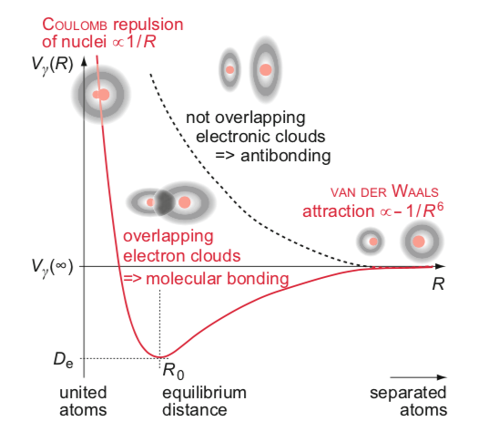
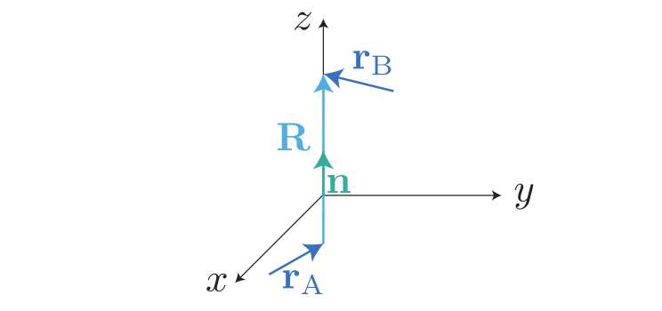
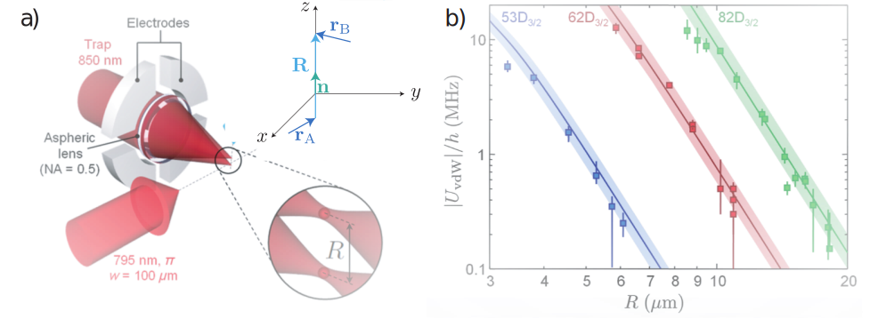
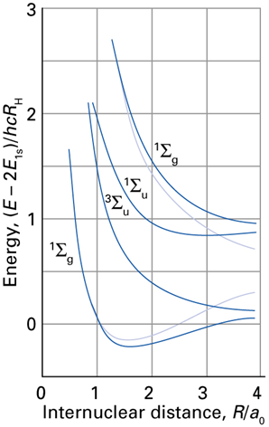
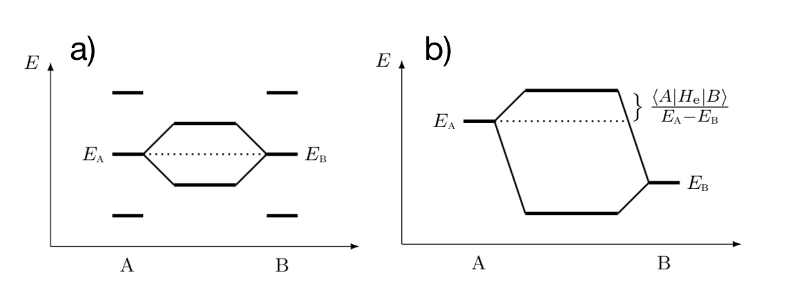
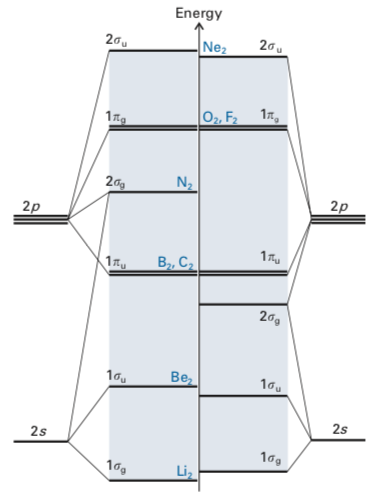

---
author:
  - Fred Jendrzejewski
  - Selim Jochim
  - Matthias Weidemüller
order: 16
title: Lecture 16 - Molecular Orbitals of Diatomic Molecules
---

In this lecture we will discuss a systematic approach to build up
molecules from more complex atoms.

In the last lecture we discussed the existing orbits within
the linear combination of orbitals. We will now try to systematically
fill up the orbitals with electrons in order of their energy.

# Molecular bindings

A good overview over the different mechanism for molecular binding is
given in Fig. [1](#fig-hydrogen-overview). In
the last lecture we have seen two different binding processes of
molecular bonding:

1.  Ionic binding, which was important in the $H_2^+$ molecule.

2.  Kovalent binding, which dominated the $H_2$ molecule.

Both are important for small distances. For large distance the van der
Waals interaction can create weakly bound molecules.

<figure id="fig-hydrogen-overview">

<figcaption>Different binding mechanisms in diatomic molecules. Figure taken from <a href="http://dx.doi.org/10.1007/978-3-642-54313-5_3">Hertel 2015</a>.</figcaption>
</figure>

# Van-der Vaals interaction

The question is then how can these systems interact ? They do not share
electrons and they are neutral, so they do not have a permanent electric
dipole moment. The magnetic dipole interaction is extremely weak anyway.

The key is induced dipole moment of the atom in in an electric field,
seen in lecture 6. Each of the atoms can have a dipole
moment $\mathbf{D}_i = q \mathbf{r}_i$. As each atom is neutral, they
interact through their dipole-dipole interaction:

$$

\hat{W}_{dd} =\frac{1}{4\pi \epsilon_0}\frac{e^2}{R^3}\left(\mathbf{r}_A\cdot \mathbf{r}_B-3(\mathbf{r}_A\cdot \mathbf{n})(\mathbf{r}_B\cdot \mathbf{n})\right)
$$

We now have to perform the amplitude of this energy
quantum mechanically. In a first step, we express $\hat{W}_{dd}$ in
terms of the operators $\hat{X}_{A,B}, \hat{Y}_{A,B}, \hat{Z}_{A,B}$.
The orientation of the atom is sketched in the inset in Fig.
[2](#fig-two-atoms).

<figure id="fig-two-atoms">

<figcaption>Configuration of two dipoles.</figcaption>
</figure>

We can write then:

$$
\hat{W}_{dd} =\frac{1}{4\pi \epsilon_0}\frac{e^2}{R^3}\left(\hat{X}_A \hat{X}_B + \hat{Y}_A\hat{Y}_B - 2 \hat{Z}_A \hat{Z}_B\right)
$$

We are only interested in their interaction at very large distances,
such that we can treat the interaction perturbatively (see lecture 7). To first order, we have to evaluate:

$$
E_1 = \left\langle\phi_{n,0,0^A, \phi_{n,0,0}^B}\right| \hat{W}_{dd}
\left|\phi_{n,0,0^A, \phi_{n,0,0}^B}\right\rangle
$$

It only contains terms of the kind
$\left\langle\phi_{n,0,0^i}\right| \hat{X}_i \left|\phi_{n,0,0^i}\right\rangle$.
As the dipole moment is zero, the first order correction in the energy
is zero too. The idea is then that the mean electric field created by
the atom might be zero. However, quantum mechanics allows for
fluctuations of the type $\langle |e\mathbf{r}|^2\rangle$. They are
taken into account through second order perturbation theory. We obtain
directly:

$$
E_2 = \sum_{\phi,\phi'} \frac{|\left\langle\psi_{\phi^A,\psi_{\phi'}^B}\right|\hat{W}_{dd}\left|\psi_{0^A,\psi_{0}^B}\right\rangle|^2}{(E_{0}^A+E_0^B -E_\phi^A -E_{\phi'}^B)}
$$

And we can also pull out the $R^3$ dependence of each
$W$, to obtain a general expression for the **van-der-Waals
interaction**:

$$
E_2 = - \frac{C_6}{R^6}
$$

To get an estimate for the typical scale of the binding we can have a
look into the prefactor $C_6$. We will do this here for highly excited
states of hydrogen as it is relevant to the other alkalis too:

- Each $\hat{X}$ will be be proportional to the typical extension of
  its orbit, such that we have $\hat{X} \sim n^2 a_0$ within the
  electronic shells.

- As for the energy difference, we know that the energy of high $n$
  $E_n \approx \frac{ R_{y,\infty}}{n^2}$ (the screening makes all
  alkalis look very similiar for high energies). The energy difference
  is therefore in the order of
  $\delta E_n \approx \frac{ R_{y,\infty}}{n^3}$.

Putting it all together, we obtain

$$
C_6 \approx \frac{e^4 a_0^4 n^8}{R_{y,\infty}/n^3} \approx \frac{e^4 a_0^4}{R_{y,\infty} (4\pi\epsilon_0)^2} n^{11}
$$

This prediction has been directly tested as shown in Fig. [3](#fig-beguin).

<figure id="fig-beguin">

<figcaption>Direct measurement of the van-der-Waals force in <a href="http://dx.doi.org/10.1103/physrevlett.110.263201">Beguin 2013</a>.</figcaption>
</figure>

# Molecular orbit theory

We would like to put together more complex molecules step-by-step. Let's
take a step back to the hydrogen molecule to formulate the problem.

## The hydrogen molecule

Let us have a brief look at H~2~ again and consider only contributions
from $1s$ atomic orbitals. We saw that we can distribute the two
electrons within the gerade and ungerade orbital of the hydrogen ion. So
our basic orbitals will be:

$$
\sigma_g \propto \left( \psi_{1s} (\vec{r}_\textrm{a}) + \psi_{1s} (\vec{r}_\textrm{b}) \right)
$$

$$
\sigma_u \propto \left( \psi_{1s} (\vec{r}_\textrm{a}) - \psi_{1s} (\vec{r}_\textrm{b}) \right).
$$

Lower case letters stand for the individual electrons
while upper case letters characterize the whole system. We will now
attempt to fill up the two orbitals with the two electrons:

- Both electrons in a gerade orbital $1\sigma_g^{2}$.

- Both electrons in an ungerade orbital $1\sigma_u^{2}$.

- One electron in a gerade orbtial and one electron in an ungerade
  orbital: $\sigma_g^{1}1\sigma_u^{1}$.

In a second step, we need to respect the Pauli principle for the two
electrons, which states that the full wavefunction should be
anti-symmetric under exchange of particles. We had a detailled
discussion of the topic on helium. So for the first
configuration $1\sigma_g^{2}$ we have:

$$
\psi_1 \propto \sigma_g(1) \cdot \sigma_g(2) \qquad (S=0, ^1\Sigma_g)
$$

The spin has to be in a singlet here as the wavefunction
itself is symmetric. Further, the parity of the full wavefunction is
gerade as $g \times g = g$. So $\psi_1$ is in a $^1\Sigma_g$
configuration.

As one atom is in $1\sigma_g^{1}$ and the other one is in
$1\sigma_u^{1}$, the parity of the full wavefunction is $g\times u = u$.
Additionally, we can choose which atom to position in which orbital and
then also the symmetry of the superposition. The symmetric superposition
is:

$$
\psi_{2} \propto \left (\sigma_g(1) \cdot \sigma_u(2) + \sigma_u(1) \cdot \sigma_u(2)\right) \quad \qquad (S=0, ^1\Sigma_u)
$$

As the orbital superposition is symmetric, we once again
have work in a spin singlet to achieve the overall anti-symmetry of the
two-electron wavefunction. So $\psi_2$ is in a $^1\Sigma_u$
configuration.

We can also choose anti-symmetric superposition of the two
distinguishable orbitals:

$$
\psi_3 \propto \left( \sigma_g(1)\cdot \sigma_u(2)-\sigma_u(1) \cdot \sigma_g(2) \right) \qquad (S=1, ^3\Sigma_u)
$$

As the orbital superposition is anti-symmetric, we have
work in a spin triplet to achieve the overall anti-symmetry of the
two-electron wavefunction. So $\psi_3$ is in a $^3\Sigma_u$
configuration.

And finally we have for $1\sigma_u^{2}$:

$$
\psi_4 \propto \sigma_u(1)\cdot \sigma_u(2) \qquad (S=0, ^1\Sigma_g)
$$

The spin has to be in a singlet here as the wavefunction
itself is symmetric. Further, the parity of the full wavefunction is
gerade as $u \times u = g$. So $\psi_4$ is in a $^1\Sigma_g$
configuration.

At short distance the energy ordering is
$E(\psi_1) < E(\psi_2) \sim E(\psi_3) < E(\psi_4)$.

<figure >

</figure>

In the figure above the faded lines indicate how the energy
of $\psi_1$ and $\psi_4$ would naively. If the system is diagonalized in
a more flexible basis, that allows for superpositions, the orbits repel.
Taken from [here](https://global.oup.com/academic/product/molecular-quantum-mechanics-9780199541423).

However for larger distances the gerade or ungerade character of each
wave function becomes of less importance and the two configurations
$\psi_1$ and $\psi_4$ become of similiar energy. They are further both
$^1\Sigma_g$ states. Therefore also all linear combinations of the two
states have the valid symmetries and and more flexibel trial solution
would be of the form:

$$
c_1 \psi_1 + c_4 \psi_4
$$

The full solution then shows clear level repulsion
between the two uncoupled channels. This concept is called
"configuration interaction".

## Conditions for (anti-)binding of particular orbitals.

The conditions for the creating of (anti-)binding orbitals is viusalized
in Fig [5](#fig-binding).

In a first step, there has to be sufficient wave function overlap, such
that there can be constructive and destructive interference. This
implies that the orbit has to be large enough to 'see' the other atom,
but not to diffuse. This typically implies that only the valence shell
has to be considered.

Only orbits of the same symmetry group can form a bond. The main
symmetry property here is the total $L_z$ with respect to the axis of
the molecule. We have [table 4.5 of Demtröder_2010](https://global.oup.com/academic/product/molecular-quantum-mechanics-9780199541423):

- $s$, $p_z$ and $d_{z^2}$ have $L_z = 0$ ($\Sigma$).

- $p_x$, $p_y$ as well as $d_{yz}$, $d_{zx}$ have $|L_z| = 1$($\Pi$)

Having a sufficient overlap is obviously not enough, the two orbits also
have to have the same a similiar energy, which is easily fulfilled in a
homonuclear molecule. But if we now have two different molecules the
orbital energy of (A) might be different from the orbital energy of (B).
The larger the difference, the smaller is the shift.

<figure id="fig-binding">

<figcaption>Two atomic orbitals with resonant energy form a binding and
anti-binding orbital. b) Molecular orbitals of heteronuclear molecules.</figcaption>
</figure>

# Homo-nuclear shell structure

We can finally put all this together to build up the shell structure of
homo-cuclear diatomic molecules as shown in Fig.
[6](#fig-homo).

<figure id="fig-homo">

<figcaption>The shell structure of some homonuclear diatomic molecules. Taken
from <a href="https://global.oup.com/academic/product/molecular-quantum-mechanics-9780199541423">here</a>.</figcaption>
</figure>

The name of the molecule indicates the highest occupied molecular orbit
(_HOMO_). The next empty shell is then called the lowest occupied
molecular orbit (_LUMO_).
