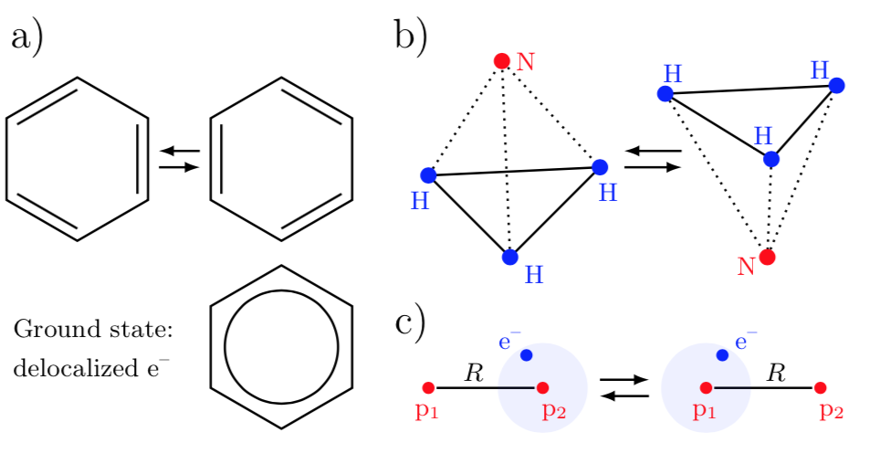
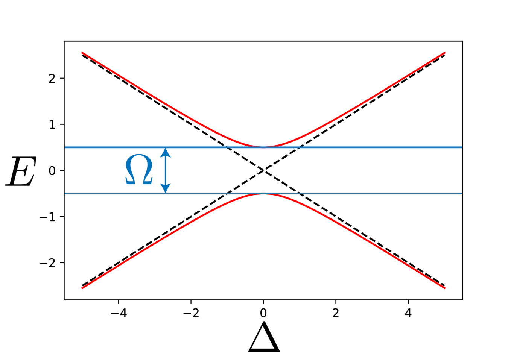
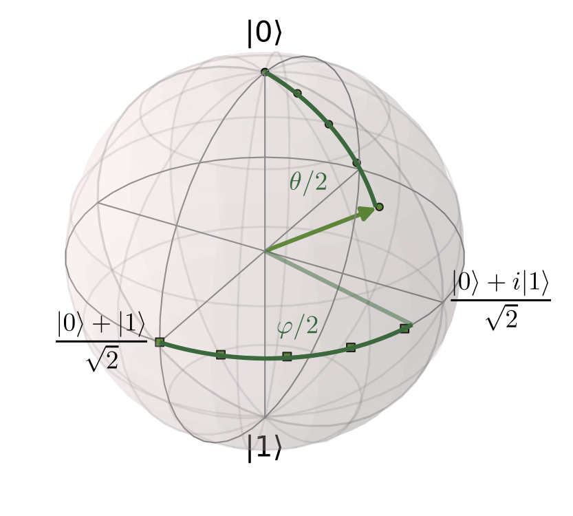
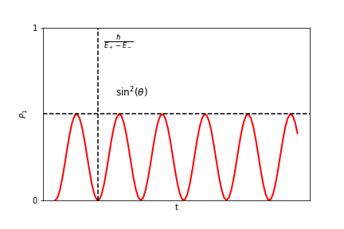

---
author:
  - Fred Jendrzejewski
  - Selim Jochim
bibliography:
  - bibliography/converted_to_latex.bib
date: January 04, 2025
title: Lecture 3 - The two-level system
---

We are going to discuss the two-level system, it's static properties
like level splitting at avoided crossings and dynamical properties like
Rabi oscillations.

After the previous discussions of some basic cooking recipes to quantum
mechanics in last weeks lectures, we will use them to understand the two-level system. A very detailled
discussion can be found in chapter 4 of Ref. [^CT1]. The importance of the
two-level system is at least three-fold:

1.  It is the simplest system of quantum mechanics as it spans a Hilbert
    space of only two states.

2.  It is quite ubiquitous in nature and very widely used in atomic
    physics.

3.  The two-level system is another word for the qubit, which is the
    fundamental building block of the exploding field of quantum
    computing and quantum information science.

Examples for two-state systems. a) Benzene: In the ground state, the
electrons are delocalized. b) Ammonia: The nitrogen atom is either found
above or below the hydrogen triangle. The state changes when the
nitrogen atom tunnels. c) Molecular ion : The electron is either
localized near proton 1 or 2.

Some of the many examples for two-level systems that can be found in
nature:

- Spin of the electron: Up vs. down state

- Two-level atom with one electron (simplified): Excited vs. ground
  state

- Structures of molecules, e.g., $NH_3$

- Occupation of mesoscopic capacitors in nanodevices.

- Current states in superconducting loops.

- Nitrogen-vacancy centers in diamond.

# Hamiltonian, Eigenstates and Matrix Notation

To start out, we will consider two eigenstates
$\left|0\right\rangle$, $\left|1\right\rangle$
of the Hamiltonian $\hat{H}_0$ with

$$
 \hat{H}_0\left|0\right\rangle=E_0\left|0\right\rangle, \qquad \hat{H}_0\left|1\right\rangle=E_1\left|1\right\rangle.
$$

Quite typically we might think of it as a two-level atom
with states 1 and 2. The eigenstates can be expressed in matrix
notation:

$$
 \left|0\right\rangle=\left( \begin{array}{c} 1 \\ 0 \end{array} \right), \qquad \left|1\right\rangle=\left( \begin{array}{c} 0 \\ 1 \end{array} \right),
$$

so that $\hat{H}_0$ be written as a diagonal matrix

$$
    \hat{H}_0 = \left(\begin{array}{cc} E_0 & 0 \\ 0 & E_1 \end{array}\right).
$$

If we would only prepare eigenstates the system would be
rather boring. However, we typically have the ability to change the
Hamiltonian by switching on and off laser or microwave fields [^1]. We
can then write the Hamiltonian in its most general form as:

$$

\hat{H} = \frac{\hbar}{2}\left( \begin{array}{cc} \Delta  & \Omega_x - i\Omega_y\\ \Omega_x +i\Omega_y & -\Delta \end{array} \right)
$$

Sometimes we will also chose the definition:

$$
\Omega = |\Omega| e^{i\varphi}=\Omega_x + i\Omega_y
$$

It is particularly useful for the case in which the
coupling is created by a laser. Another useful way of thinking about the
two-level system is as a spin in a magnetic field. Let us remind us of
the definitions of the of the spin-1/2 matrices:

$$
s_x = \frac{\hbar}{2}\left(\begin{array}{cc}
0 & 1\\
1 &  0
\end{array}
\right)~
s_y = \frac{\hbar}{2}\left(\begin{array}{cc}
0 & -i\\
i &  0
\end{array}
\right)~s_z =\frac{\hbar}{2} \left(\begin{array}{cc}
1 & 0\\
0 &  -1
\end{array}
\right)
$$

We then obtain:

$$

\hat{H} = \mathbf{B}\cdot\hat{\mathbf{s}}\text{ with }\mathbf{B} = (\Omega_x, \Omega_y, \Delta)
$$

You will go through this calculation in the excercise of
this week.

## Case of no perturbation $\Omega = 0$

This is exactly the case of no applied laser fields that we discussed
previously. We simply removed the energy offset
$E_m = \frac{E_0+E_1}{2}$ and pulled out the factor $\hbar$, such that
$\Delta$ measures a frequency. So we have:

$$
E_0 = E_m+ \frac{\hbar}{2}\Delta\\
E_1 = E_m- \frac{\hbar}{2}\Delta
$$

We typically call $\Delta$ the energy difference between
the levels or the **detuning**.

## Case of no detuning $\Delta = 0$

Let us suppose that the diagonal elements are exactly zero. And for
simplicity we will also keep $\Omega_y =0$ as it simply complicates the
calculations without adding much to the discussion at this stage. The
Hamiltonian reads then:

$$
\hat{H} = \frac{\hbar}{2}\left( \begin{array}{cc} 0  & \Omega\\ \Omega &0 \end{array} \right)
$$

Quite clearly the states $\varphi_{1,2}$ are not the eigenstates of the
system anymore. How should the system be described now ? We can once
again diagonalize the system and write

$$
\hat{H}\left|\varphi_{\pm}\right\rangle = E_{\pm}\left|\varphi_\pm\right\rangle\\
E_{\pm} = \pm\frac{\hbar}{2}\Omega\\
\left|\varphi_\pm\right\rangle = \frac{\left|0\right\rangle\pm\left|1\right\rangle}{\sqrt{2}}
$$

Two important consequences can be understood from this
result:

1.  The coupling of the two states shifts their energy by $\Omega$. This
    is the idea of level repulsion.

2.  The coupled states are a superposition of the initial states.

This is also a motivation the formulation of the 'bare' system for
$\Omega = 0$ and the 'dressed' states for the coupled system.

## General case

Quite importantly we can solve the system completely even in the general
case. By diagonalizing the Hamiltonian we obtain:

$$
 E_\pm = \pm \frac{\hbar}{2} \sqrt{\Delta^2+|\Omega|^2}
$$

The energies can be nicely summarized as in Fig.

The Eigenstates then read:

$$
\left|\psi_+\right\rangle=\cos\left(\frac{\theta}{2}\right) \mathrm{e}^{-i{\varphi}/{2}}\left|0\right\rangle+\sin\left(\frac{\theta}{2}\right) \mathrm{e}^{i{\varphi}/{2}}\left|1\right\rangle,
$$

$$
\left|\psi_-\right\rangle=-\sin\left(\frac{\theta}{2}\right) \mathrm{e}^{-i{\varphi}/{2}}\left|0\right\rangle+\cos\left(\frac{\theta}{2}\right) \mathrm{e}^{i{\varphi}/{2}}\left|1\right\rangle,
$$

where

$$

\tan(\theta) = \frac{|\Omega|}{\Delta}
$$

# The Bloch sphere

While we could just discuss the details of the above state in the
abstract, it is extremely helpful to visualize the problem on the Bloch
sphere. The idea of the Bloch sphere is that the we have a complex wave
function of well defined norm and two free parameters. So it seems quite
natural to look for a good representation of it. And this is the Bloch
sphere as drawn below

We will see especially its usefulness especially as we discuss the
dynamics of the two-state system.

# Dynamical Aspects

## Time Evolution of $\left|\psi(t)\right\rangle$

After the static case we now want to investigate the dynamical
properties of the two-state system. We calculate the time evolution of
$\left|\psi(t)\right\rangle = c_0(t)\left|0\right\rangle + c_1(t)\left|1\right\rangle$
with the Schrödinger equation and the perturbed Hamiltonian:

$$
i\hbar \frac{d}{dt}\left|\psi(t)\right\rangle=\hat{H}\left|\psi(t)\right\rangle,\\
i \frac{d}{dt}\left(\begin{array}{c} c_0(t) \\ c_1(t) \end{array}\right) = \frac{1}{2}\left( \begin{array}{cc} \Delta & \Omega \\ \Omega^* & -\Delta \end{array} \right) \left(\begin{array}{c} c_0(t) \\ c_1(t) \end{array} \right).
$$

We have two coupled differential equations and we luckily already know
how to solve them as we have calculated the two eigenenergies in the
previous section. For the state
$\left|\psi(t)\right\rangle$ we get

$$
 \left|\psi(t)\right\rangle=\lambda \mathrm{e}^{-i{E_+}t/{\hbar}} \left|\psi_+\right\rangle + \mu \mathrm{e}^{-i{E_-}t/{\hbar}} \left|\psi_-\right\rangle
$$

with the factors $\lambda$ and $\mu$, which are defined
by the initial state. The most common question is then what happens to
the system if we start out in the bare state
$\left|0\right\rangle$ and then let it evolve under
coupling with a laser ? So what is the probability to find it in the
other state $\left|1\right\rangle$:

$$
P_1(t)=\left|\left\langle 1|\psi(t)\right\rangle\right|^2.
$$

As a first step, we have to apply the initial condition
to and express
$\left|\varphi\right\rangle$ in terms of $|\psi_+$ and $|\psi_-$:

$$
\left|\psi(0)\right\rangle \overset{!}{=} \left|0\right\rangle\\
  = \mathrm{e}^{i{\varphi}/{2}} \left[ \cos\left( \frac{\theta}{2}\right) \left|\psi_+\right\rangle-\sin\left(\frac{\theta}{2}\right)\left|\psi_-\right\rangle\right]
$$

By equating the coefficients we get for $\lambda$ and
$\mu$:

$$
\lambda = \mathrm{e}^{i{\varphi}/{2}}\cos\left(\frac{\theta}{2}\right), \qquad  \mu = -\mathrm{e}^{i{\varphi}/{2}}\sin\left(\frac{\theta}{2}\right).
$$

One thus gets:

$$
\hspace{-2mm} P_1(t)=\left|\left\langle 1|\psi(t)\right\rangle\right|^2 \\
= \left|\mathrm{e}^{i\varphi} \sin\left(\frac{\theta}{2}\right)\cos\left(\frac{\theta}{2}\right)\left[\mathrm{e}^{-i{E_+}t/{\hbar}} - \mathrm{e}^{-i{E_-}t/{\hbar}}\right]\right|^2\\
= \sin^2(\theta)\sin^2\left(\frac{E_+-E_-}{2\hbar}t\right)
$$

$P_1(t)$ can be expressed with $\Delta$ and $\Omega$
alone. The obtained relation is called Rabi's formula:

$$
 P_1(t)=\frac{1}{1+\left(\frac{\Delta}{|\Omega|}\right)^2}\sin^2\left(\sqrt{|\Omega|^2+\Delta^2}\frac{t}{2}\right)
$$

## Visualization of the dynamics in the spin picture

While the previous derivation might be the standard one, which certainly
leads to the right results it might not be the most intuitive way of
thinking about the dynamics. They become actually quite transparent in
the spin language and on the Bloch sphere. So let us go back to the
formulation of the Hamiltonian in terms of spins as at the beginning of the lecture.

How would the question of the time evolution from $0$ to $1$ and back go
now ? Basically, we would assume that the spin has been initialize into
one of the eigenstates of the $z$-basis and now starts to rotate in some
magnetic field. How ? This can be nicely studied in the Heisenberg
picture, where operators have a time evolution. In the Heisenberg
picture we have:

$$
\frac{d}{dt} \hat{s}_i = \frac{i}{\hbar}\left[\hat{H},\hat{s}_i\right]\\
\frac{d}{dt} \hat{s}_i = \frac{i}{\hbar}\sum_j B_j \left[\hat{s}_j,\hat{s}_i\right]\\

$$

So to understand we time evolution, we only need to
employ the commutator relationships between the spins:

$$
= \hbar is_z~~[ s_y, s_z] = \hbar is_x~~[ s_z, s_x] = \hbar is_y
$$

For the specific case of $B_x=\Omega$, $B_y = B_z = 0$,
we have then:

$$
\frac{d}{dt} \hat{s}_x = 0\\
\frac{d}{dt} \hat{s}_y = -\Omega \hat{s}_z\\
\frac{d}{dt} \hat{s}_z = \Omega \hat{s}_y

$$

So applying a field in x-direction leads to a rotation of the spin
around the $x$ axis with velocity $\Omega$. We can now use this general
picture to understand the dynamics as rotations around an axis, which is
defined by the different components of the magnetic field.

# A few words on the quantum information notation

The qubit is THE basic ingredient of quantum computers. A nice way to
play around with them is actually the [IBM Quantum
experience](https://quantum-computing.ibm.com/). However, you will
typically not find Pauli matrices etc within these systems. The typical
notation there is:

- $R_x(\phi)$ is a rotation around the x-axis for an angle $\phi$.

- Same holds for $R_y$ and $R_z$.

- $X$ denotes the rotation around the x axis for an angle $\pi$. So it
  transforms $\left|1\right\rangle$ into
  $\left|0\right\rangle$ and vise versa.

- $Z$ denotes the rotation around the x axis for an angle $\pi$. So it
  transforms $\left|+\right\rangle$ into
  $\left|-\right\rangle$ and vise versa.

The most commonly used gate is actually one that we did not talk about
at all, it is the _Hadamard_ gate, which transforms
$\left|1\right\rangle$ into
$\left|-\right\rangle$ and
$\left|0\right\rangle$ into
$\left|+\right\rangle$:

$$
\hat{H}\left|1\right\rangle = \left|-\right\rangle  ~   \hat{H}\left|0\right\rangle = \left|+\right\rangle\\
\hat{H}\left|-\right\rangle = \left|1\right\rangle  ~   \hat{H}\left|+\right\rangle = \left|0\right\rangle
$$

In the forth lecture we will see how it is that a time-dependent field can actually couple two atomic states, which are normally of very different energies.

[^1]: See the discussions of the next lecture

[^CT1]: Quantum Mechanics, Volume 1. Cohen-Tannoudji, Diu, Laloe. Wiley-VCH, 2006.