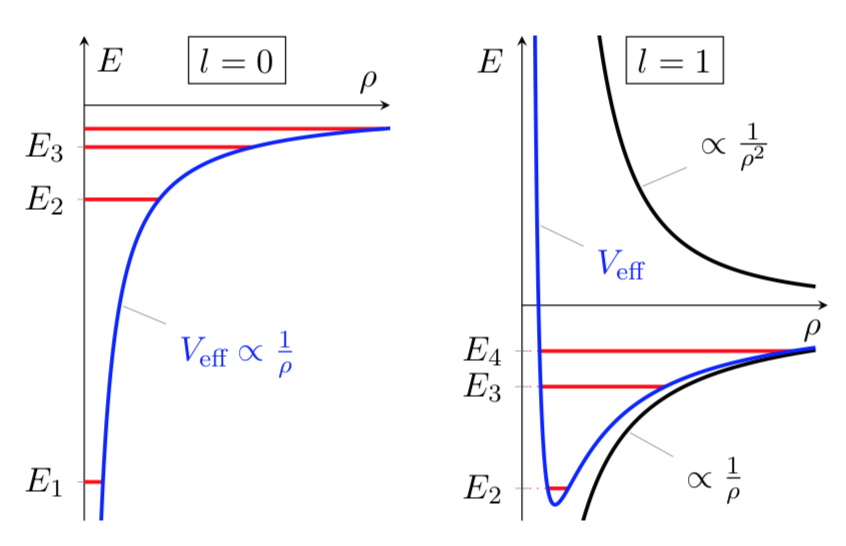
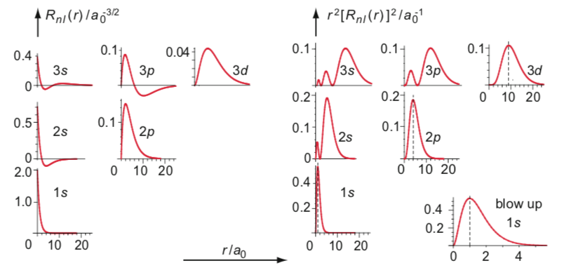
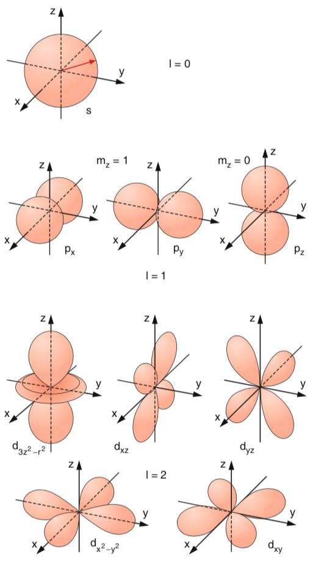
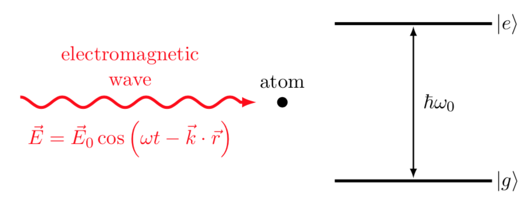
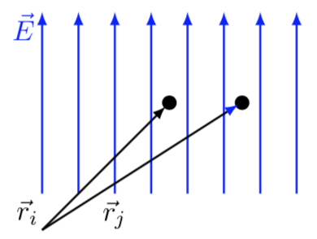
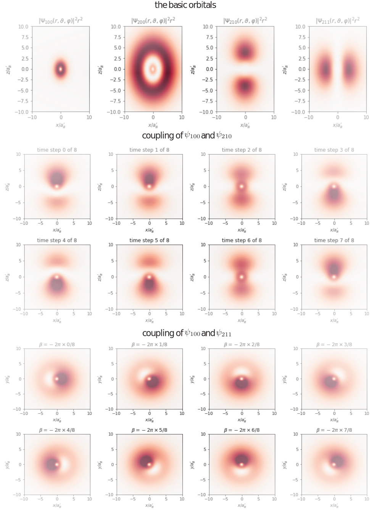

---
author:
  - Fred Jendrzejewski
  - Selim Jochim
bibliography:
  - bibliography/converted_to_latex.bib
date: January 04, 2025
nocite: "[@*]"
title: Lecture 6 - The dipole approximation in the hydrogen atom
---

We will continue with some properties of the hydrogen atom. First
compare it to the harmonic oscillator, then look into dipole transitions
and end with the coupling to static magnetic fields.

In the last lecture, we discussed the basic properties of the
hydrogen atom and found its eigenstates. We will now summarize the most
important properties and look into its orbitals. From that we will
understand the understand the interaction with electromagnetic waves and
introduce the selection rules for dipole transitions.

# The energies of Hydrogen and its wavefunctions

In the last lecture, we looked into hydrogen and saw that we could write
it's Hamiltonian as:

$$
\hat{H}_\text{atom} = \hat{H}_r + \frac{\hat{L}}{2\mu r^2}+V(r) \\
\hat{H}_r = -\frac{\hbar^2}{2\mu}\frac{1}{r^2}\frac{\partial}{\partial r}\left(r^2\frac{\partial}{\partial r}\right)
$$

We could then separate out the angular part and
decompose it as:

$$
\psi (r,\theta,\phi) = \frac{u(r)}{r} Y_{lm}(\theta,\phi)
$$

The radial wave equation reads then:

$$

-\frac{\hbar^2}{2\mu}\frac{d^2}{dr^2}u(r) +\underbrace{ \left( -\frac{Ze^2}{4\pi\epsilon_0 r} + \frac{\hbar^2}{2\mu} \frac{l(l+1)}{r^2} \right)}_{V_{\text{eff}}} u(r) = E \, u(r),
$$

## Energy scales

We can now make the last equation dimensionless, by rewriting:

$$
r = \rho \tilde{a}_{0}
$$

So we rewrite:

$$
-\frac{\hbar^2}{2\mu \tilde{a}_{0}^2}\frac{d^2}{d\rho^2}u(r) + \left( -\frac{Ze^2}{4\pi\epsilon_0\tilde{a}_{0}}\frac{1}{\rho} + \frac{\hbar^2}{2\mu \tilde{a}_{0}^2} \frac{l(l+1)}{\rho^2} \right) u(r) = E \, u(r),
$$

This allows us to measure energies in units of:

$$
E = \epsilon R_{y,\textrm{m}}\\
R_{y,\textrm{m}} = -\frac{\hbar^2}{2\mu \tilde{a}_{0}^2}
$$

The equation reads then:

$$
\frac{d^2}{d\rho^2}u(\rho) + \left( \frac{\mu Ze^2 \tilde{a}_{0}}{\hbar^2 4\pi\epsilon_0}\frac{2}{\rho} - \frac{l(l+1)}{\rho^2} \right) u(\rho) = \epsilon u(\rho),
$$

If we finally set

$$
\tilde{a}_{0}=\frac{4\pi\epsilon_0 \hbar^2}{\mu Z e^2}
$$

We obtain the especially elegant formulation:

$$
\frac{d^2}{d\rho^2}u(\rho) + \left( \frac{2}{\rho} - \frac{l(l+1)}{\rho^2} \right) u(\rho) = \epsilon u(\rho),
$$

We typically call $\tilde{a}_{0}$ the **Bohr radius**
for an atom with reduced mass $\mu$ and with a nucleus with charge
number $Z$. $R_{y,\textrm{m}}$ is the **Rydberg energy** of such an
atom.

The universal constant is defined for the infinite mass limit
$\mu \approx m_e$ and for $Z=1$. As a length scale we introduce the Bohr
radius for infinite nuclear mass

$$
a_0 = \frac{4\pi\epsilon_0\hbar^2}{m_e e^2} = 0.5\text{angstrom} = 0.05 \text{nm}.
$$

The energy scale reads:

$$
R_{y,\infty} = \frac{m_e e^4}{32 \pi^2 \epsilon_0^2 \hbar^2}\\
\approx 2.179e-18\textrm{J}\\
 \approx e \times 13.6\textrm{eV}\\
\approx h \times 3289\textrm{THz}
$$

So if we excite the hydrogen atom for time scales of a
few attoseconds, we will coherently create superposition states of all
existing levels. But which ones ? And at which frequency ?

## Solution of the radial wave equation

At this stage we can have a look into the energy landscape:

Energy potential of the hydrogen atom

The energies read then

$$
E_n = -\frac{R_{y,\textrm{m}}}{n^2} \qquad \text{with} \qquad  n=1,2,3,\cdots
$$

for $l=0$ and

$$
E_n = -\frac{R_{y,\textrm{m}}}{n^2} \qquad \text{with} \qquad  n=2,3,4,\cdots
$$

for $l=1$. Despite the different effective potentials, we get the
same eigenstates. This looks like an accidental degeneracy. Actually,
there is a hidden symmetry which comes from the so-called "Runge-Lenz"
vector. It only occurs in an attractive $1/r$-potential . This
vector reads: $$\mathbf{A} =\mathbf{p}\times\mathbf{L}-\mathbf{r}$$

Finally, we can also visualize the radial wavefunctions for the hydrogen
atom as shown below

Associated with these radial wavefunctions, we also have the angular
profiles. Where $Y_{lm}(\theta, \phi)$ are the **spherical harmonics**
as shown below

Their shape is especially important for understanding the possibility of
coupling different orbits through electromagnetic waves.

# The electric dipole approximation

Below you see the interaction between an atom and an electromagnetic wave $\vec{E}$ with
wave vector $\vec{k}$. The states $\text{|g>}$ and $\text{|e>}$ stand
for the ground and excited state and $\hbar\omega_0$ is the energy of
the resonant transition between the states.

We consider an atom which is located in a radiation field. By resonant
coupling with the frequency $\omega_0$, it can go from the ground state
$\left|g\right\rangle$ to the excited state
$\left|e\right\rangle$.

The potential energy of a charge distribution in a homogeneous
electromagnetic field $\vec{E}$ is:

$$
E_\text{pot} = \sum_i q_i \vec{r}_i\cdot \vec{E}.
$$

If the upper limit of the sum is 2, we obtain the dipole
moment

$$
\vec{D} = e \vec{r}.
$$

For the hydrogen atom, the distance corresponds to the
Bohr radius.

**Note.** Apart from the monopole, the dipole potential is the lowest
order term of the multipole expansion of the scalar potential $\phi$:

$$
\phi \left( \vec{r} \right) = \frac{1}{4\pi\epsilon_0}\frac{\vec{D}\cdot\vec{r}}{|\vec{r}|^3}\\
\vec{E}(\vec{r})= \vec{\nabla}\phi(\vec{r}) = \frac{ 3 \left(\vec{D}\cdot \vec{r}\right) \vec{r}/{|\vec{r}|^2}- \vec{D}}{4\pi\epsilon_0|\vec{r}|^3}.
$$

For the dipole approximation we consider the size of the atom and
compare it to the wavelength $\lambda$ of the electromagnetic field:

$$
\left\langle|r|\right\rangle \sim 1\text{angstrom}\ll \lambda \sim 10^3\text{angstrom}
$$

- Therefore, we assume that the field is homogeneous in space and omit
  the spatial dependence:

$$
    E(r,t) \approx E(t)

$$

- The correction term resulting from the semi-classical dipole
  approximation then is

$$
    \hat{H}_1(t)=-e\hat{\vec{r}} \cdot \vec{E}(t) = -\hat{\vec{D}} \cdot \vec{E}(t)

$$

- Why can the magnetic field be ignored in this approximation? The
  velocity of an electron is $\sim \alpha c$. The hydrogen atom only
  has small relativistic corrections. If we compare the modulus of the
  magnetic and the electric field, we get:

$$
    \left| \vec{B} \right| = \frac{|\vec{E}|}{c}
$$

The electric field contribution thus dominates. Now we choose

$$
\vec{E} = E_0 \vec{\epsilon} \cos \left(\omega t - \vec{k} \cdot \vec{r}\right)
$$

and do time-dependent perturbation theory:

$$
\left|\psi(t)\right\rangle = \gamma_1(t) \mathrm{e}^{-iE_1t/\hbar} \left|1\right\rangle + \gamma_2(t) \mathrm{e}^{-iE_2t/\hbar} \left|2\right\rangle\\
+\sum_{n=3}^\infty \gamma_n \mathrm{e}^{-iE_nt/\hbar} \left|n\right\rangle
$$

As initial condition we choose

$$
 \gamma_i(0) = \left\{ \begin{array}{ccc} 1 &\text{for}&  i=1 \\ 0 &\text{for}& i>1  \end{array} \right.
$$

We write $\omega_0 = (E_2-E_1)/\hbar$ and get to first
order $\hat{\vec{D}}$:

$$
\gamma_2(t) = \overbrace{\frac{E_0}{2\hbar} \left\langle 2|\hat{\vec{D}}\cdot \vec{\epsilon}|1\right\rangle}^{\text{Rabi frequency }\Omega} \underbrace{\left(\frac{\mathrm{e}^{i(\omega_0 + \omega)t}-1}{\omega_0 + \omega} + \frac{\mathrm{e}^{i(\omega_0 - \omega)t}-1}{\omega_0 - \omega}\right)}_{\text{time evolution of the system}}
$$

The term before the round brackets is called dipole
matrix element:

$$

\left\langle 2|\hat{\vec{D}}\cdot \vec{\epsilon}\,|1\right\rangle =e \int \psi_2\left(\vec{r}\right) \cdot \vec{r} \cdot \vec{\epsilon} \cdot \psi_1\left(\vec{r}\right) \mathop{}\!\mathrm{d}\vec{r}.
$$

# Selection rules

We can now look into the allowed transition in the atom as they are what
we will typically observe within experiments.

## Change of parity

The parity operator is defined as:

$$
\hat{P}\psi(\vec{r}) = \psi(-\vec{r})
$$

For the eigenfunction we have:

$$
\hat{P} \psi(\vec{r}) = \lambda \psi(\vec{r})\\
\lambda = \pm 1
$$

The eigenvalues are called _odd_ and _even_. From the
definition of the dipole operator we can see that it is of odd parity.
What about the parity of the states that it is coupling ? If they have
both the same parity than the whole integral will disappear and no
dipole transition can appear.

We can become more concrete for the given eigenfunctions as we have
within spherical coordinates:

$$
(r, \theta, \phi) \rightarrow (r, \pi -\theta, \phi+\pi)
$$

For the orbitals of the hydrogen atom we then have
explicitly:

$$
\hat{P}\psi_{nlm}(r, \theta, \phi) = R_{nl}(r)Y_{lm}(\pi -\theta, \phi+\pi)\\
= (-1)^l R_{nl}(r)Y_{lm}(, \theta, \phi)
$$

This gives us the first selection rule that the
**orbital angular momentum has to change for dipole transitions**
$\Delta  l = \pm 1$.

- $s$ orbitals are only coupled to $p$ orbitals through dipole
  transitions.

- $p$ orbitals are only coupled to $s$ and $d$ orbitals through dipole
  transitions.

## Coupling for linearly polarized light

Having established the need for parity change, we also need to
investigate the influence of the polarization of the light, which enters
the dipole operator through the vector $\epsilon$. In the simplest case
the light has linear polarization ($\pi$ polarized) and we can write:

$$
\vec{E}(t) = \vec{e}_zE_0 \cos(\omega t +\varphi)
$$

This means that the dipole transition element is now given by:

$$
\left\langle 2\right|\vec{D}\cdot\vec{e}_z\left|1\right\rangle = e \int \psi_2(\vec{r}) z \psi_1\left(\vec{r}\right) \mathop{}\!\mathrm{d}\vec{r}
$$

We can now transform z into the spherical coordinates
$z= r \cos(\theta) = r\sqrt{\frac{4\pi}{3}}Y_{10}(\theta, \phi)$. We can
further separate out the angular part of the integral to obtain:

$$
\left\langle 2\right|\vec{D}\cdot\vec{e}_z\left|1\right\rangle \propto e \int \sin(\theta) d\theta d\varphi Y_{l',m'}(\theta, \varphi) Y_{10}(\theta, \phi) Y_{l,m}(\theta, \varphi)
$$

This element is only non-zero if $m = m'$ (see [appendix
C of Hertel 2015](http://dx.doi.org/10.1007/978-3-642-54322-7) for all the gorious details).

Above are the dipole selection rules for different polarizations of light.

## Circularly polarized light

Light has not just linear polarization, but it might also have some
circular polarization. In this case we can write:

$$
\vec{E}(t) = \frac{E_0}{\sqrt{2}} \left(\cos(\omega t +\varphi)\vec{e}_x + \sin(\omega t +\varphi)\vec{e}_y\right)\\
\vec{E}(t) = \text{Re}\left(\vec{e}_+ E_0 e^{-i\omega t +\phi}\right)\\
\vec{e}_\pm = \frac{\vec{e}_x\pm i\vec{e}_y}{\sqrt{2}}
$$

So light with polarization $\vec{\epsilon} = \vec{e}_+$
is called right-hand circular ($\sigma^+$) and
$\vec{\epsilon} = \vec{e}_-$ is called left-hand circular ($\sigma^-$).
Let us now evaluate the transition elements here. The dipole operator
element boils now down to the evaluation of the integral:

$$
\left\langle l',m',n'\right|x+iy\left|l,m,n\right\rangle
$$

As previously we can express the coupling term in
spherical coordinates:

$$
\frac{x+iy}{\sqrt{2}} = -r \sqrt{\frac{4\pi}{3}}Y_{11}(\theta, \varphi)
$$

Evaluation of the integrals lead now to the rule the
projection of the quantum number has to change $m' = m+1$. In a similiar
fashion we find for left-hand circular light the selection rule
$m' = m - 1$.

In the next lecture, we will investigate the influence of
perturbative effects and see how the fine structure arises.
