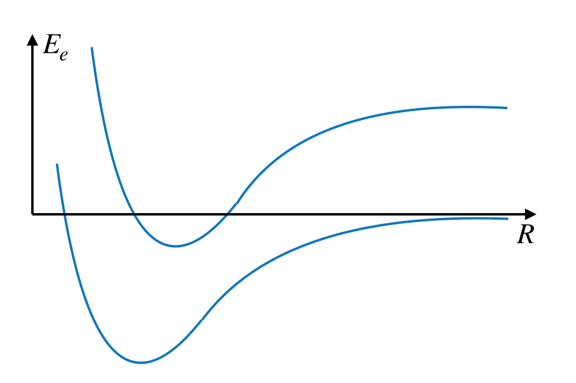
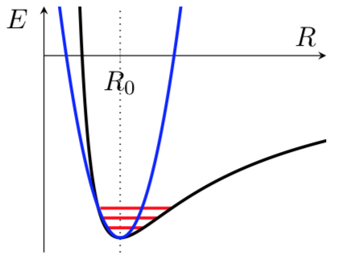
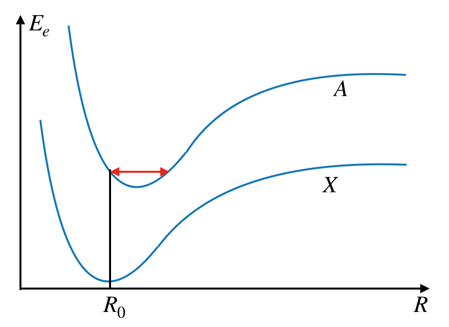
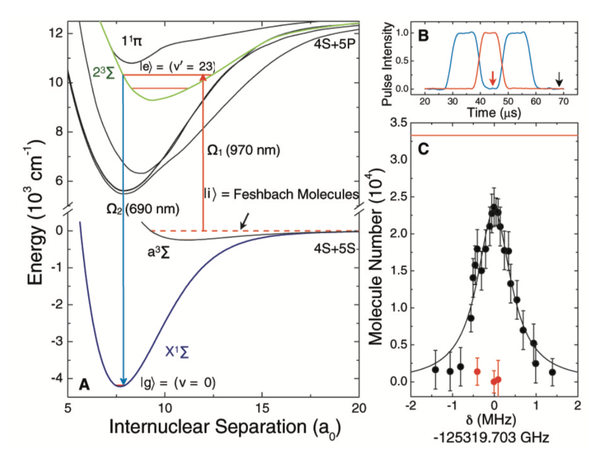
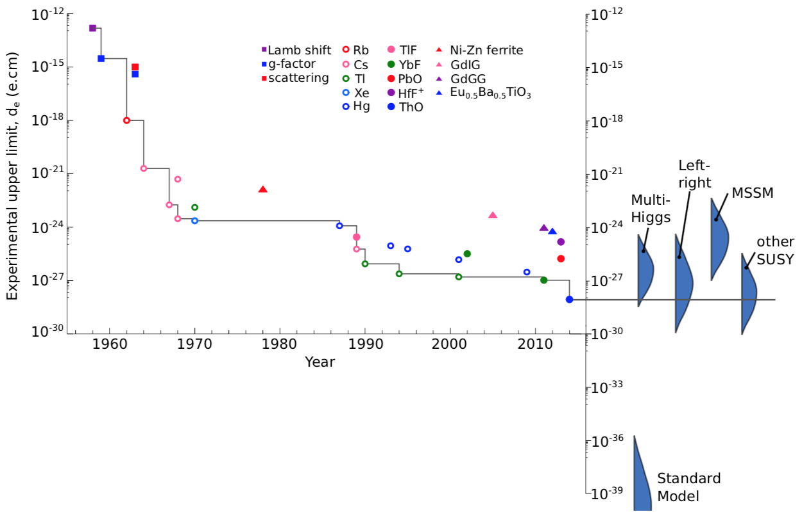

---
author:
  - Fred Jendrzejewski
  - Selim Jochim
  - Matthias Weidemüller
order: 17
title: Lecture 17 - Rotation and Vibration of Molecules
---

We will study the existance of vibrational and rotational levels in
molecules. It allows us investigate the transitions of molecules and
introduce the Franck-Condon principle. Finally, we will study how such
intruiging molecules are used for the study of the permanent electric
dipole moment of the electron.

We studied during the last two lectures the properties the electronic
structure. For atoms the next step was the analysis of the transition
rules to understand the spectrum. However, for molecules the electronic
transition directly couple to the vibrational and rotational motion of
the nuclei, which will have to study first.

# A short reminder on nuclear motion

We discussed diatomic molecules, with $N$ electrons bound to the nuclei. The full Hamiltonian of the molecule could be written in
the following fashion:
$$\hat{H} = \hat{T}_e + \hat{T}_N + V(\hat{\mathbf{R}_\mathrm{A}}, \hat{\mathbf{R}_\mathrm{B}},\hat{\mathbf{r}}_1,\cdots, \hat{\mathbf{r}}_N)$$
$\hat{T}_e$ describes the kinetic energy of the electrons, $\hat{T}_N$
the kinetic energy of the nuclei and $V$ the coupling between them. The
we decomposed the full wavefunction over a nuclear part and an
electronic part:
$$\Psi(\mathbf{R}_\mathrm{A}, \mathbf{R}_\mathrm{B}, \mathbf{r}_1,\cdots, \mathbf{r}_N) = \psi_e(\mathbf{R}_\mathrm{A}, \mathbf{R}_\mathrm{B}, \mathbf{r}_1,\cdots, \mathbf{r}_N)\cdot \psi_n(\mathbf{R}_\mathrm{A}, \mathbf{R}_\mathrm{B})$$
This allowed us to decouple nicely the two motions and study the
properties of the electronic potentials first. In the Born-Oppenheimer
approximation we obtained:

$$
\hat{T}_N \psi_N + E_e (\vec{R}_\textrm{a}, \vec{R}_\textrm{b}) \psi_N = E \psi_N
$$

with

$$
\hat{T}_N = - \frac{1}{2 M_\textrm{a}} \Delta_{\vec{R}_\textrm{a}} - \frac{1}{2 M_\textrm{b}} \Delta_{\vec{R}_\textrm{b}},
$$

the total energy $E$ and the masses of the individual
atoms $M_\textrm{a}$ and $M_\textrm{b}$. For the electronic energy
$E_e$, only $\vec{R} = \vec{R}_\textrm{a} - \vec{R}_\textrm{b}$ matters.
We then calculated the molecular potential curves $E_e(R)$, which differ
for each electronic configuration, discussed in the last lecture and sketched once more in Fig.
[1](#fig-potential).

<figure id="fig-potential">

<figcaption>The molecular potential curves obtained from the Born-Oppenheimer
Approximation.</figcaption>
</figure>

In the center of mass frame we can tranform and get:

$$
\left( - \frac{1}{2M} \Delta_{\vec{R}} + E_e (\vec{R}) \right) \psi_\textrm{n} (\vec{R}) = E \psi_\textrm{n} (\vec{R}),
$$

$\vec{R}$ is spherically symmetric, and

$$
M = \frac{M_\textrm{a} \cdot M_\textrm{b}}{M_\textrm{a} + M_\textrm{b}}
$$

is the reduced mass. This means that we can separate the
angular and radial motion to obtain:

$$
\psi_\textrm{n} (R,\theta,\varphi) = \frac{1}{R} S(R) \cdot Y_l^m (\theta,\varphi)
$$

They describe the rotational and vibrational levels of
the nucleus.

# Rotations

If we assume a "rigid" molecule where the distance between the atoms is
fixed, the rotational energy is simply given by:

$$
E_\text{rot} (R) = \frac{J\cdot (J+1)}{2M R^2}\, (\text{a.u.})
$$

where $M$ is the reduced mass of the nuclei in atomic
units and $J$ is the angular momentum quantum number. The factor $MR^2$
represents the moment of inertia. For more complex atoms the
relationship is not quite as simple and the rotational energy is
typically described by the moment of interia $I_{ij}$. The Hamiltonian
for this rotation reads then:

$$
\hat{H}_{rot} =\frac{J_x^2}{2I_{xx}}+\frac{J_y^2}{2I_{yy}}+\frac{J_z^2}{2I_{zz}}
$$

The molecule $H_2$ has then a rotational frequency
$\omega/2\pi =3\cdot 10^{12}\cdot J(J+1) \text{Hz}$.

# Vibrations

As already known from the hydrogen atom we can use the angular solutions
to discuss the radial solutions. We have to solve now:

$$
\left( \frac{1}{2M} \frac{d^2}{dR^2} + E_e (R) + \frac{1}{2M} \frac{J(J+1)}{R^2} \right) S(r) = E_\text{vib} S(R)
$$

If the extension from the minimum (see [2](#fig-internuclear)) is small, we can approximate it by a harmonic
potential. We can then find a vibrational energy
$E_\text{vib} = \omega_0 (\nu+\frac{1}{2})\, \nu=0,1,\cdots$ The
harmonic expansion around the minimum reads:

$$
E_e \approx E_0 + \frac{1}{2} M \omega_0^2 (R-R_0 )^2
$$

For the example of H~2~, we get $\omega/2\pi \sim 10^{14}$ Hz.

<figure id="fig-internuclear">

<figcaption>Internuclear potential. In the limit of a harmonic expansion around
the minimum, the vibrationally excited states are equidistant.</figcaption>
</figure>

A better approximation of the vibrational level structure than the
simple harmonic oscillator is the **Morse potential**.

## The Morse potential

In this case we approximate the molecular potential curves by:

$$
E_e(R) \approx V_\text{morse}(R)\\
V_\text{morse}(R) =hcD_e(1-e^{-ax})^2\text{ with }a =\sqrt{\frac{k}{2hcD_e}}\\
x = R-R_0
$$

Its particular usefulness stems from the fact that it is
still analyitically solvable and we obtain:

$$
E_{vib}=(\nu+\frac{1}{2})\hbar \omega-(\nu+\frac{1}{2})^2 \hbar \omega x_e\\
\omega x_e = \frac{a^2\hbar}{2M}
$$

$x_e$ is then called the anharmonicity parameter.

# Molecular transitions

We are now ready to discuss the different transitions that might appear
in the spectrum. And we will work our way through the different levels
of energy as we will see that they are all coupled.

## Rotational transitions

We will start out with the transitions of the lowest frequency, the
rotational transitions. So, we would like to know if it is possible to
transition from a state
$\left|\epsilon, J, M_J\right\rangle$ to another state
$\left|\epsilon, J', M_J'\right\rangle$, where $\epsilon$
describes the electronic and vibrational degree of freedom. This means
that we have to calculate as usual the the electric dipole moment:

$$
\left\langle\epsilon, J', M_J'\right| \vec{D}\left|\epsilon, J, M_J\right\rangle
$$

Within the Born-Oppenheimer approximation electronic and
rotational degree of freedom decouple and we can write:

$$
\left\langle\epsilon, J', M_J'\right| \vec{D}\left|\epsilon, J, M_J\right\rangle = \left\langle J', M_J'\right| \left\langle\epsilon\right|\vec{D}\left|\epsilon\right\rangle\left| J, M_J\right\rangle
$$

This electric dipole transitions were forbidden in atoms
as they do not have a permanent electric dipole moment. However,
hetero-nuclear atoms can have such a permanent electric dipole moment,
they are called polar molecules. Examples are alkali-alkali molecules
like NaK, NaCs, KRb whose permenanent electric dipole moment can be up
$3 ea_0$. It follows that:

- **Pure rotational transitions exist in polar molecules.**

The transition rules are di-atomic molecules: $\Delta J = \pm 1$ and
$\Delta M_J= 0, \pm1$. For more complex molecules these transition rules
can vary quite substantially as the rotational degree of freedom might
have to be described by an additional quantum number.

## Vibrational transitions

In the next step, we would like to understand the transitions between
different vibrational levels. Hence, we are investigating the electric
dipole moment

$$
\left\langle\epsilon, \nu'\right| \vec{D}\left|\epsilon, \nu\right\rangle= \left\langle\nu'\right| \vec{D}_\epsilon\left|\nu\right\rangle
$$

The evaluation is now not quite as simple as for the
rotational degree of freedom as both $\nu$ and $\epsilon$ will influence
the length of the molecule, they both directly depend on $R$. We can
develop the electric dipole moment as a function of distance from the
equilibrium and write then:

$$
\left\langle\nu'\right| \vec{D}_\epsilon\left|\nu\right\rangle= \left\langle\nu'\right| \left(\vec{D}_\epsilon(0)+ \frac{d\vec{D}_\epsilon}{dx}x+\cdots\right)\left|\nu\right\rangle\\
= \frac{d\vec{D}_\epsilon}{dx}\left\langle\nu'\right|x\left|\nu\right\rangle+\cdots
$$

So vibrational transistions will only happen in
molecules for which the permanent electric dipole changes as a function
of distance. Once again they are non-existant in homo-nuclear molecules.

# Vibronic transitions

At this stage, we are ready to discuss electronic transitions. If we are
performing an electronic transition this also implies a change on the
molecular potential curve as indicated in Fig.
[3](#fig-franck-condon). Imagine now the
transition of the ground state molecular branch (called the X branch) to
a higher electronic shell (called A, B, C, \...). Such a transition will
happen at constant internuclear radius as they are much faster than the
nuclei motion. This implies that an electronic transition will typically
excite the molecule into a high vibrational branch. The dipole moment is
then proportional too:

$$
\left\langle\epsilon', \nu'\right| \vec{D}\left|\epsilon, \nu\right\rangle\approx \vec{D}_{\epsilon, \epsilon'} \left\langle\nu'\right| \left|\nu\right\rangle
$$

<figure id="fig-franck-condon">

<figcaption>The Franck-Condon principle for a simple toy model.</figcaption>
</figure>

The factor
$S(\nu, \nu')=|\left\langle\nu\right|\left|\nu'\right\rangle|^2$
is then called the Franck-Condon factor and it describes the strength of
the transitions.

It is exactly this coupling of different hierarchies that makes the
molecular spectra so rich and also extremely tough to control.

# Can we get into the groundstate ?

Given all the complexities of molecules it seems non-trivial to find a
scheme that gets them into the ground state. For atoms laser cooling has
proven very efficient as we will discuss later. However, it mainly
adresses the cooling of external degrees of freedom. In molecules a
significant amount of energy its in the rotational and vibrational
levels. In this connection, a beautiful solution has been demonstrated
in [Ni 2008](http://dx.doi.org/10.1126/science.1163861).

The scheme is visualized in Fig. [4](#fig-ni2008).

<figure id="fig-ni2008">

<figcaption>TProduction of groundstate molecules of K + Rb. Figure is taken from <a href="http://dx.doi.org/10.1126/science.1163861">Ni 2008</a>  </figcaption>
</figure>

In a first step the atoms are cooled and then associated to a highly
excited molecule in the a^3^$\Sigma$ state. From there the atom has to
be transferred down in to the ground state
$\left|g\right\rangle$. A direct thransfer is not possible
as the Franck-Condon factors do not allow for it. Another path is to go
through an intermediate level (here the 2$^3 \Sigma$ level), which has
overlap with both of them. However, this level has typically overlap
with plenty of other levels and a finite lifetime. How can we then
optimize the transfer ? The idea is to use the concept of dark states in
the triplet of $\{i, e, g\}$.

## The dark states in three level systems

We can visualize the idea of the dark state transfer through the
following Hamiltonian:

$$
\hat{H}= \Omega_1\left(\left|i\right\rangle\left\langle e\right|+\left|e\right\rangle\left\langle i\right|\right)+\Omega_2\left(\left|g\right\rangle\left\langle e\right|+\left|e\right\rangle\left\langle g\right|\right)
$$

We can rewrite it as:

$$
\hat{H}= (\Omega_1\left|i\right\rangle+\Omega_2\left|g\right\rangle)\left\langle e\right|+\left|e\right\rangle(\Omega_1\left\langle i\right|+\Omega_2\left\langle g\right|)\\
\propto\left|B\right\rangle\left\langle e\right|+\left|e\right\rangle\left\langle B\right|\\
\left|B\right\rangle= \frac{\Omega_1\left|i\right\rangle+\Omega_2\left|g\right\rangle}{\sqrt{\Omega_1^2+\Omega_2^2}}
$$

So in the three level scheme the excited state is always
could to the so-called bright state, which is a coherent superposition
of $\left|g\right\rangle$ and
$\left|i\right\rangle$. The orthogonal state is the dark
state:

$$
\left|D\right\rangle= \frac{\Omega_1\left|g\right\rangle-\Omega_2\left|i\right\rangle}{\sqrt{\Omega_1^2+\Omega_2^2}}\\
\langle B| D\rangle = 0
$$

Now we can also discuss the transfer sequence non as
STIRAP (stimulated Raman adiabatic passage).

## STIRAP

STIRAP transfers the loosely bound molecules coherently into the
groundstate without ever passing through the lossy excited level. It has
the following steps:

1.  The dressing laser $\Omega_2$ is ramped on. The initial
    $\left|i\right\rangle$ is now the dark state.

2.  The coupling laser $\Omega_1$ is ramped on, while the laser
    $\Omega_2$ is ramped down. This transfers the
    $\left|i\right\rangle$ adiabatically into the state
    $\left|g\right\rangle$, which is the dark state for
    fully switched of $\Omega_2$.

The molecules are now in the groundstate with a transfer efficiency of
roughly $50\%$.

# Measurement of the electron electric dipole moment

Despite their complexity, molecules can be an enormously powerful tool
for precision measurements as you might find in [this](http://dx.doi.org/10.1103/revmodphys.90.025008) or [this review](https://arxiv.org/abs/1710.02504). The test of
the existance of a permanent electric dipole moment (electron edm) of
the electron is one of these tests.

What does does the existance of electron edm actually mean ? We have
already discussed quite heavily the existance of a permanent edm for
polar molecules. The amplitude of their dipole moment is in the order of
a few $ea_0$, which is also the natural unit for the induced edm of
atoms. One could now also imagine that the electron itself has an edm,
which is aligned with its spin $\vec{D}_e = d_e \vec{s}_e$. The standard
model actually predicts such a permanent electron edm, but only of the
amplitude $d_e \approx 10^{-30}ea_0$, which is fantastically small .
However, the search continues as most extensions of the standard model
actually predict substantially higher values as summarized in Fig.
[5](#fig-dipole). As we can see the
most precise measurments are actually performed in very heavy di-atomic
molecules.

In these molecules the electron 'feels' enormous effective electric
fields, which can reach the [several GV/cm regime](http://dx.doi.org/10.1103/physrevlett.119.153001).

<figure id="fig-dipole">

<figcaption>Search for the permanent electric dipole moment. Figure is taken from <a href="http://hdl.handle.net/10044/1/45291">here</a>  </figcaption>
</figure>

The search for the dipole moment is then testing the dependence of the
electron energy:

$$
E_\pm  = \pm(\mu B_0 + d_e E)
$$

This energy difference can be read out through Ramsey
spectroscopy. Switching the electric field allows then to switch the
frequency difference by $\hbar \delta \omega = 4d_e E$. Only an upper
limit is known up to now $|d_e|< 8.7 e cm$.
