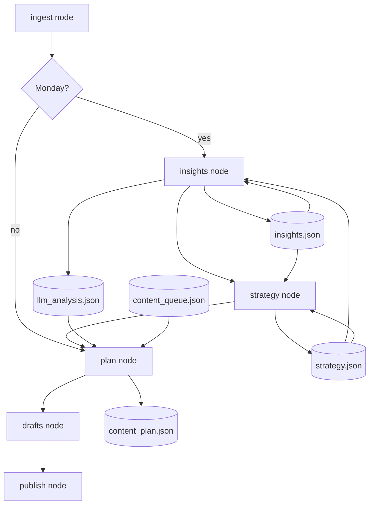
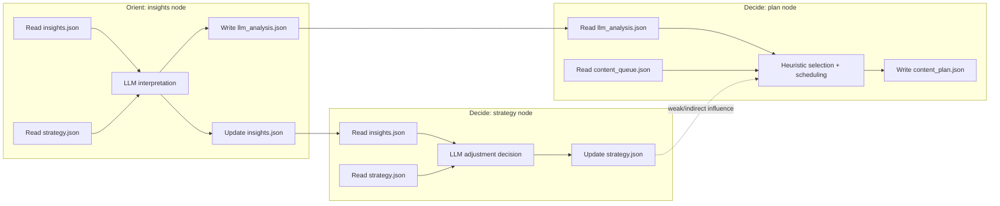
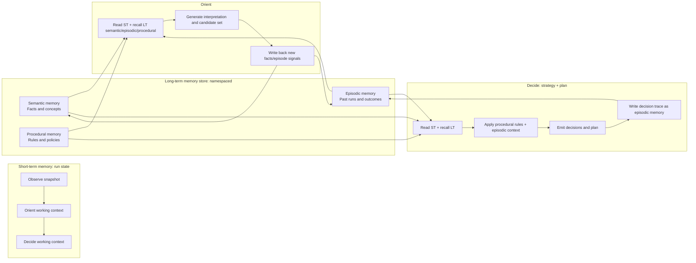

# AI Growth Agent — Social Media Follower Growth

## Implementation Plan & Architecture

---

# 1. Objective

Build an AI-powered **Social Media Growth Agent** that:

* Analyzes website traffic (Umami) and social media engagement
* Generates social media posts (Mastodon, Bluesky, later Threads)
* Drives followers from social networks to the website
* Continuously improves strategy via feedback loops

**Primary goal:** Grow social media followers → drive traffic to fretchen.eu

---

# 2. Core Design Principles

* **Structured > autonomous**: Agent operates within controlled workflows
* **State-driven system**: JSON files as the source of truth
* **Human-in-the-loop**: Approval before publishing (initially)
* **Iterative learning loop**: Continuous optimization based on performance
* **Consistent stack**: Python Scaleway Container, matching existing deployment patterns
* **Blog is read-only**: Agent reads blog content as input, but never publishes to the blog

---

# 3. High-Level Architecture

## Target: OODA Loop

The agent follows an **OODA (Observe → Orient → Decide → Act)** architecture,
the state-of-the-art for autonomous growth agents. Each OODA phase maps to
LangGraph nodes in `agent/graph.py`:

| OODA Phase | Node | Responsibility | Status |
|---|---|---|---|
| **Observe** | `ingest` | Umami analytics + social follower counts | ✅ |
| **Orient** | `insights` | LLM analyses patterns in all observed data | ✅ (Monday only) |
| **Decide** | `strategy` | LLM adjusts strategy based on insights + Umami data | ✅ (Monday only) |
| **Decide** | `plan` | Select pages, assign channels + schedule | ✅ |
| **Act** | `drafts` | LLM generates platform-specific post content | ✅ |
| **Act** | `publish` | Post to Mastodon/Bluesky, record metrics | ✅ |

**Current graph:**
```
START → [Ingest] → (Monday? → [Insights] → [Strategy]) → [Plan] → [Drafts] → [Publish] → END
```

> **Why Plan is separate from Drafts:** Plan decides *what* to post (which pages,
> which channels, when). Drafts decides *how* to say it (LLM content generation).
> This separation enables strategy to influence planning without touching content
> generation, and makes each node independently testable.

## 3.1 IST Analysis: `insights`, `strategy`, `plan`

This section documents the current (as-is) behavior of the three core nodes,
which files they use, and how well they map to the originally intended OODA
loop.

### Node responsibilities and file usage (as-is)

| Node | OODA role | What it does today | Reads | Writes | Code entrypoint |
|---|---|---|---|---|---|
| `insights` | **Orient** | Interprets latest analytics/social data with LLM, proposes `best_pages_for_social`, `top_topics`, `content_gaps`, and `growth_opportunities` | `insights.json`, `strategy.json` | `llm_analysis.json`, updated `insights.json` | `agent/nodes/insights.py` |
| `strategy` | **Decide** (strategic) | Asks LLM whether to adjust strategy and applies at most one pillar replacement plus one posting frequency change | `insights.json`, `strategy.json` | updated `strategy.json` (with `changes` audit log) | `agent/nodes/strategy.py` |
| `plan` | **Decide** (operational) | Computes pipeline depth, selects pages from `llm_analysis`, assigns channel/time slots, and writes a concrete plan for draft generation | `llm_analysis.json`, `content_queue.json` | `content_plan.json` | `agent/nodes/plan.py` |

Additional runtime dependencies:

- `agent/graph.py`: controls routing (`ingest -> insights -> strategy -> plan` on Monday, otherwise `ingest -> plan`).
- `agent/storage.py`: `load_model()` + storage read/write abstraction used by all nodes.
- `agent/models.py`: schema contracts (`LLMAnalysis`, `Strategy`, `ContentQueue`, `ContentPlan`).
- `agent/page_meta.py`: used by `insights` and `plan` to fetch page metadata.
- `agent/llm_client.py`: used by `insights` and `strategy` only.

### Detailed current behavior per node

#### `insights` node (Orient)

1. Loads `insights.json` and `strategy.json`.
2. Builds a broad analytics prompt (top pages, referrers, events, social summary).
3. Calls LLM with `LLMAnalysis` schema.
4. Persists full model output to `llm_analysis.json`.
5. Updates `insights.json` with `growth_opportunities` and `last_analysis`.

Role fulfillment (as-is):

- Strong on interpretation/synthesis of observed data.
- Uses strategy context in the prompt, so orientation is not purely reactive.
- Diversity intent exists in prompt instructions, but enforcement is not hard at this step.

#### `strategy` node (Decide, strategic)

1. Loads `insights.json` and current `strategy.json`.
2. Calls LLM with conservative adjustment rules.
3. Applies up to one content pillar replacement and up to one frequency change.
4. Appends `StrategyChange` entries with timestamp/reason.
5. Persists updated `strategy.json` only if a change is applied.

Role fulfillment (as-is):

- Clearly acts as a strategic decision layer.
- Has a bounded-change policy and audit trail.
- Produces durable policy state (`strategy.json`), but downstream operational enforcement is partial.

#### `plan` node (Decide, operational)

1. Loads `llm_analysis.json` and queue state (`content_queue.json`).
2. Computes `needed` based on pipeline depth (`drafts` + future `approved`).
3. Selects candidate pages using local heuristic (`proven`/`exploratory` mix + dedupe in candidate set).
4. Builds schedule (alternating channel, one-day spacing).
5. Builds `ContentPlanItem[]` and writes `content_plan.json`.

Role fulfillment (as-is):

- Clearly turns analysis into executable operational decisions.
- Deterministic scheduling and pipeline-fill behavior are implemented.
- Selection focuses on current candidate list; history-aware anti-repeat guarantees are limited.

### Flow visualization (current implementation)



### OODA fit: precise IST + GAP

#### Intended mapping (documented)

- Observe: `ingest`
- Orient: `insights`
- Decide: `strategy` + `plan`
- Act: `drafts` + `publish`

#### As-is fit

1. **Observe -> Orient** is present and functional: `insights` consumes observed data and transforms it into structured interpretation.
2. **Orient -> Decide (strategic)** is present and functional: `strategy` applies bounded, auditable policy changes.
3. **Decide (operational) -> Act** is present and functional: `plan` emits concrete, schedulable work for `drafts`/`publish`.

#### Gaps against a fully closed OODA decision loop

1. **Strategic decision propagation gap**: `strategy.json` is updated, but `plan` relies primarily on `llm_analysis.json` + queue state and does not consume strategy as a strict operational policy contract.
2. **Decision traceability gap**: there is no explicit persisted explanation linking each `content_plan.json` item back to strategy constraints vs. insights evidence.
3. **History-aware decision guarantee gap**: operational selection enforces local candidate heuristics, but does not enforce a strong cross-run anti-repeat policy over published history.

Conclusion (as-is): the architecture follows OODA structurally, but the Decide phase is split into strategic and operational layers with only partial hard coupling between them.

## 3.2 Memory Handling in Orient/Decide (IS vs SHOULD)

This section focuses only on memory handling in the Orient (`insights`) and
Decide (`strategy`, `plan`) phases.

Scope:

- IS analysis: current persisted state and read/write flows.
- SHOULD analysis: conceptual target shape based on LangChain memory concepts
  (short-term state + long-term memory store with semantic, episodic, and
  procedural memory).
- Gap analysis: biggest gaps only, no implementation recommendations.

### Memory model (IS)

Current memory is JSON-file centric and node-local:

- `insights` reads `insights.json` and `strategy.json`, then writes
  `llm_analysis.json` and updates `insights.json`.
- `strategy` reads `insights.json` and `strategy.json`, then conditionally writes
  `strategy.json`.
- `plan` reads `llm_analysis.json` and `content_queue.json`, then writes
  `content_plan.json`.

Properties of the current model:

- Persistence exists (files in S3/local), but memory is mostly artifact-based.
- There is no explicit memory taxonomy (semantic/episodic/procedural) in storage.
- There is no explicit retrieval layer; each node directly loads specific files.
- Cross-node state transfer is file-to-file, not namespace/query-based memory recall.

### Memory flow (IS) - detailed graph



### Memory model (SHOULD, conceptual)

Based on LangChain memory concepts, orient/decide memory ideally has two layers:

1. Short-term memory (thread/run scoped state):
  per-run working state used by nodes during one invocation.
2. Long-term memory (cross-run store, namespaced):
  persistent memory with explicit memory types.

Conceptual long-term memory types for this workflow:

- Semantic memory (facts): topic performance facts, stable page/topic metadata,
  recurring audience signals.
- Episodic memory (experiences): prior planning/publishing episodes, selected
  topics/channels/timing and observed outcomes.
- Procedural memory (rules): strategy and planning constraints (policy-level
  rules and stable operating instructions).

### Memory flow (SHOULD, conceptual graph)



### Biggest gaps (IS vs SHOULD)

1. Memory taxonomy gap:
  current storage does not explicitly separate semantic, episodic, and
  procedural memory; information is spread across operational JSON artifacts.
2. Retrieval gap:
  orient/decide do not perform explicit memory recall across namespaces/types;
  they load fixed files only.
3. Strategy-to-plan transmission gap:
  strategic memory (`strategy.json`) is not consumed by `plan` as a strict
  decision policy input.
4. Episodic continuity gap:
  there is no explicit decision-trace memory linking prior decisions,
  rationales, and outcomes into reusable episodic context for the next run.
5. Memory write-path clarity gap:
  writes are artifact updates (`*.json`) but not clearly modeled as hot-path vs
  background memory formation with typed memory objectives.
6. Cross-run grounding gap:
  plan decisions are grounded mainly in latest analysis artifact and queue state,
  not in a first-class long-term memory retrieval step.

## 3.3 Priority Fixes and Complexity-Benefit Analysis (Orient/Decide Memory)

This section prioritizes the biggest problems to fix now, compares solution
options by implementation complexity vs expected benefit, and identifies the
closest KISS path for closing the most critical gaps.

### Biggest problems to fix first (priority order)

1. Strategy-to-plan transmission gap
  The strategic memory exists (`strategy.json`) but is not used by plan as a
  strict decision policy input. This weakens the entire Decide phase.
2. Episodic continuity gap
  There is no explicit memory of prior planning decisions and outcomes that can
  be recalled in later runs.
3. Cross-run grounding gap
  Plan is grounded mostly in current `llm_analysis.json` + queue state, not in
  explicit long-term memory recall.
4. Retrieval gap
  Orient/Decide nodes load fixed files directly and cannot query memory by type
  or intent.
5. Memory write-path clarity gap
  Memory updates are not modeled explicitly as hot-path vs background memory
  writes.
6. Memory taxonomy gap
  Semantic, episodic, and procedural memory are not explicitly separated.

### Option analysis by complexity vs benefit

Scale used:

- Complexity: Low / Medium / High
- Benefit: Low / Medium / High

| Option | Description | Complexity | Benefit | Biggest gaps addressed |
|---|---|---|---|---|
| A | Minimal policy propagation: strategy constraints are explicitly consumed in plan input before selection/scheduling | Low | High | #1, partially #3 |
| B | Episodic decision log artifact (separate memory file for planning decisions + outcomes) used by orient/decide recall | Low-Medium | High | #2, #3, partially #4 |
| C | Typed memory split over current JSON storage (semantic/episodic/procedural artifacts with explicit ownership) | Medium | Medium-High | #2, #5, #6 |
| D | Add retrieval layer on top of file artifacts (namespace/type-based recall abstraction) | Medium | High | #3, #4, partially #6 |
| E | Full long-term memory store with namespaced documents and search | High | High | #2, #3, #4, #5, #6 |
| F | Introduce hot-path plus background memory writing model | High | Medium-High | #2, #5 |

### Complexity-benefit interpretation

1. Option A has the best immediate ratio:
  low implementation complexity with direct impact on the most critical Decide
  coupling gap.
2. Option B is the next strongest leverage:
  still relatively lightweight, but significantly improves cross-run continuity
  and decision grounding.
3. Option D adds strong architectural value at moderate cost:
  improves memory recall quality without requiring a full memory platform
  migration.
4. Options E/F are powerful but not KISS:
  high implementation effort and operational complexity.

### Closest KISS path for biggest gap closure (analysis only)

From a complexity-benefit perspective, the closest KISS path is:

1. First layer: Option A
  ensure strategy memory is a direct policy input to plan decisions.
2. Second layer: Option B
  establish explicit episodic continuity between runs.
3. Third layer: Option D (only if needed)
  add a lightweight retrieval abstraction when fixed-file loading becomes a
  bottleneck.

Why this is the closest KISS trajectory:

- It addresses the top two high-impact gaps first (#1 and #2).
- It preserves the current file-based architecture initially.
- It delays high-complexity memory platform work until there is evidence that
  lightweight recall abstractions are insufficient.

### Summary table (what to fix now vs later)

| Horizon | Focus | Rationale |
|---|---|---|
| Now | Strategy-to-plan propagation + episodic continuity | Highest impact, lowest complexity |
| Next | Retrieval abstraction over memory artifacts | Improves grounding and recall quality |
| Later | Full memory store + hot/background memory pipeline | High value, but only justified after simpler layers saturate |

## System Overview

```
┌─────────────────┐    ┌──────────────────┐
│ Umami Analytics  │    │  Blog Content     │
│ (Page Views,     │    │  (website/blog/)  │
│  Event Funnels)  │    │  Read-Only Input  │
└────────┬────────┘    └────────┬──────────┘
         │                      │
         ▼                      ▼
┌─────────────────────────────────────────┐
│  growth-agent/ (Python 3.11, Cron)      │
│  Scaleway Container — Daily 08:00 UTC   │
│                                         │
│  ┌─────────────┐  ┌──────────────────┐  │
│  │ Analytics    │→ │ Insight          │  │
│  │ Ingest      │  │ Generation (LLM) │  │
│  └─────────────┘  └───────┬──────────┘  │
│                           ▼              │
│  ┌─────────────┐  ┌──────────────────┐  │
│  │ Strategy    │← │ Content Planning │  │
│  │ State (S3)  │  │ (LLM)           │  │
│  └─────────────┘  └───────┬──────────┘  │
│                           ▼              │
│                   ┌──────────────────┐   │
│                   │ Content Creation │   │
│                   │ (LLM)           │   │
│                   └───────┬──────────┘   │
│                           ▼              │
│                   ┌──────────────────┐   │
│                   │ Publishing       │   │
│                   │ (Mastodon API,   │   │
│                   │  Bluesky atproto)│   │
│                   └──────────────────┘   │
└──────────────┬──────────────────────────┘
               │ reads/writes
               ▼
┌──────────────────────┐
│ S3 State Storage     │
│ (my-imagestore/      │
│  growth-agent/*.json)│
└──────────────────────┘
               ▲ reads/writes
               │
┌──────────────┴──────────────────────────┐
│  scw_js/growth_api.ts (Node 22, HTTP)   │
│  Draft Approval API — Scaleway Function  │
│                                         │
│  ┌──────────────────────────────────┐   │
│  │ Path-based routing:              │   │
│  │ GET  /drafts, /status, /insights │   │
│  │ PUT  /drafts/:id                 │   │
│  │ POST /drafts/:id/approve|reject  │   │
│  └──────────────────────────────────┘   │
│  Auth: viem.verifyMessage() EIP-191     │
└──────────────┬──────────────────────────┘
               │ HTTP
               ▼
┌─────────────────────────────────────────┐
│  website/pages/growth/ (Vite+Vike)      │
│  Wagmi wallet connect → Owner check     │
│  Draft list, edit, schedule, approve    │
└─────────────────────────────────────────┘
```

---

# 4. Technology Stack

## Runtime & Deployment

| Component       | Technology                      | Justification                                       |
| --------------- | ------------------------------- | --------------------------------------------------- |
| Runtime (Cron)  | Python 3.11 (Scaleway Container) | LLM ecosystem, social media libraries               |
| Runtime (API)   | Node 22 (Scaleway Function)      | Reuses scw_js/ — viem, S3, pino already available   |
| Dep Management  | `uv` (Python), `npm` (TypeScript) | Separate toolchains per runtime                    |
| Deployment      | OpenTofu (Container), `serverless-scaleway-functions` (API) | IaC for container, serverless for Node |
| Container Build | Colima + Docker CLI              | Lightweight Docker-compatible runtime for macOS     |
| Trigger         | Scaleway Container Cron (daily)  | HTTP POST to container, serverless scale-to-zero    |
| State Storage   | S3 (`my-imagestore` bucket)     | Already used by scw_js/ for Merkle tree data         |
| LLM             | IONOS AI Model Hub              | Existing integration, OpenAI-compatible API          |
| LLM Model       | `meta-llama/Llama-3.3-70B-Instruct` | Already in use by scw_js/llm_service.js         |
| Agent Framework | LangGraph                       | Structured multi-step workflows, state management    |

## Social Media APIs

| Platform  | API                     | Auth                    | Status        |
| --------- | ----------------------- | ----------------------- | ------------- |
| Mastodon  | REST API (v1/v2)        | OAuth2 Bearer Token     | **Phase 1** ✅ OAuth app created |
| Bluesky   | AT Protocol (atproto)   | App Password            | **Phase 1** ✅ App password generated |
| Threads   | Meta Threads API        | Instagram OAuth + Token | **Phase 2** ⚠ |

> ⚠ **Threads API** requires Meta App Review and Instagram Business account.
> Evaluate feasibility in Phase 2. API is relatively open for posting but
> rate-limited and requires approval process.

## Existing Infrastructure Reused

* **Umami Analytics** — Website ID `e41ae7d9-a536-426d-b40e-f2488b11bf95` on cloud.umami.is
* **S3 Bucket** — `my-imagestore.s3.nl-ams.scw.cloud` for state persistence
* **IONOS LLM** — `https://openai.inference.de-txl.ionos.com/v1/chat/completions`
* **Social Profiles** — `@fretchen@mastodon.social`, `fretchen.eu` on Bluesky
* **Bridgy** — Existing cross-posting via webmentions (can coexist with direct API posting)

---

# 5. Folder Structure

### growth-agent/ (Python — AI pipeline + Cron)

```
growth-agent/
│
├── pyproject.toml          # uv-managed dependencies
├── uv.lock                 # Lockfile
├── .env.example            # Required environment variables
├── .gitignore
│
├── agent/
│   ├── __init__.py
│   ├── models.py           # Pydantic state models (Insights, Strategy, Draft, LLMAnalysis, PageMeta, ...)
│   ├── llm_client.py       # IONOS LLM client (langchain-openai ChatOpenAI)
│   ├── umami_client.py     # Umami Cloud REST API client
│   ├── page_meta.py        # HTTP-based page metadata fetcher (title, description from meta tags)
│   ├── storage.py          # LocalStorage (notebooks) + S3Storage (production) + load_model helper
│   ├── publisher.py        # Publish approved drafts to platforms
│   ├── platforms/           # (Phase 1a)
│   │   ├── mastodon.py     # Mastodon REST API client (httpx)
│   │   └── bluesky.py      # AT Protocol client (httpx)
│   ├── nodes/               # LangGraph node modules
│   │   ├── __init__.py
│   │   ├── ingest.py       # ingest_analytics() — Umami + social metrics
│   │   ├── insights.py     # generate_insights() — LLM analysis + prompt templates
│   │   ├── strategy.py     # adjust_strategy() — LLM strategy adjustments + audit log
│   │   ├── plan.py         # create_plan() — page selection, scheduling, pipeline depth
│   │   ├── drafts.py       # create_drafts() — LLM content generation per plan item
│   │   └── publish.py      # publish_approved_drafts() — platform posting + char limits
│   ├── state.py            # AgentState TypedDict (shared across graph and nodes)
│   └── graph.py            # LangGraph StateGraph — OODA loop compilation
│
├── notebooks/
│   ├── 01_umami_ingest.ipynb
│   ├── 02_llm_insights.ipynb
│   ├── 03_content_creation.ipynb
│   ├── 04_s3_state.ipynb
│   ├── 05_social_posting.ipynb
│   └── 06_approval.ipynb          # Phase 1a: review, edit & approve drafts
│
├── handler.py              # Scaleway Container entry point (HTTP server + graph invocation, ~180 lines)
├── Dockerfile              # (Phase 1f) Container image definition (uv + Python 3.11)
├── .dockerignore           # (Phase 1f) Excludes .venv, tests, notebooks from image
│
├── terraform/              # (Phase 1f) OpenTofu infrastructure
│   ├── main.tf             # Container + cron + secrets
│   ├── variables.tf        # Secret variable declarations
│   └── .gitignore          # .terraform/, *.tfstate*, *.tfvars
├── bin/
│   └── deploy.sh           # (Phase 1f) Build + push + tofu apply
│
└── test/
    └── ...
```

### scw_js/ additions (TypeScript — Draft Approval API)

The API lives in `scw_js/` alongside existing functions (LLM, image gen, leaf history).
This avoids a new project, reuses `viem`, `@aws-sdk/client-s3`, `pino`, and the
existing Serverless Framework deployment.

```
scw_js/
├── growth_api.ts           # (Phase 1c) Handler: path-based routing for /drafts, /insights, etc.
├── growth_service.ts       # (Phase 1c) S3 read/write for growth-agent/*.json + wallet auth
├── serverless.yml          #            + new `growthapi` function entry
├── tsup.config.js          #            + growth_api.ts in entry array
└── test/
    └── growth_api.test.ts  # (Phase 1c) Tests for API routes + auth
```

### website/ additions (Frontend — Approval UI)

```
website/pages/growth/
└── +Page.tsx               # (Phase 1d) Draft approval page with Wagmi wallet auth
```

> **Note:** `growth-agent/` is its own subproject in the monorepo, managed with `uv`
> (not Poetry like `notebooks/`). It has its own `pyproject.toml` and `uv.lock`.
> The API in `scw_js/` shares the existing `package.json` and deployment pipeline.

---

# 6. Scaleway Deployment

## growth-agent/ (Python — Scaleway Serverless Container)

**Status:** Migrating from Scaleway Functions to Serverless Containers (see Phase 1f).

**Why Containers instead of Functions:**
Scaleway Python Functions require vendoring all dependencies into a `package/` directory
(`pip install --target ./package`). With ~40 dependencies including C-extensions
(tiktoken, pydantic-core), this is fragile and error-prone. Containers solve this
with a standard Dockerfile and `uv sync`.

**Architecture:**
- Docker image built with `uv` (no `requirements.txt` needed)
- Scaleway Container Registry for image storage
- Scaleway Serverless Container with `min_scale=0` (scale-to-zero)
- Cron trigger sends HTTP POST to `/` daily at 08:00 UTC
- OpenTofu manages all infrastructure (container, cron, secrets)

**Container Runtime:**
- Port: `$PORT` (set by Scaleway), fallback `8080`
- Cron sends POST with JSON body to `/`
- Health check: `GET /health` → 200
- Retry: up to 3 attempts on status ≥ 300 (handler is idempotent)

> **Note:** The container namespace is separate from `scw_js/`.
> The approval API remains in `scw_js/` as a Node 22 Function.

## scw_js/serverless.yml additions (TypeScript — API)

Add the growth API function to the existing `scw_js/serverless.yml`:

```yaml
# ... existing functions ...
  growthapi:
    handler: dist/growth_api.handle
    description: "Growth Agent API - draft approval with wallet auth"
    minScale: 0
    maxScale: 1
```

Additional secrets needed in the `scw_js/` provider block:

```yaml
  secret:
    # ... existing secrets ...
    OWNER_ETH_ADDRESS: ${env:OWNER_ETH_ADDRESS}
```

> The `growthapi` function deploys alongside `genimgx402token`, `llm`, and `leafhistory`
> in the same Scaleway namespace. It reuses the same S3 credentials and Node 22 runtime.
> Wallet auth uses `viem.verifyMessage()` (already a dependency).

---

# 7. State Schemas (stored in S3)

## 7.1 strategy.json

```json
{
  "content_pillars": [
    "Politische Ökonomie & Spieltheorie",
    "Blockchain & Web3 (NFTs, x402, Smart Contracts)",
    "Quantencomputing & QML",
    "AI-Tools & Infrastruktur"
  ],
  "channels": ["mastodon", "bluesky"],
  "posting_frequency": {
    "mastodon": 5,
    "bluesky": 5
  },
  "tone": "insightful, technical, opinionated, accessible",
  "languages": ["en", "de"],
  "target_audience": "Tech-curious academics, developers, blockchain enthusiasts",
  "website_url": "https://fretchen.eu",
  "last_updated": "2026-04-12"
}
```

## 7.2 insights.json

```json
{
  "website_analytics": {
    "top_pages": [],
    "top_referrers": [],
    "event_funnels": {
      "wallet_connect": { "attempts": 0, "successes": 0, "conversion": 0 },
      "imagegen": { "hovers": 0, "clicks": 0, "creations": 0 },
      "assistant": { "hovers": 0, "first_messages": 0 },
      "blog_support": { "hovers": 0, "clicks": 0, "successes": 0 }
    }
  },
  "social_metrics": {
    "mastodon": { "followers": 0, "engagement_rate": 0, "top_posts": [] },
    "bluesky": { "followers": 0, "engagement_rate": 0, "top_posts": [] }
  },
  "growth_opportunities": [],
  "last_analysis": null
}
```

## 7.3 content_queue.json

```json
{
  "drafts": [
    {
      "id": "draft_001",
      "created": "2026-04-12T08:00:00Z",
      "channel": "mastodon",
      "language": "en",
      "content": "...",
      "source_blog_post": "prisoners_dilemma_interactive",
      "hashtags": ["#GameTheory", "#PoliticalEconomy"],
      "link": "https://fretchen.eu/blog/prisoners_dilemma_interactive",
      "status": "pending_approval"
    }
  ],
  "approved": [
    {
      "id": "draft_002",
      "content": "... (edited by human) ...",
      "scheduled_at": "2026-04-14T09:00:00Z",
      "status": "approved"
    }
  ],
  "published": [],
  "rejected": []
}
```

## 7.4 performance.json

```json
{
  "posts": [
    {
      "id": "draft_001",
      "channel": "mastodon",
      "published_at": "2026-04-12T10:00:00Z",
      "platform_id": "123456789",
      "metrics": {
        "reblogs": 5,
        "favourites": 12,
        "replies": 2,
        "link_clicks": null
      },
      "website_referral_sessions": 0
    }
  ]
}
```

---

# 8. Analytics Integration

## 8.1 Umami Data (Website)

**API:** Umami Cloud REST API (requires API token from cloud.umami.is)

Data to ingest:
* **Page views** — top pages, trends, bounce rates
* **Referrers** — which social platforms drive traffic
* **Event funnels** — existing tracked events:
  - `wallet-*` events (connect funnel)
  - `imagegen-*` events (artwork creation funnel)
  - `assistant-*` events (AI chat adoption)
  - `blog-support-*` events (donation/star funnel)
* **UTM tracking** — tag social posts with `?utm_source=mastodon&utm_campaign=growth-agent`

> **OPEN:** Umami free plan API access — check if REST API is included.
> If not, consider upgrading or scraping dashboard data as fallback.

## 8.2 Mastodon Metrics

**API:** `GET /api/v1/accounts/verify_credentials` → follower count
**API:** `GET /api/v1/accounts/:id/statuses` → post metrics (reblogs, favourites, replies)

Available metrics:
* Follower count (daily delta)
* Per-post: reblogs, favourites, replies
* Notification stream for mentions/follows

## 8.3 Bluesky Metrics

**API:** `app.bsky.actor.getProfile` → follower count
**API:** `app.bsky.feed.getAuthorFeed` → post metrics (likes, reposts, replies)

Available metrics:
* Follower count (daily delta)
* Per-post: likes, reposts, replies, quote posts

## 8.4 Cross-Platform Attribution

* All social posts include tagged links: `https://fretchen.eu/blog/...?utm_source=mastodon`
* Umami tracks UTM parameters → map website visits back to social posts
* Goal: measure "social post → website visit → funnel action" conversion

---

# 9. Node Implementation Reference

All node logic lives in `agent/nodes/`. Each module is self-contained with its
own LLM prompts, storage I/O, and error handling. See Section 3 (OODA table)
for responsibilities and Section 5 (folder structure) for file descriptions.

**Key design decisions:**
- Prompts are inline in each node module (not externalized) — co-located with the logic that uses them
- All nodes read/write state via `storage` (S3 in production, local in notebooks)
- `load_model()` helper provides type-safe deserialization with Pydantic defaults
- Strategy constraints (max 1 change per run) are enforced in code, not via prompts

---

# 10. Execution Schedule

## Daily Cron (08:00 UTC)

1. **Analytics Ingest** — fetch Umami + social metrics
2. **Check approved queue** — publish any approved drafts with `scheduled_at <= now`
3. **Performance update** — refresh metrics for published posts
4. **Pipeline refill** *(Phase 1e)* — count pending + approved drafts, generate new ones if < 10.
   Each new draft auto-scheduled at `last_slot + 1 day`, alternating Mastodon/Bluesky.
   Uses last saved LLMAnalysis from S3 (no LLM call unless Monday).

## Weekly (Monday run, logic in agent)

5. **Insight Generation** — LLM analysis of weekly data, persisted to `growth-agent/llm_analysis.json`
6. **Strategy Update** — adjust if data warrants it
7. **Content Planning** — generate draft ideas (folded into pipeline refill step 4)

## Human (async)

8. **Review drafts** — edit/approve/reject via website page (`/growth`).
   Pre-filled `scheduled_at` can be overridden during approval.

---

# 11. API Endpoints — Phase 1c

These endpoints are served by the `growthapi` function in **`scw_js/`** (Node 22),
accessible via the Scaleway-generated domain (no custom domain needed).
The static approval page (Phase 1d) and any other client consumes these endpoints.
All endpoints require an EIP-191 signature from `OWNER_ETH_ADDRESS`.

| Method | Path                    | Description                              |
| ------ | ----------------------- | ---------------------------------------- |
| GET    | `/drafts`               | All drafts (optionally filter `?status=pending_approval`) |
| GET    | `/insights`             | Latest insights and analytics            |
| GET    | `/performance`          | Published post metrics                   |
| PUT    | `/drafts/:id`           | Edit draft content (pending or approved) |
| POST   | `/drafts/:id/approve`   | Approve with optional `{ scheduled_at }` |
| POST   | `/drafts/:id/reject`    | Reject draft                             |

### Authentication

All non-OPTIONS requests require an `Authorization` header:

```
Authorization: Bearer <base64-encoded JSON>
```

Payload: `{ "address": "0x...", "signature": "0x...", "message": "growth-api:1713000000" }`

**Verification steps:**
1. `viem.verifyMessage({ address, message, signature })` — valid EIP-191 signature
2. `address.toLowerCase() === OWNER_ETH_ADDRESS.toLowerCase()` — owner check
3. **Replay protection:** `message` must be `"growth-api:<unix-timestamp>"` where
   timestamp is within 5 minutes of server time. Simple, no server-side state needed.

### Draft Editing Scope

Drafts with status `pending_approval` **and** `approved` (not yet published) can be
edited via `PUT /drafts/:id`. This allows correcting a draft even after approval,
as long as the cron hasn't published it yet.

> Path-based routing in a single function, matching `x402_facilitator` pattern.
> Implementation lives in `scw_js/growth_api.ts` + `scw_js/growth_service.ts`.
> Auth uses `viem.verifyMessage()` — no SIWE or web3.py needed.
> Not needed during Phase 1a — the notebook reads/writes state directly.

---

# 12. Observability & Logging

* **S3 logs** — `growth-agent/logs/YYYY-MM-DD.json` per run
* **Structured logging** — JSON format, matching scw_js/ pino pattern
* **Metrics tracked:**
  - Follower count (daily, per platform)
  - Posts published (daily)
  - Engagement rate (weekly average)
  - Website referrals from social (weekly)
  - LLM token usage (cost tracking)

---

# 13. Phase Plan

## Phase 0 — Local Validation (Notebooks) ✅ COMPLETE

Validated each pipeline node interactively in Jupyter notebooks (`growth-agent/notebooks/`).
Notebooks 01–04 cover Umami ingest, LLM insights, content creation, and S3 state.
Social posting (notebook 05) was deferred to Phase 1a.

### Phase 0 Lessons Learned

1. **Post quality requires human editing, not just approval.** LLM-generated posts are
   a useful starting draft but consistently need tone/content adjustments before publishing.
   The approval workflow must support **editing**, not just approve/reject.
2. **Page descriptions are essential context.** Without fetching the meta description from
   the target page, the LLM produces generic, superficial posts. `page_meta.py` fetches
   `<meta name="description">` via HTTP — works for all page types (blog, quantum, lab).
3. **Structured output eliminates fragile JSON parsing.** Using `langchain-openai`'s
   `with_structured_output()` with Pydantic models is far more reliable than prompting
   for JSON and parsing with `json.loads()` + code-fence stripping.
4. **IONOS supports `response_format: json_schema` with `strict: true`** — OpenAI-compatible
   structured output works out of the box.

## Phase 1a — Notebook Approval, Posting & Scheduling ✅ COMPLETE

Edit and approve drafts in a notebook, publish to Mastodon and Bluesky,
with a scheduled publishing queue. Mastodon/Bluesky posting clients in `agent/platforms/`.

## Phase 1b — Python Cron Deployment (PR: `growth-agent/`) ✅ COMPLETE

Deployed the AI pipeline as a Scaleway Python Function with daily cron trigger (`0 8 * * *`).
`handler.py` entry point, S3 state, Umami ingest, LLM insights, draft generation.
Later replaced by container in Phase 1f.

## Phase 1c — Draft Approval API (PR: `scw_js/`) ✅ COMPLETE

TypeScript API (`growth_api.ts`) for draft management in the `scw_js/` namespace.
Path-based routing, CORS, wallet auth, S3 read/write. 140 tests.

## Phase 1d — Approval Website (PR: `website/`) ✅ COMPLETE

Static prerendered approval page (`/growth`), authenticated via ETH wallet.
Uses existing Wagmi, Panda CSS, `useUmami`. 22 tests.

**Key implementation patterns:**
- Auth caching (4-min TTL) with in-flight promise deduplication
- Unlisted page — access via direct URL only (owner-only)
- Optimistic UI updates after approve/reject
- `OWNER_ADDRESS` centralized in `website/utils/getChain.ts`

## Phase 1e — Auto-Scheduling & Pipeline Depth (PR: `growth-agent/` + `website/`) ✅ COMPLETE

1 post/day (alternating Mastodon/Bluesky), auto-scheduled at draft creation,
10-post pipeline maintained. Daily draft generation with pipeline guard,
weekly insights (Monday only). LLMAnalysis persisted to S3 for reuse.

## Phase 1f — Container Migration (PR: `growth-agent/`) ✅ COMPLETE

Migrated from Scaleway Functions to Serverless Containers for reliable Python
dependency management. Docker image (`uv:python3.11-trixie-slim`), OpenTofu IaC
(`growth-agent/terraform/`), deploy script (`bin/deploy.sh`).

**Why:** Scaleway Python Functions silently fail with ~40 deps (langchain, boto3,
tiktoken) requiring C-extensions. Container with `uv sync` handles this natively.

**What stayed unchanged:** `handler.py` logic, `agent/` module, `run_local.py`,
tests, S3 state, env vars, `scw_js/growth_api.ts`, `website/pages/growth/`.

## Phase 2a — KISS Cleanup & LangGraph Migration (PR: `growth-agent/`)

Goal: Simplify existing code (KISS), then migrate the linear orchestration in `handle()`
to a minimal LangGraph StateGraph — **without changing behavior**. No new features,
no feedback loops, no quality gates. Just a clean graph that does exactly what the
current sequential code does.

**Why KISS first:** The `handler.py` had accumulated complexity (dual HTTP clients,
duplicated prompts, unused model fields). Steps 1–4 cleaned this up
before introducing LangGraph to avoid baking tech debt into graph nodes.

**Why 1:1 migration:** A minimal graph that reproduces existing behavior is easy to verify
(same tests, same S3 output). Once stable, it becomes the foundation for Phase 2b additions
(feedback loops, quality gates, deepeval).

### Step 1: Remove Unused Model Fields (`agent/models.py`) ✅

- [x] Delete `EventFunnel` model (+ `WebsiteAnalytics.event_funnels`) — never set
- [x] Delete `SocialMetrics.engagement_rate` and `SocialMetrics.top_posts` — never set
- [x] Delete `Strategy.last_updated` — never read
- [x] Delete `PostMetrics` detail fields (reblogs, favourites, replies, link_clicks,
  website_referral_sessions) — not yet populated, re-enable in Phase 3
- `Draft.hashtags` kept — actively used in `scw_js/growth_service.ts` and `website/pages/growth/+Page.tsx`

### Step 2: Unify LLM Client (`agent/llm_client.py`) ✅

- [x] Remove dual HTTP client (httpx + ChatOpenAI) — use ChatOpenAI only
- [x] `chat()` uses `ChatOpenAI.bind().invoke()` instead of raw `httpx.post()`
- [x] Delete `self.client = httpx.Client(...)` and `IONOS_ENDPOINT` constant
- [x] `close()` becomes a no-op (LangChain manages lifecycle)
- [x] Shared `_to_langchain_messages()` helper extracted

### Step 3: Simplify `handler.py` Orchestration ✅

- Client reuse in `publish_approved_drafts()` was already done in Phase 1e (lazy init per batch)
- [x] **Channel config:** `CHANNEL_CONFIG` dict replaces if/else for max_tokens per channel
- [x] **Scheduling extraction:** `plan_draft_schedule(queue, needed, now)` as standalone
  function with 3 dedicated unit tests (empty queue, continues from existing, zero needed)
- [x] `create_drafts()` uses schedule iterator from `plan_draft_schedule()`

### Step 4: Remove Unused Dependencies (`pyproject.toml`) ✅

- [x] Remove `scaleway-functions-python` from dev deps (container migration done)
- `httpx` kept — used by Mastodon, Bluesky, Umami, page_meta modules
- `eth-account` kept in dev deps (used in notebooks)

### Step 5: Add LangGraph Dependency ✅

- [x] Add `langgraph>=0.2` to `pyproject.toml` dependencies
- [x] `uv sync --extra dev`

### Step 6: Define Agent State & Graph (`agent/graph.py`) ✅

- [x] Create `AgentState(TypedDict)` with fields: storage, is_monday, analytics_ok, published_ids, insights_ok, drafts_created
- [x] Create node wrapper functions: `_ingest_node`, `_publish_node`, `_insights_node`, `_drafts_node`
- [x] Define `StateGraph` with conditional Monday routing
- [x] Compile graph: `graph = build_graph()`

### Step 7: Wire Graph into `handler.py` ✅

- [x] `handle()` builds initial state, calls `graph.invoke(state)`
- [x] HTTP server (`_create_server`, `_run_server`) stays unchanged
- [x] Error handling: `graph.invoke()` wrapped in try/except, `crashed` flag preserved
- [x] Return same JSON structure as before

### Step 8: Update Tests ✅

- [x] Existing `test_handle_*` tests adapted to mock graph node functions
- [x] `uv run pytest` — all 24 tests green

### Step 9: Extract Nodes to `agent/nodes/` ✅

Moved all business logic from `handler.py` (~400 lines) into dedicated node modules.
`handler.py` reduced from ~750 to ~180 lines (orchestration + HTTP server only).

- [x] `agent/nodes/ingest.py` — `ingest_analytics()` + Umami/social aggregation
- [x] `agent/nodes/publish.py` — `publish_approved_drafts()` + char-limit validation
- [x] `agent/nodes/insights.py` — `generate_insights()` + LLM prompt templates
- [x] `agent/nodes/drafts.py` — `create_drafts()`, `plan_draft_schedule()`, prompt templates
- [x] `agent/storage.py` — added `load_model()` helper (shared across nodes)
- [x] `agent/graph.py` — imports nodes directly, builds + compiles graph at module level
- [x] Test patches updated to reference new module paths
- [x] 24/24 tests green, ruff clean

### Verification Criteria ✅

- [x] `uv run pytest` — all 24 tests pass (behavior unchanged)
- [x] `uv run ruff check .` — lint clean
- [ ] Deploy & verify: `bash bin/deploy.sh`, cron produces same S3 output

### What Changed

| Component | Before | After |
|-----------|--------|-------|
| `handler.py` | ~750 lines (all business logic + orchestration) | ~180 lines (orchestration + HTTP server only) |
| `agent/nodes/` | Empty `__init__.py` | 4 node modules with all business logic |
| `agent/graph.py` | Node functions injected via `build_graph()` params | Imports nodes directly, compiles graph at module level |
| `agent/storage.py` | Storage classes only | + `load_model()` helper shared across nodes |
| `agent/models.py` | 15+ unused fields | Cleaned up |
| `agent/llm_client.py` | Dual HTTP clients (httpx + LangChain) | ChatOpenAI only |

### What Stays Unchanged

- All external behavior (S3 state, social media posting, analytics ingest)
- HTTP server (`_create_server`, `_run_server`)
- `run_local.py`, notebooks, storage layer
- `scw_js/growth_api.ts`, `website/pages/growth/`
- Cron schedule, environment variables, secrets

## Phase 2b — OODA Graph Reorder & New Nodes ✅ COMPLETE

Established the correct OODA node ordering and added the missing **Strategy** and
**Plan** nodes. Each step was independently deployable and tested.

**What changed:**
1. **Publish moved to end** — correct OODA ordering (Act is last)
2. **Plan node extracted** from Drafts — `plan.py` handles page selection, scheduling,
   pipeline depth; `drafts.py` only does LLM content generation
3. **Strategy node added** — Monday-only LLM evaluation of current strategy against
   insights data. Max 1 pillar change + 1 frequency adjustment per run, with audit log
   (`strategy.json.changes`). Conservative by design — no change if data doesn't warrant it.

**Final graph:** `START → ingest → (Monday? → insights → strategy) → plan → drafts → publish → END`

**Result:** 30 tests green, mypy clean, ruff clean.

---

## Phase 2c — Draft Quality Evaluation

Depends on Phase 2b (stable graph with clear node boundaries required).

**Why deepeval:** LLM-as-Judge framework for automated post quality assessment.
Replaces manual "does this post look good?" with measurable metrics.
Runs locally with pytest integration, uses LLM API for evaluation.

**Status:** Step 1 to 4 are already implemented.
The next goal is to feed this evaluation with real labeled review data from the
existing approval workflow.

### SOTA: Self-Refine Pattern

The standard approach for draft improvement is **Self-Refine** — an internal
critique-and-revise loop *inside* the generation node, not a separate graph step:

```
drafts_node internally:
  1. Generate initial draft
  2. Self-critique (same LLM, critique prompt)
  3. If issues found: single refine pass (max 1 iteration)
  4. Output final draft with quality_score attached
```

This avoids graph complexity while ensuring every draft gets reviewed once.
A separate `review` node would be over-engineering for short social posts.

### Steps

- [x] **Step 1: deepeval setup** — Add `deepeval` to `pyproject.toml` (dev dependency).
      Create golden set: 10–20 manually rated posts as quality baseline.
- [x] **Step 2: Quality metrics** — Define custom G-Eval metrics for social posts:
      faithfulness (no hallucination), platform fit, hook quality, length compliance.
- [x] **Step 3: Test suite** — Create `test/test_post_quality.py` with deepeval
      integration. Runs on `uv run pytest test/test_post_quality.py`.
- [x] **Step 4: Self-Refine in drafts_node** — Add optional self-critique step
      inside `create_drafts()`. Single refine pass if critique finds issues.
      Populate `Draft.quality_score` and `Draft.quality_issues` fields.
- [ ] **Step 5: Approval comments** — Extend the existing approve/reject flow to
  capture a short human review comment. Approve comments can stay optional.
  Reject comments should be strongly encouraged.
- [ ] **Step 6: Persist review comments** — Store `review_outcome`,
  `review_comment`, and `reviewed_at` on the draft so real labeled production
  data accumulates over time.
- [ ] **Step 7: Review rejected drafts first** — Start with comments mainly on
  rejected drafts. This keeps the human workflow light while still collecting
  the most useful failure examples for eval.
- [ ] **Step 8: Use real comments for eval calibration** — Once enough reviewed
  drafts exist, compare human review outcomes and comments against deepeval
  scores and use that data to improve prompts and thresholds.

### Detailed implementation plan for Steps 5 to 8

The goal of these steps is deliberately narrow: keep the existing approval flow,
but make every human review decision usable as labeled eval data.
No extra graph node, no separate review service, no automatic quality gate.

#### Step 5 — Approval comments

Add the smallest possible extension to the current approve/reject flow:

1. **Request payloads**
  Extend `POST /drafts/:id/approve` and `POST /drafts/:id/reject` to accept an
  optional `review_comment` string.
2. **Service layer**
  Pass `review_comment` through `scw_js/growth_api.ts` into
  `scw_js/growth_service.ts` when moving drafts between `pending_approval`,
  `approved`, and `rejected`.
3. **UI**
  In `website/pages/growth/+Page.tsx`, add a small textarea to the existing
  approval form. Keep approve lightweight: comment optional. Keep reject
  useful: comment strongly encouraged.
4. **Tests**
  Extend `scw_js/test/growth_api.test.ts` to cover approve/reject with and
  without `review_comment`.

#### Step 6 — Persist review comments

Store review information directly on the draft first. This is the KISS path.

1. **Draft model**
  Extend the draft schema in `growth-agent/agent/models.py` with optional
  fields:
  - `review_outcome`
  - `review_comment`
  - `reviewed_at`
2. **Persistence**
  When approve/reject is called, write those fields back into the existing
  `content_queue.json` record before moving or updating the draft.
3. **Backwards compatibility**
  All new fields must be optional so old queue files still load without
  migration work.
4. **No extra storage yet**
  Do not introduce a separate review events file in this step. If later needed,
  it can be added once enough review activity exists.

#### Step 7 — Review rejected drafts first

Keep the human workflow as light as possible.

1. **Primary focus**
  Start by collecting comments mainly for rejected drafts, since these contain
  the highest-value failure examples for evaluation.
2. **Approve flow**
  Keep approve comments optional so the review UI does not become annoying for
  drafts that are already good enough.
3. **Reject flow**
  Strongly encourage a short reason such as what was wrong with the draft or
  what would have needed to change.
4. **Practical result**
  This yields useful labeled data quickly without forcing the reviewer to fully
  annotate every single draft.

#### Step 8 — Use real comments for eval calibration

Only start this step after enough reviewed drafts exist.

1. **Minimal threshold for usefulness**
  Wait until there are at least a few dozen reviewed drafts before drawing any
  conclusions from the labels.
2. **First comparison**
  Compare human `review_outcome` against `quality_score` and
  `quality_issues` already produced by `drafts.py`, then read the saved review
  comments to understand where the automatic eval missed the real problem.
3. **Questions to answer**
  - Are low-scoring drafts actually rejected?
  - Which rejection reasons appear most often in human comments?
  - Which accepted drafts still required heavy manual edits?
4. **Use of results**
  Use these findings to improve prompts, refine the existing critique prompt,
  and tune score thresholds. Do not automatically block publishing in this
  phase.
5. **Execution format**
  Keep this first calibration step offline: notebook, script, or test fixture
  is enough. No dashboard or ongoing analytics pipeline is required yet.

### Out of Scope (deferred to Phase 3)

- Separate `review` graph node (Self-Refine pattern is sufficient)
- Automatic publish-blocking based on quality score
- Topic diversity enforcement (small fix in insights/plan prompts, not a phase)
- Post-engagement metrics from platform APIs
- Multi-iteration refinement loops

> **Note:** deepeval is already in place as an offline evaluation tool.
> The next step in Phase 2c is to collect real human labels from the approval UI.

## Phase 2d — Orient & Decide Memory

Depends on Phase 2c (stable approval data flow and clear node boundaries).

Goal: make memory handling in Orient/Decide explicit, traceable, and reusable
across runs, while staying close to a KISS path identified in Section 3.3.

### Why this phase

The current OODA flow is structurally correct, but memory handling in
`insights`, `strategy`, and `plan` is mostly artifact-based and weakly coupled.
Phase 2d introduces explicit memory contracts for these nodes so decisions are
grounded in:

1. current observations,
2. strategic policy memory,
3. episodic decision history.

### Target outcomes

1. **Strategy-to-plan propagation is explicit**
  `plan` must consume strategy policy memory as a direct input contract.
2. **Episodic continuity exists across runs**
  planning decisions and outcomes are persisted in a reusable memory artifact.
3. **Orient/Decide memory boundaries are clear**
  semantic, episodic, and procedural memory responsibilities are documented and
  represented in storage artifacts.
4. **Decision traceability is first-class**
  each planned item can be traced to candidate evidence + policy constraints.

### Scope (in / out)

In scope:

- Memory contracts for `insights`, `strategy`, `plan`
- Strategy policy propagation into plan input
- Episodic decision memory artifact and write/read flow
- Decision diagnostics in planning output
- Tests for continuity and determinism

Out of scope:

- Full memory-store platform migration
- Vector search / semantic retrieval infrastructure
- New graph nodes (no topology change in this phase)
- Fully automated quality/topic gates

### Memory contract for Orient/Decide (Phase 2d)

#### Procedural memory (policy)

- Primary artifact: `strategy.json`
- New role: strict policy input for `plan` (not only context for `insights`)
- Typical policy fields consumed by `plan`: channel mix, scheduling constraints,
  diversity/cooldown parameters (where defined)

#### Episodic memory (decision history)

- New artifact: `planning_memory.json`
- Contents (conceptual): prior plan decisions, selected/rejected candidate URLs,
  policy snapshot used, and run metadata (timestamp/run id)
- Consumers: `insights` (context), `plan` (anti-repeat + continuity)

#### Semantic memory (facts)

- Existing artifacts remain source of truth in this phase:
  `insights.json`, `llm_analysis.json`, `content_queue.json`
- No dedicated memory store yet; semantic memory remains file-based.

### Steps

- [ ] **Step 1: Define memory schemas (Pydantic)**
  Add explicit schema models for planning memory and diagnostics in
  `agent/models.py`.
  Minimum fields:
  - run metadata (`run_at`, optional `run_id`)
  - selected items (url/channel/scheduled_at)
  - blocked items with reason codes
  - policy snapshot used for the run
  - aggregate counters for diagnostics

- [ ] **Step 2: Add planning memory artifact lifecycle**
  In `agent/nodes/plan.py`, load `planning_memory.json` if present and write it
  at the end of every successful planning run.
  Keep append/rotate behavior simple and deterministic.

- [ ] **Step 3: Strategy as strict plan input**
  Ensure `plan` loads `strategy.json` directly and uses it as policy input
  (not as optional context).
  Persist the effective policy snapshot in planning memory and plan diagnostics.

- [ ] **Step 4: Add episodic continuity in plan selection path**
  Integrate prior decision history (`planning_memory.json` + queue state) into
  candidate filtering/selection, with explicit reason tagging for blocked items.

- [ ] **Step 5: Add plan diagnostics to output artifact**
  Extend `content_plan.json` model/output with diagnostics that explain:
  - candidate counts before/after filtering
  - selected proven/exploratory counts
  - policy parameters used
  - fallback/degradation flags when constraints cannot be satisfied

- [ ] **Step 6: Orient memory read integration**
  In `agent/nodes/insights.py`, read a bounded slice of episodic planning
  memory for context (recent runs only), and include it as explicit analysis
  context for candidate generation.

- [ ] **Step 7: Tests (unit + integration)**
  Add tests for:
  - deterministic plan decisions given same inputs
  - strategy policy propagation into plan behavior
  - episodic anti-repeat continuity across consecutive runs
  - diagnostics completeness and reason-code correctness

- [ ] **Step 8: Documentation and runbook updates**
  Update architecture and state sections in this document to include
  `planning_memory.json`, ownership, and read/write semantics for Orient/Decide.

### Detailed implementation plan by work package

#### WP-A — Data contracts and storage (foundation)

Files:

- `growth-agent/agent/models.py`
- `growth-agent/agent/nodes/plan.py`

Deliverables:

1. `PlanningMemoryEntry` and `PlanningMemory` models.
2. `PlanDiagnostics` model attached to `ContentPlan`.
3. Read/write support for `planning_memory.json` in plan node path.

Acceptance checks:

1. Empty/missing memory file loads safely.
2. New artifact is persisted on every planning run.
3. Pydantic validation catches malformed memory records.

#### WP-B — Decide memory coupling (strategy -> plan)

Files:

- `growth-agent/agent/nodes/plan.py`
- `growth-agent/agent/models.py`

Deliverables:

1. Plan always loads strategy policy before candidate selection.
2. Effective policy snapshot is persisted with the run decision record.
3. Plan diagnostics reference policy values used for this run.

Acceptance checks:

1. Changing strategy policy changes plan behavior in tests.
2. Plan record can be audited without recomputing hidden state.

#### WP-C — Episodic continuity in Orient and Decide

Files:

- `growth-agent/agent/nodes/insights.py`
- `growth-agent/agent/nodes/plan.py`

Deliverables:

1. Insights reads bounded recent planning episodes as context.
2. Plan reads episodic history to enforce continuity constraints.
3. Blocked/selected decisions are reason-coded in memory.

Acceptance checks:

1. Consecutive runs demonstrate continuity behavior in test fixtures.
2. Reason codes are present and stable across runs.

#### WP-D — Observability and verification

Files:

- `growth-agent/test/*`
- `growth-agent/GROWTH_AGENT.md`

Deliverables:

1. Unit/integration tests for memory coupling and continuity.
2. Updated architecture docs for the Orient/Decide memory model.

Acceptance checks:

1. Test suite remains green (`pytest`, `ruff`).
2. Local diagnose flow exposes enough state to inspect memory behavior.

### Suggested execution order (KISS-first)

1. WP-A (contracts + persistence)
2. WP-B (strategy-to-plan coupling)
3. WP-C (episodic continuity)
4. WP-D (tests + docs)

This sequence follows the complexity-benefit analysis in Section 3.3: first fix
the highest-impact, lowest-complexity gaps, then add broader recall continuity.

### Verification criteria for Phase 2d completion

1. Plan decisions are auditable via persisted diagnostics and episodic records.
2. Strategy policy is a direct and test-verified plan input.
3. Orient and Decide read from a shared episodic memory artifact.
4. Consecutive runs show memory continuity in deterministic tests.
5. Documentation reflects final memory contracts and ownership.

### Exit criteria

- [ ] `planning_memory.json` is in active use in Orient/Decide paths.
- [ ] `content_plan.json` includes plan diagnostics.
- [ ] Strategy-to-plan policy coupling verified by tests.
- [ ] Updated architecture + state docs merged.

## Phase 3 — Refinements & Optimization

Ideas for improving the OODA loop once it's stable in production.
**Not required for the loop to function.**

### Topic Diversity

Current planning can collapse onto a narrow topic set when `best_pages_for_social`
clusters around trending content. Two small fixes (no new phase needed):

1. **Insights prompt** — Add explicit instruction to recommend pages spanning
   different content_pillars, not just highest-traffic pages.
2. **Plan sampling** — Add diversity cap in `create_plan()`: max 2 items per
   URL-inferred pillar per run (round-robin or cap logic).

### Broader Candidate Selection Plan

The current problem is not just weak diversity rules in `create_plan()`.
The deeper issue is that the planner sees too narrow a candidate set too early,
then reuses the same pages too aggressively.

Today the flow collapses like this:

1. `ingest.py` only loads a small top-pages slice from Umami.
2. `insights.py` passes only a narrow subset of those pages to the LLM.
3. `plan.py` takes the first items from `best_pages_for_social` and may reuse
  the same URL multiple times in one planning run.

That behavior is too exploitative for an early-stage blog where the strongest
topics are not clear yet. The next change should therefore bias the system
toward exploration before optimization.

#### KISS implementation plan

1. **Widen the raw page pool in ingest**
  Increase the Umami `top_pages` limit in `agent/nodes/ingest.py` so the
  downstream system sees a broader candidate set. The goal is not perfect
  coverage, just a meaningfully larger set than the current top slice.
2. **Feed more candidates into insights**
  In `agent/nodes/insights.py`, pass a broader set of candidate pages to the
  LLM instead of only the very top performers. Also fetch metadata for a wider
  set so weaker but still relevant pages are visible to the prompt.
3. **Change the prompt from "best pages" to "balanced candidates"**
  Update the insights prompt so the LLM is asked to recommend:
  - proven pages with clear audience interest
  - emerging pages with some signal but limited history
  - underexplored pages from other parts of the blog worth testing
  The point is to generate a mixed candidate list, not just a leaderboard.
4. **Stop duplicating the same URL by default**
  In `agent/nodes/plan.py`, remove the current default behavior of assigning up
  to two items per page in the same run. In the early stage, use at most one
  post per URL per planning cycle.
5. **Add a simple exploration mix in the planner**
  Make `create_plan()` intentionally mix safer and broader choices. A simple
  rule is enough: most slots come from the top of the candidate list, but a
  smaller fraction should come from the broader remainder.
6. **Add a lightweight diversity rule**
  Prevent back-to-back selections from the same narrow topic cluster when
  possible. This does not need a full taxonomy in the first version; even a
  simple URL or heuristic grouping is enough to reduce obvious collapse.

#### Slightly cleaner version (optional follow-up)

If the KISS version works but still feels opaque, extend `PageForSocial` with a
small field such as `selection_type` or `selection_bucket`, for example:

- `proven`
- `exploratory`

Then `insights.py` can explicitly label why a page was selected, and `plan.py`
can mix the buckets intentionally instead of inferring diversity from ordering.
This is cleaner than free-form reasoning, but should only be added if the plain
KISS version proves too fuzzy.

#### What should be tested before implementation is considered done

1. `create_plan()` should no longer emit duplicate URLs by default in one run.
2. A broader `best_pages_for_social` set should still produce a valid plan when
  metadata is missing for some pages.
3. The planner should continue to fill the pipeline target while producing a
  visibly more varied mix of pages.
4. Diversity rules should not break scheduling continuity or the existing queue
  depth logic.

#### Explicitly out of scope for this change

- Full recommender system
- Automatic pillar classification service
- Post-performance feedback loop from platform APIs
- New graph node for exploration vs. exploitation
- Hard quality or diversity gates before approval

### Post Engagement Metrics

Fetch per-post performance from platform APIs to give Strategy finer-grained data.
Currently the loop uses Umami traffic + follower counts — engagement metrics
(likes, reblogs) are vanity metrics but could improve strategy decisions.

- [ ] Extend `MastodonClient`: `get_status(id)` → reblogs, favourites, replies
- [ ] Extend `BlueskyClient`: `get_post_thread(uri)` → likes, reposts, replies
- [ ] Re-enable `PostMetrics` fields, update Strategy prompt
- [ ] Cross-reference Umami UTM data with post UTM tags (per-post CTR)

### Quality Gates

- [ ] Draft quality gate: deepeval score threshold before entering `approved` queue
- [ ] Evaluate LLM provider switch if quality insufficient (Anthropic, OpenAI)

### Platform Expansion

- [ ] Threads integration (requires Meta App Review + Instagram Business account)
- [ ] DE language variants to expand pipeline
- [ ] A/B test post variants (time, tone, language)

### Other Ideas

- [ ] Newsletter integration
- [ ] Decide Bridgy coexistence: keep for webmentions + agent for original content?

---

# 14. Key Risks & Mitigations

| Risk                           | Mitigation                                       |
| ------------------------------ | ------------------------------------------------ |
| Poor content quality           | Human edit + approval workflow, not just approve/reject |
| Strategy drift                 | Max 1 change per run, audit log in strategy.json  |
| LLM hallucination in posts     | Human edit step, factual grounding via page descriptions |
| API rate limits (Mastodon)     | Respect 300 req/5min, scheduled queue spreads posts |
| Bluesky API changes            | atproto is versioned, pin SDK version              |
| S3 state race condition        | Cron runs daily at fixed time, API writes are rare |

---

# 15. Open Items & Decisions

### Open

1. **LLM provider switch** — When to evaluate Anthropic/OpenAI? Quality threshold?
   Currently IONOS Llama 3.3 70B. Monitor post quality after strategy node is live.
2. **Posting language logic** — Post in both DE+EN? Alternate? Platform-specific?
   Currently EN only. DE variants could expand pipeline.
3. **Bridgy coexistence** — Keep Bridgy for blog cross-posts + agent for original social content?
   Or migrate fully to agent-managed posting?
4. **Threads API** — Apply for Meta App Review if Mastodon/Bluesky growth plateaus.
5. **Deploy Phase 2b** — `bash bin/deploy.sh`, verify Monday cron triggers strategy node.

---

# 16. Dependencies & Secrets

## Environment Variables (Scaleway Console → Secrets)

### growth-agent namespace (Python — migrating to Container)

Currently set via Scaleway Console (Functions). After Phase 1f, managed by OpenTofu.

```
IONOS_API_TOKEN          # Existing — IONOS AI Model Hub
UMAMI_API_TOKEN          # ✅ Generated — cloud.umami.is API key
SCW_ACCESS_KEY           # Existing — S3 access
SCW_SECRET_KEY           # Existing — S3 access
MASTODON_ACCESS_TOKEN    # ✅ Created — Mastodon OAuth app
BLUESKY_APP_PASSWORD     # ✅ Generated — Bluesky app password
```

### scw_js namespace (Node 22) — additional secret

```
OWNER_ETH_ADDRESS        # Phase 1c — wallet address for approval API auth
```

> All other scw_js secrets (`SCW_ACCESS_KEY`, `SCW_SECRET_KEY`, etc.) already exist.

## Python Dependencies (managed via `uv`, defined in `pyproject.toml`)

```
# Core (installed)
httpx>=0.27              # HTTP client for APIs
boto3>=1.34              # S3 access
pydantic>=2.0            # State validation
langchain-openai>=0.2    # Structured output via ChatOpenAI.with_structured_output()

# Phase 1a (no additional deps — clients use httpx directly)
# atproto, Mastodon.py SDKs not needed

# Phase 2a
langgraph>=0.2           # Multi-step workflow orchestration

# Dev (installed)
pytest>=8.0
ruff>=0.4
jupyter>=1.0
ipykernel>=6.0
python-dotenv>=1.0
deepeval>=1.0            # Phase 2c — LLM evaluation framework
```

## TypeScript Dependencies (Phase 1c — no new packages needed)

The growth API in `scw_js/` reuses existing dependencies:

```
# Already in scw_js/package.json:
@aws-sdk/client-s3       # S3 read/write for growth-agent/*.json
viem                     # verifyMessage() for EIP-191 wallet auth
pino                     # Structured logging
```

> No new `npm install` needed — all dependencies are already available.

---

# 17. Relationship to Existing Systems

```
┌──────────────────────────────────────────────────────────────────┐
│                     fretchen.eu Ecosystem                        │
│                                                                  │
│  website/          scw_js/           x402_facilitator/           │
│  (Vite+Vike)       (Node 22)         (Node 22)                  │
│  Blog content ←──── LLM + Images     Payment facilitator        │
│  Umami tracking     S3 storage ─────→ S3 bucket (shared)        │
│       │             │                                            │
│       │ reads       │ growth_api.ts                              │
│       │             │ Draft approval API                         │
│       │             │ viem wallet auth                            │
│       │             │ S3 read/write growth-agent/*.json           │
│       ▼             │                                            │
│  growth-agent/      │                                            │
│  (Python 3.11, uv)  │                                            │
│  Scaleway Container  │                                           │
│  Cron: AI pipeline   │                                           │
│  Reads: Umami API   │                                            │
│  Writes: Mastodon,  ├──── shared S3 state ────→ S3 bucket        │
│   Bluesky posts     │     (growth-agent/)      (my-imagestore)   │
│  LLM: IONOS         │                                            │
│                     │                                            │
│  Bridgy (external) ← coexists for webmention cross-posting      │
└──────────────────────────────────────────────────────────────────┘

PR Boundary Map:
  Phase 1a PR: growth-agent/ (Python notebooks) ✅ COMPLETE
  Phase 1b PR: growth-agent/ (Python cron) ✅ COMPLETE
  Phase 1c PR: scw_js/ (TypeScript API) ✅ COMPLETE
  Phase 1d PR: website/ (approval page) ✅ COMPLETE
  Phase 1e PR: growth-agent/ + website/ (auto-scheduling & pipeline) ✅ COMPLETE
  Phase 1f PR: growth-agent/ (container migration) ✅ COMPLETE
  Phase 2a PR: growth-agent/ (KISS cleanup + LangGraph migration) ✅ COMPLETE
  Phase 2b PR: growth-agent/ (OODA reorder + Strategy/Plan nodes) ✅ COMPLETE
```

---

**End of Document**
