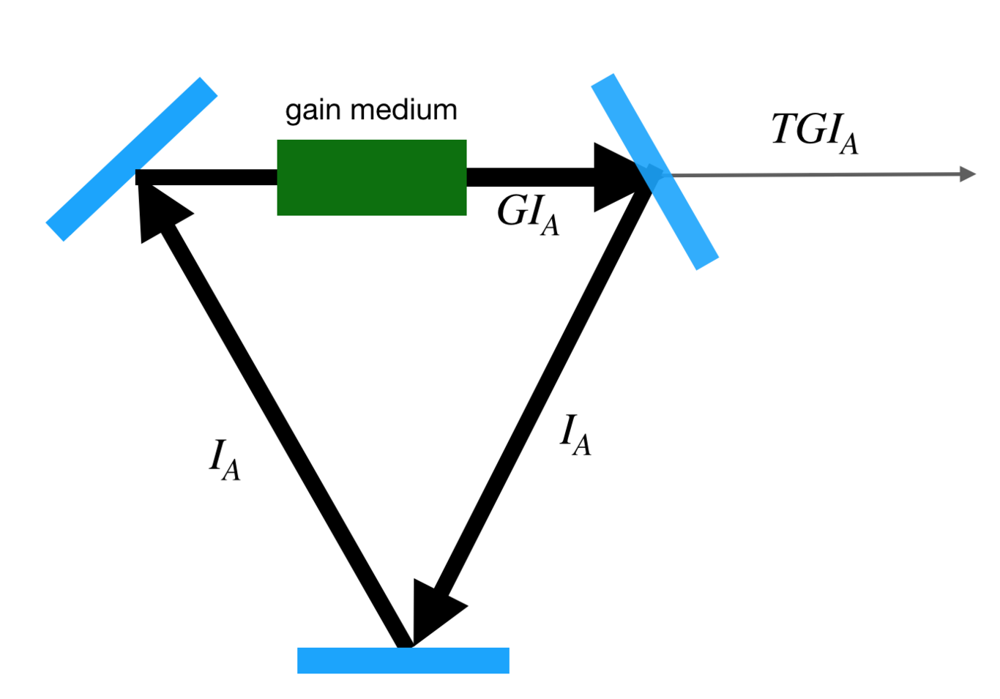
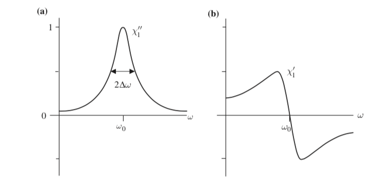
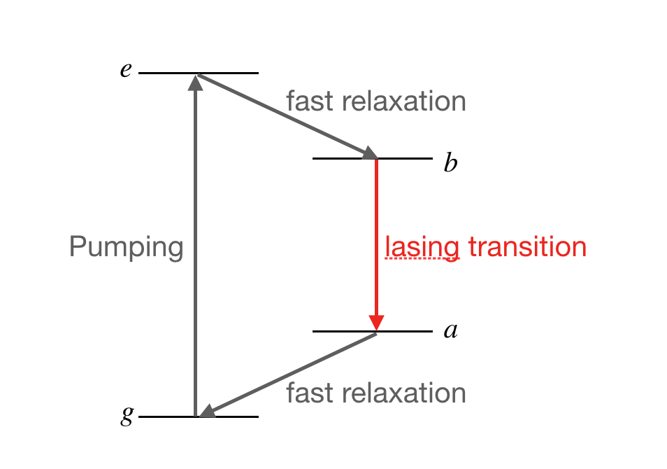
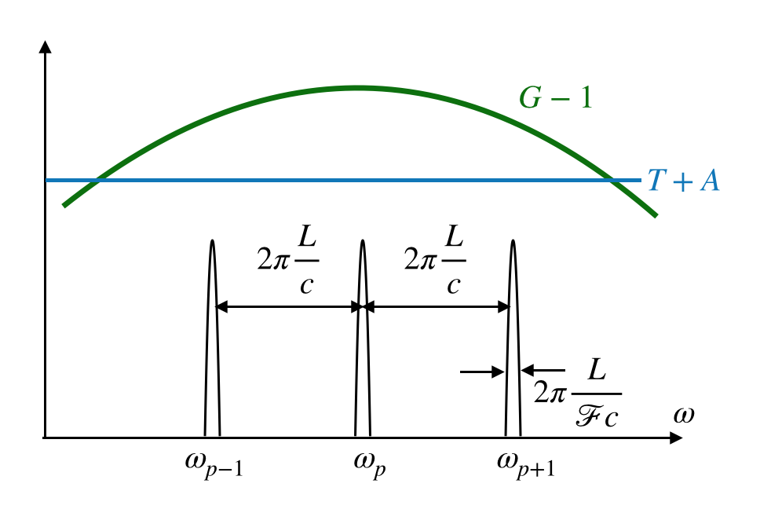

---
author:
  - Fred Jendrzejewski
order: 11
title: Lecture 11 - Laser fundamentals
---

We will study some basic properties of the laser.

In the last lecture we studied the interaction of atoms
and light. Most importantly, we saw that electric field can be dephased
and absorped through the interaction with atomic gases. In this lecture,
we will see how this interaction can be employed to induce lasing and
then study some basic properties of the laser. In the laser would most
importantly find a situation in which the light coming out of the
dielectric medium is amplified as shown in Fig.
[1](#fig-laser).

<figure id="fig-laser">

<figcaption>The Laser set-up.</figcaption>
</figure>

The crucial idea of the system is that it is possible to find a
configuration for the medium in which it has a certain gain for the
propagation of the electric field. So if the light comes into the gain
medium with amplitude $I_A$ it exits with amplitude $G^{(0)}I_A$. The
output mirror and losses lower the intensity such that the intensity. We
can describe losses by the aborption rate $A$. The transmission of the
semi-transparent mirror is quantified by the transmission coefficient
$T$. Putting it all together, the intensity just before reentering the
medium reads then $G^{(0)}I_A(1-T)(1-A)$. Amplification will happen if
this intensity is higher than the initial one:

$$
G^{(0)}>\frac{1}{(1-T)(1-A)}
$$

We will see that such a configuration is not trivial at all on the
two-level system. Then we will discuss the appropiate configuration for
lasing and a few properties of the laser.

## The two level system

In the last lecture, we saw that the two-level system might be described
by the following rate equations:

$$
\dot{N}_g = i\Omega(\sigma_{eg}-\sigma_{ge})+\Gamma N_e\\
\dot{\sigma}_{ge}= -i\delta \sigma_{ge}-i (N_g-N_e)\Omega-\frac{\Gamma}{2}\sigma_{ge}
$$

The definitions were:

- $\Omega$ is the strength of the Rabi coupling.

- $\delta$ the detuning.

- $\Gamma$ is the lifetime of the excited state.

- $N_g$ the groundstate population.

- And $\sigma_{g,e}$ is the coherence
  $\sigma_{g,e} = \gamma_g^* \gamma_e$.

- $\Gamma_2$ is the lifetime of the coherence. For the moment we will
  work in the limit $\Gamma_2 = \frac{\Gamma}{2}$. Let we will relax
  this point a bit.

At this stage we can find the steady-state solutions by setting
$\dot{N}_g = \dot{\sigma}_{ge} = 0$. This leads too:

$$

N_e = \frac{1}{2}\frac{\Omega^2}{2\delta^2+\Gamma^2/2+\Omega^2}
$$

$$

\sigma_{ge} = i\frac{\Omega}{2}\frac{\Gamma-i2\delta}{2\delta^2+\Gamma^2/2+\Omega^2}
$$

We will now discuss these results in the two important regimes of very
weak and very strong coupling. The first one is important for probe
experiments, while the second one is typically the one, where we would
like to operate a laser.

### Linear response

For very small coupling strength we can neglect the $\Omega$ dependence
in the coherence and we obtain:

$$
\sigma_{ge} = \frac{\Omega}{2}\frac{\delta+i\Gamma/2}{\Gamma^2/4+\delta^2}
$$

We can now plug this into the dipole element [^1]:

$$
D = d \sigma_{eg}\\
D = \frac{d^2}{2}\frac{\delta-i\Gamma/2}{\Gamma^2/4+\delta^2}E
$$

In the second line, we used the relationship
$\Omega = dE$ from lecture 4 [@Jendrzejewskia]. We can then directly
read of the polarizability and hence the susceptibility, which was
defined through $D = \alpha E$:

$$
\alpha =\frac{d^2}{2}\frac{\delta-i\Gamma/2}{\Gamma^2/4+\delta^2}
$$

On resonance $\delta=0$ we have:

$$
\alpha(0) =-i\frac{d^2}{\Gamma}\\
\chi(0) = -i\frac{n}{\epsilon_0}\frac{d^2}{\Gamma}
$$

We obtain now rather directly that:

- Absorption is maximal on resonance.

- There is no dephasing on resonance.

- For large detunings the absorption can be increasingly neglected and
  the media becomes refractive as it only keeps an optical index.

We can then also look for maximum dephasing and find the it happens
close to the resonance. A summary can be found in Fig.
[2](#fig-susc).

<figure id="fig-susc">

<figcaption>Susceptibility of the two level system. Figure taken from <a href="https://www.cambridge.org/core/books/introduction-to-quantum-optics/F45DCE785DC8226D4156EC15CAD5FA9A">Grynberg</a>.</figcaption>
</figure>

### Saturation

The population and coherence in the two-level system will saturate as a
substantial amount of atoms is excited. To simplify the discussion let
us rewrite the eq. the populations and coherence of the two-level system on resonance:

$$
N_e = \frac{1}{2}\frac{\Omega^2}{\Gamma^2/2+\Omega^2}\\
\sigma_{ge} = i\frac{\Omega}{2}\frac{\Gamma}{\Gamma^2/2+\Omega^2}
$$

We can see that the excited fraction is limited to $1/2$
of the atoms. So at some point the system cannot react anymore to the
additional coupling strength. This is also the reason for the decay of
the coherence at very large $\Omega$, which is basically telling us that
the medium becomes transparent. This kind of observations motivates for
practical purposes to introduce the saturation intensity
$I_{sat} \propto \frac{\Gamma^2}{2}$, which allows us to rewrite the
previous to equations as:

$$
N_e = \frac{1}{2}\frac{I/I_{sat}}{1+I/I_{sat}}
$$

Finally, this kind of expressions allows us also nicely to see the
direct connection between the dipole element and the number of excited
atoms:

$$
\sigma_{ge} = i\frac{N_e}{\Omega}
$$

So we never obtain a situation, where the two-level
system amplifies light. Let us look into this situation once again from
a technical point of view to see if we can obtain situations of
amplificiation.

## Rate equations

To understand laser it is best to formulate the interaction of atoms and
light in terms of rate equations for the populations, assuming that the
coherences follow adiabatically. While strict derivations can become
very tedious, they can be written down in a phenomenological way rather
easily. So we will convince us here in some limiting cases of the
usefulness.

We now would like to use the previous discussions to set up the
necessary formalism for laser amplification, which is based on the idea
of rate equations. While these equations are of phenomenological nature,
we can convince ourselves of their soundness in a first step.

### The two-level system

In the last lecture we saw that we can write down the following Bloch
equations for the two-level system on resonance:

$$
\dot{N}_g = -i\Omega(\sigma_{eg}-\sigma_{ge})+\Gamma N_e\\
\dot{\sigma}_{ge}= i (N_g-N_e)\Omega-\Gamma_2\sigma_{ge}
$$

In a substantial amount of situations the coherences
reach the steady state much faster than the population. This can be due
to technical noise, collisions or other effects. In this case we can
assume $\dot{\sigma}_{ge}=0$ and the solve for the populations:

$$
\sigma_{ge}= i \frac{\Omega}{\Gamma_2} (N_g-N_e)\\
\sigma_{eg}-\sigma_{ge} = -2i \frac{\Omega}{\Gamma_2} (N_g-N_e)
$$

We can see in this limit that the inversion of the sign
of the dipole element would come with $N_g < N_e$ **in the
steady-state**. We saw previously that we cannot achieve this limit in
the two-level system.

Having eliminated adiabatically the coherences, we end up with the
following time evolution of the population:

$$
\dot{N}_g = 2\frac{\Omega^2}{\Gamma_2}(N_e-N_g)+\Gamma N_e\\
$$

We can now identify the three terms as:

- Stimulated emission.

- Stimulated absorption.

- Spontaneous emission.

We will then focus on the rate equation for the populations and attempt
to find situations, where $N_g < N_e$.

### Optional: Rate equations for light

To see, when light amplification will happen, we now need to connect the
rate equations to evolution of light within the medium. One heuristic
approach is guided by the Beer-Lambert law (Ch. 4.2.3 of [Hertel 2015](https://doi.org/10.1007%2F978-3-642-54322-7)
).

$$
\frac{dI}{dz}=- N_g\sigma I
$$

We would like to translate this now more precisely into
a change of photon numbers through the relation:

$$
I = c \hbar\omega N_{ph}
$$

This allows us to rewrite for a propagation wave with
$z = ct$:

$$
- \frac{N_g\sigma I}{\hbar \omega} = \frac{d}{dt}N_{ph} = \frac{dN_g}{dt} = -\frac{dN_e}{dt}
$$

This allows us to define an absorption rate:

$$
R_{ab} =  \frac{\sigma I}{\hbar \omega}\\
= \frac{1}{N_g}\frac{dN_g}{dt}
$$

This process is just the description of **stimulated
absorption**. Nothing was special about the discussion of the absorption
and we can actually also have exactly the inverse situation, where we
assume that all the atoms start out in the excited state and then lead
to an increased intensity:

$$
\frac{dI}{dz}= N_e\sigma I
$$

Both processes are now computing and we obtain in
general:

$$
\frac{dI}{dz}= (N_e-N_g)\sigma I
$$

So if we have most atoms in the excited state and neglect the atoms in
the ground state we can actually have light amplification. This is idea
is underlying the laser. However, we have already seen for the two-level
system that this situation is not easily achieved and we will now
discuss it a bit further.

## Lasing condition in a four-level system

To obtain in the medium, it is necessary to have an excited state
population which is higher than the population of the ground state. This
is not possible in the two-level system and in practice realized mostly
in four-level systems.

<figure id="fig-4level">

<figcaption>The 4 level system.</figcaption>
</figure>

The idea of such a system is the following:

- A strong pumping beam excites atoms into the state $e$.

- From $e$ they decay rapidely into the state b. This is the upper
  state for the lasing transition $b\rightarrow a$.

- We obtain lasing on the transition $b\rightarrow a$, which has a
  decay rate of $\tau_B$

- The lower state $a$ is easily depopulated through the fast
  relaxation $a\rightarrow g$.

We can now write down the rate equations for a weak laser, such that we
can only keep terms in first order:

$$
\dot{N}_e = w(N_g-N_e)-N_e/\tau_e\\
\dot{N}_b = \frac{N_e}{\tau_e}-N_b/\tau_b\\
\dot{N}_a = \frac{N_b}{\tau_b}-N_a/\tau_a\\
\dot{N}_g = \frac{N_a}{\tau_a}-w(N_g-N_e)
$$

We can now find steady state solutions assuming that
$\tau_e, \tau_a \ll \tau_b$. Further we assume that the pumping to $e$
is not too strong, i.e. $w \tau_e\ll1$. We then obtain:

$$
N_e \simeq w\tau_e N_g\\
N_b \simeq w\tau_b N_g\\
N_a \simeq w\tau_a N_g
$$

We then obtain the state populations:

$$
\frac{N_b-N_a}{N_g + N_e + N_a + N_b}\simeq \frac{w\tau_b}{1+w\tau_b}
$$

Lasing is then obtained above the pumping threshold at which the gain
overcomes the losses.

## Steady-state operation of the laser

Assuming that the lasing condition is fullfilled, we can now investigate
its steady-state behavior. Quite importantly, we have to have an
electric field, which remains exactly constant after each round
trip.This implies to conditions:

- The gain has to cancel the losses:

$$
    G = \frac{1}{(1-T)(1-A)}

$$

- The phase after the round trip has to be a multiple of $2\pi$

For a cavity of length $L$, the wavelength $\lambda_p$ has to be an
integer fraction:

$$
L_{cav} = p\lambda_p\text{ with }p \in  \mathbb{N}\\
\omega_p/2\pi =p \frac{c}{L}
$$

So the lasing will not happen at one single frequency,
but actually for any wavelength fulfilling this condition. The laser has
multiple **longitudinal modes**. Some tricks allow to suppress this
multi-mode behavior, such that we obtain a very pure light source.

<figure id="fig-freq-laser">

<figcaption>Frequency distribution of the steady-state laser.</figcaption>
</figure>

## Mode-locked operation

We have seen in the last section that a laser might act in the multimode
regime. So let us write down for simplicity the total field, where we
assume that the relative phase between modes in uncorrelated and that
the amplitude is the same for all of them. We then have:

$$
E(t) = \sum_{k=0}^{N-1}E_0 \cos(\omega_k t +\phi_k)
$$

The frequency of each mode:

$$
\omega_k = \omega_0 + k \Delta\text{ with }\Delta/2\pi = \frac{c}{L_{cav}}
$$

Summing the electric fields leads to an intensity:

$$
I(t)= \frac{NE_0^2}{2}+E_0^2\sum_{j_k}\cos\left[(\omega_j-\omega_k)t+\phi_j-\phi_k\right]
$$

For uncorrelated fields this intensity is on average
$\overline{I} = \frac{NE_0^2}{2}$ with temporal fluctuations in the
order of the amplitude itself [^2] For correlated fields the equations
simplify a lot and we obtain:

$$
I = \frac{1}{2}\left|\sum_{k=0}^{N-1}E_0e^{-i\omega_k t}\right|^2\\
 = \frac{E_0^2}{2}\left|\sum_{k=0}^{N-1}e^{i k\Delta  t}\right|^2\\
 = \frac{E_0^2}{2}\left|\frac{\sin(\frac{N\Delta t}{2})}{\sin(\frac{\Delta t}{2})}\right|^2
$$

The maximum intensity in this coherent sum is now

$$
I_{max} = N\overline{I}
$$

We can then reach petawatt (!!) peak powers.

In the next lecture, we will study how the laser is actually used for the study of entanglement

[^1]:
    The sign change appears as we are now working with $\sigma_{eg}$
    instead of $\sigma_{ge}$

[^2]: We obtain actually a speckle pattern in time here.
