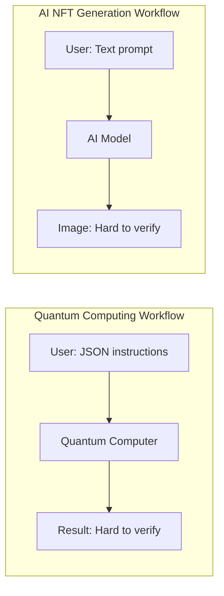

# Verbesserungsvorschläge für "quantum_now.md"

## Zusammenfassung

Dieser Guide enthält priorisierte Empfehlungen zur Verbesserung des Blog-Posts "What can we learn from NFTs for quantum computing with smart contracts?". Die Vorschläge zielen auf:
- **Konsistenz** mit vorherigen Posts
- **Zugänglichkeit** für verschiedene Zielgruppen
- **Instruktivität** durch konkrete Beispiele

---

## 🔴 MUST-FIX (Konsistenz-Probleme)

### 1. Chainlink-Story klären

**Problem:** Die Evolution von "interesting" (Blog 6) → "too expensive" (Blog 9) → "never felt right" (aktuell) ist unklar und verwirrt Leser.

**Aktueller Zustand:**
- Blog 6: "ChainLink functions are an interesting way to go"
- Blog 9: "chainlink you have to pay 3 cents per request... too expensive"
- Aktuell: "never felt right"

**Lösungsoptionen:**

#### Option A: Chronologische Erklärung (empfohlen)
Füge in "Learning 3" einen Absatz ein:
```markdown
Initially (as mentioned in [blog post 6](/blog/6)), I thought Chainlink Functions looked promising. 
However, after testing, I discovered two dealbreakers:
1. The 3¢/request overhead is substantial when AI generation itself costs only 7¢
2. Chainlink Functions require APIs to respond within 9 seconds, but AI image generation takes 30+ seconds

This led me to implement a custom listener node instead.
```

#### Option B: Lessons-Learned Format
Umstrukturiere "Learning 3" als:
```markdown
## Learning 3: API connections require custom solutions

**What I tried:** Chainlink Functions
**Why it didn't work:**
- ❌ 3¢ overhead on 7¢ images (43% markup)
- ❌ 9-second timeout vs 30s AI generation time
- ❌ Limited flexibility for custom logic

**What worked:** Custom listener node
**Trade-offs:**
- ✅ No per-request overhead
- ✅ Handles long-running operations
- ⚠️ Introduces centralization (my server listens to blockchain)
```

**Entscheidung:** [ ] Option A | [ ] Option B | [ ] Anders | [ ] Skip

---

### 2. "Reliable Nodes" definieren

**Problem:** Der Begriff "reliable nodes" wird 3x verwendet aber nie erklärt. Für technische Leser frustrierend unspezifisch.

**Erwähnungen:**
- "some 'reliable' node that just listens to the blockchain"
- "work with some 'reliable' nodes that provide the service"
- Im Conclusion: "Have some 'reliable' nodes that provide the service"

**Lösungsoptionen:**

#### Option A: Dedicated Erklärung (empfohlen)
Füge neuen Abschnitt nach "Learning 3" ein:
```markdown
### What are "reliable nodes"?

In my current setup, a "reliable node" is a centralized server I control that:
1. Listens to blockchain events (NFT mints, payments)
2. Calls external APIs (AI model, quantum computer)
3. Updates the blockchain with results

**Why "reliable" in quotes?** Because it's the weakest link in an otherwise decentralized system:
- It's a single point of failure
- Users must trust me to execute requests honestly
- It contradicts the "trustless" blockchain philosophy

For quantum computing, this means providers would need to run their own listener nodes. 
Future work could explore:
- Multi-signature schemes (multiple nodes must agree)
- Oracle networks (decentralized node infrastructure)
- Zero-knowledge proofs (verify computation without trusting provider)
```

#### Option B: Inline Definition
Bei erster Erwähnung ergänzen:
```markdown
So for the moment, I would like stick with the approach of having some "reliable" node 
(a centralized server that listens to blockchain events and calls external APIs) that 
just listens to the blockchain and calls the API when needed.
```

#### Option C: Footnote-Style
Erste Erwähnung mit Link:
```markdown
having some "reliable" node[^1] that just listens to the blockchain

[^1]: A "reliable node" is a centralized server that bridges blockchain and traditional APIs. 
See detailed explanation in the appendix.
```

**Entscheidung:** [ ] Option A | [ ] Option B | [ ] Option C | [ ] Anders | [ ] Skip

---

### 3. Kosten-Präzision vereinheitlichen

**Problem:** Kosten-Angaben variieren stark zwischen Posts:
- Blog 6: "less than one euro"
- Blog 9: "5 to 6 cents" → "10 cents total"
- Aktuell: "~7¢ AI + 1¢ gas + 2¢ margin"

**Lösungsoptionen:**

#### Option A: Standardisierte Breakdown (empfohlen)
Verwende überall die gleiche Aufteilung:
```markdown
**Cost breakdown (as of October 2025):**
- AI generation: 7¢ (via BFL/Ionos)
- Blockchain gas: 1¢ (Optimism L2)
- Service margin: 2¢
- **Total:** 10¢ per image
```

#### Option B: Range mit Datum
```markdown
Costs range from 5-10¢ depending on:
- AI model provider (BFL: 6¢, Ionos: 7¢, DeepInfra: 5¢)
- Blockchain (Optimism: 1¢, Base: 1¢, Ethereum: $2+)
- Service margin (0-3¢)

*(Prices as of October 2025)*
```

**Entscheidung:** [ ] Option A | [ ] Option B | [ ] Anders | [ ] Skip

---

## 🟡 HIGH-IMPACT (Zugänglichkeit & Verständlichkeit)

### 4. Workflow-Visualisierung hinzufügen

**Problem:** Der Quantum Computing ↔ AI-Vergleich ist brilliant, aber textlastig.

**Lösungsoptionen:**

#### Option A: Mermaid Diagram


#### Option B: Side-by-Side Tabelle (empfohlen für Markdown)
```markdown
| Step | Quantum Computing | AI NFT Generation |
|------|-------------------|-------------------|
| **Input** | JSON instructions for quantum circuit | Text prompt in JSON format |
| **Processing** | Quantum computer (IBM, IonQ, etc.) | AI model (Stable Diffusion, etc.) |
| **Output** | Measurement results | Generated image |
| **Payment** | Cloud provider account (AWS Braket) | Smart contract (10¢ in ETH) |
| **Ownership** | No proof of computation | NFT proves ownership |
| **Verification** | Hard to verify correctness | Hard to verify authenticity |
| **Privacy** | Shared with provider | Can be encrypted on IPFS |
```

#### Option C: Annotierte ASCII-Grafik
```markdown
QUANTUM COMPUTING:           AI IMAGE GENERATION:
┌─────────────────┐         ┌─────────────────┐
│ User writes     │         │ User writes     │
│ quantum circuit │         │ text prompt     │
└────────┬────────┘         └────────┬────────┘
         │                           │
         ▼                           ▼
┌─────────────────┐         ┌─────────────────┐
│ Send to quantum │         │ Send to AI      │
│ computer via    │         │ model via       │
│ cloud API       │         │ smart contract  │
└────────┬────────┘         └────────┬────────┘
         │                           │
         ▼                           ▼
┌─────────────────┐         ┌─────────────────┐
│ Get results     │         │ Get NFT with    │
│ (hard to verify)│         │ image (on-chain)│
└─────────────────┘         └─────────────────┘
```

**Entscheidung:** [ ] Option A | [ ] Option B | [ ] Option C | [ ] Skip

---

### 5. Konkrete Beispiele statt abstrakte Aussagen

**Problem:** "NFTs are great" ist abstrakt. Zeige konkret WARUM.

**Lösungsoptionen:**

#### Option A: User Story (empfohlen)
Füge bei "Learning 1" ein konkretes Szenario ein:
```markdown
**Example:** When Alice generates an AI image with the prompt "quantum computer in a forest":
1. She pays 10¢ and receives NFT #456
2. The NFT contains: prompt, timestamp, model version, image IPFS link
3. Alice can prove she owns this specific generation (unlike with Midjourney)
4. She can sell/transfer the NFT on OpenSea
5. All metadata is permanent and verifiable on-chain

For quantum computing, this means:
- Bob submits a quantum circuit and pays via smart contract
- He gets NFT #789 with encrypted results
- The NFT proves Bob ran this computation at this time
- No centralized database needed, no account registration
```

#### Option B: Vergleichstabelle
```markdown
| Aspect | Traditional Database | NFT on Blockchain |
|--------|---------------------|-------------------|
| **Ownership proof** | Database record (provider can delete) | On-chain (permanent) |
| **Privacy** | Trust provider to not look | Can encrypt before storing |
| **Portability** | Locked to one service | Transfer between wallets |
| **Cost** | Subscription ($10-100/month) | Per-use (10¢ per generation) |
| **Censorship** | Provider can block account | Permissionless access |
```

#### Option C: Before/After Scenario
```markdown
**Without NFTs (current quantum computing):**
- Register account with IBM Quantum
- Submit job via their API
- Results stored in their database
- No portable proof of computation
- Account can be suspended

**With NFTs (proposed approach):**
- No registration needed (just wallet)
- Submit job via smart contract
- Results stored as encrypted NFT
- Own the computation proof forever
- Truly permissionless
```

**Entscheidung:** [ ] Option A | [ ] Option B | [ ] Option C | [ ] Kombination | [ ] Skip

---

### 6. Spezifische Call-to-Action

**Problem:** "Feel free to write down ideas" ist vage und passiv.

**Lösungsoptionen:**

#### Option A: Konkrete Fragen (empfohlen)
Ersetze Conclusion mit:
```markdown
## I need your input

This approach is only valuable if it solves real problems. I need feedback from:

**Quantum computing providers/researchers:**
- Would you run a listener node to offer your quantum computer via smart contracts?
- What verification methods could prove computation correctness?
- Is privacy (encrypted results) important for your use cases?

**Blockchain developers:**
- Know better oracle solutions than Chainlink for 30+ second operations?
- Ideas on trustless verification of AI/quantum results?
- Experience with similar "blockchain meets external API" projects?

**Potential users:**
- Would you pay via crypto to access quantum computing anonymously?
- Is NFT-based result storage valuable, or just gimmicky?
- What would make you choose this over AWS Braket?

**How to contribute:**
- Comment on this post
- Open GitHub issues at [repo link]
- Email me: [your email]
- Join discussion on [Discord/Telegram if you have one]
```

#### Option B: Roadmap-basierter CTA
```markdown
## Next steps & how you can help

**What I'm working on:**
1. Smart contract for quantum job submission (November 2025)
2. Integration with toy quantum simulator (December 2025)
3. Pilot with real quantum provider (Q1 2026)

**How you can contribute:**
- **Researchers:** Share verification approaches for trustless computation
- **Developers:** Review smart contract architecture (link coming in next post)
- **Providers:** Express interest in being a pilot quantum provider
- **Everyone:** Test the ImageGen system and share UX feedback

**Stay updated:** [Newsletter signup / GitHub watch / Twitter follow]
```

#### Option C: Action-Oriented
```markdown
## Take Action

If this resonates with you:

1. **Try the existing system:** Generate an AI image at [link] to see NFT workflow
2. **Share your expertise:** [Survey link] - 5 minute questionnaire
3. **Collaborate:** [GitHub Issues] - Technical discussions
4. **Connect:** [Email/Twitter/LinkedIn] - Let's build this together

**Most urgent need:** Solutions for trustless verification of quantum/AI results.
If you're working on zero-knowledge proofs, TEEs, or similar - let's talk!
```

**Entscheidung:** [ ] Option A | [ ] Option B | [ ] Option C | [ ] Kombination | [ ] Skip

---

## 🟢 NICE-TO-HAVE (Erweiterte Instruktivität)

### 7. Verification Problem tiefer behandeln

**Problem:** "How do you verify the provider is not tricking you?" ist DIE zentrale Frage, aber du sagst nur "I don't know".

**Lösungsoptionen:**

#### Option A: Research Directions auflisten
Füge neuen Abschnitt ein:
```markdown
## Learning 5: Trustless verification is unsolved (but solvable)

The elephant in the room: How do we verify that a quantum computer (or AI model) 
actually performed the computation honestly?

**Potential approaches:**

### 1. Zero-Knowledge Proofs
- Provider generates cryptographic proof that computation was performed correctly
- **Pro:** Mathematically verifiable, truly trustless
- **Con:** Extremely complex, current ZK systems can't verify quantum operations
- **Research needed:** ZK-SNARKs for quantum circuits

### 2. Multi-Provider Consensus
- Submit same job to 3 different quantum computers, require 2/3 agreement
- **Pro:** Simple to implement, catches single bad actor
- **Con:** 3x cost, assumes majority honest
- **Status:** Could implement today

### 3. Verifiable Random Functions (VRFs)
- Random spot-checks on subset of computations with known results
- **Pro:** Probabilistic assurance at lower cost
- **Con:** Not 100% guarantee, requires benchmark database
- **Status:** Feasible for certain quantum algorithms

### 4. Trusted Execution Environments (TEEs)
- Run quantum simulator in Intel SGX or ARM TrustZone
- **Pro:** Hardware-based attestation
- **Con:** Doesn't work for real quantum hardware, trust in hardware vendor
- **Status:** Partial solution for hybrid systems

### 5. Reputation + Economic Stakes
- Providers stake tokens, lose them if caught cheating
- **Pro:** Simple, economically rational
- **Con:** Centralization risk, doesn't prevent first offense
- **Status:** Could launch with this as interim solution

**My current thinking:** Start with reputation + economic stakes (5), research ZKPs (1) 
in parallel, implement multi-provider consensus (2) once we have 3+ providers.

**This could be published:** "Trustless Verification for Quantum Cloud Computing" 
would be a legitimate research contribution. If you're interested in collaborating, reach out.
```

#### Option B: Simplified Version
```markdown
### On the verification problem

The hardest unsolved challenge: proving a quantum computer did the work honestly.

Some ideas (none perfect):
- **Zero-Knowledge Proofs:** Mathematically prove correctness (very complex)
- **Multiple providers:** Run on 3 computers, require agreement (3x cost)
- **Random testing:** Spot-check with known results (probabilistic)
- **Reputation system:** Providers stake money, lose it if caught cheating (centralization)

For now, I'd start with reputation + staking and research ZKPs in parallel.
```

**Entscheidung:** [ ] Option A | [ ] Option B | [ ] Skip (too technical) | [ ] Separate post

---

### 8. Timeline/Evolution visualisieren

**Problem:** Der Post erwähnt mehrere frühere Posts, aber zeitlicher Zusammenhang ist unklar.

**Lösungsoptionen:**

#### Option A: Timeline am Anfang
```markdown
## My journey from AI images to quantum computing

```
├─ Jan 2025: Started with AI image generation
│  └─ Blog 6: "Running an image generator"
│
├─ Apr 2025: Added blockchain payments
│  └─ Blog 9: "Generating AI images, paying anonymously"
│
├─ Oct 2025: Realized quantum computing has same structure
│  ├─ Blog 17: "Can we decentralize quantum computing?"
│  └─ This post: Concrete learnings
│
└─ Next: Smart contract implementation (Blog 19, Nov 2025)
```
```

#### Option B: Journey-Narrative Intro
```markdown
Over the past 10 months, I've been experimenting with blockchain-enabled AI services:
- **January:** Built AI image generator ([blog 6](/blog/6))
- **April:** Added crypto payments + NFT minting ([blog 9](/blog/9))
- **October:** Realized this architecture could democratize quantum computing ([blog 17](/blog/17))

This post connects the dots: What did I learn from AI that applies to quantum computing?
```

**Entscheidung:** [ ] Option A | [ ] Option B | [ ] Skip

---

### 9. Zielgruppen-spezifische Sections

**Problem:** Du schreibst gleichzeitig für Blockchain-Devs UND Quantum-Researcher.

**Lösungsoptionen:**

#### Option A: Explizite Sections
```markdown
## Why this matters

### For Quantum Researchers
Current quantum cloud access requires:
- Corporate accounts (IBM, AWS, Azure)
- Credit cards / institutional billing
- Sharing sensitive research data
- No proof of computation ownership

Smart contracts enable:
- Anonymous access (just crypto wallet)
- Pay-per-job (no subscriptions)
- Encrypted results as NFTs
- Portable computation proofs

### For Blockchain Developers
This is a challenging use case because:
- External API calls take 30+ seconds (Chainlink timeout issues)
- Result verification is non-trivial (need ZKPs or consensus)
- High privacy requirements (encrypted NFT storage)
- Existing oracle solutions don't fit

Successfully solving this unlocks:
- Real-world utility for L2 chains
- Research-grade use case for ZK tech
- Decentralized scientific infrastructure

### For Entrepreneurs
Market opportunity:
- Quantum computing: $1.3B market, growing to $8.6B by 2030
- Cloud quantum access: Currently monopolized by big tech
- Target users: Universities, startups, independent researchers
- Business model: Transaction fees on smart contract usage
```

#### Option B: Tooltips/Expandable
```markdown
NFTs<sup>[?]</sup> are really a great way to implement this kind of ideas.

[?] NFT = Non-Fungible Token. A unique blockchain token that proves ownership. 
Unlike regular tokens (like Bitcoin), each NFT is distinct.
```

**Entscheidung:** [ ] Option A | [ ] Option B | [ ] Skip (keep general) | [ ] Glossary at end

---

### 10. Forward-Looking konkretisieren

**Problem:** "In the next blog post" ist vage.

**Lösungsoptionen:**

#### Option A: Konkrete Roadmap
```markdown
## What's next

This is part 2 of a 3-part series on smart contracts for quantum computing:

**✅ Part 1 ([Blog 17](/blog/17)):** The vision - why decentralize quantum computing?

**✅ Part 2 (This post):** Learnings from implementing AI + blockchain

**⏭ Part 3 (Coming November 2025):** Technical implementation
- Smart contract architecture
- Privacy-preserving result storage
- Integration with quantum simulators
- Cost analysis
- Open-source code release

**🔮 Part 4 (Q1 2026):** Pilot results with real quantum provider

**Subscribe to updates:** [Newsletter/RSS/GitHub Watch]
```

#### Option B: Preview Next Post
```markdown
## Preview: Next post

In the next article, I'll dive into the technical implementation:

```solidity
// Sneak peek: The QuantumJobNFT contract
contract QuantumJobNFT is ERC721 {
    function submitJob(
        bytes calldata quantumCircuit,
        bytes32 encryptionKey
    ) external payable returns (uint256 jobId) {
        // Mint NFT with encrypted results
        // Pay provider when job completes
        // Verify result integrity
    }
}
```

Plus: Integration with [Cirq](https://quantumai.google/cirq), IPFS storage, and cost breakdown.

Expected: Mid-November 2025
```

**Entscheidung:** [ ] Option A | [ ] Option B | [ ] Kombination | [ ] Keep vague

---

## 📋 Implementation Checklist

As you work through these suggestions, track your decisions:

### Must-Fix (Critical)
- [ ] 1. Chainlink story clarified
- [ ] 2. "Reliable nodes" defined
- [ ] 3. Cost precision unified

### High-Impact (Recommended)
- [ ] 4. Workflow visualization added
- [ ] 5. Concrete examples added
- [ ] 6. Specific call-to-action implemented

### Nice-to-Have (Optional)
- [ ] 7. Verification problem expanded
- [ ] 8. Timeline visualization added
- [ ] 9. Audience-specific sections
- [ ] 10. Forward-looking concretized

---

## Meta: Writing Philosophy

**Observation:** Your posts are authentically exploratory - "I tried X, it didn't work, so Y". 
This is refreshing compared to polished corporate blogs.

**Recommendation:** Keep this voice! But add:
- More specifics (exact costs, exact timelines)
- Visual aids (tables > paragraphs for comparisons)
- Actionable next steps (for readers AND yourself)

**The best version of this post:** Shows the messy reality of building decentralized systems 
while giving readers concrete technical knowledge and ways to contribute.
