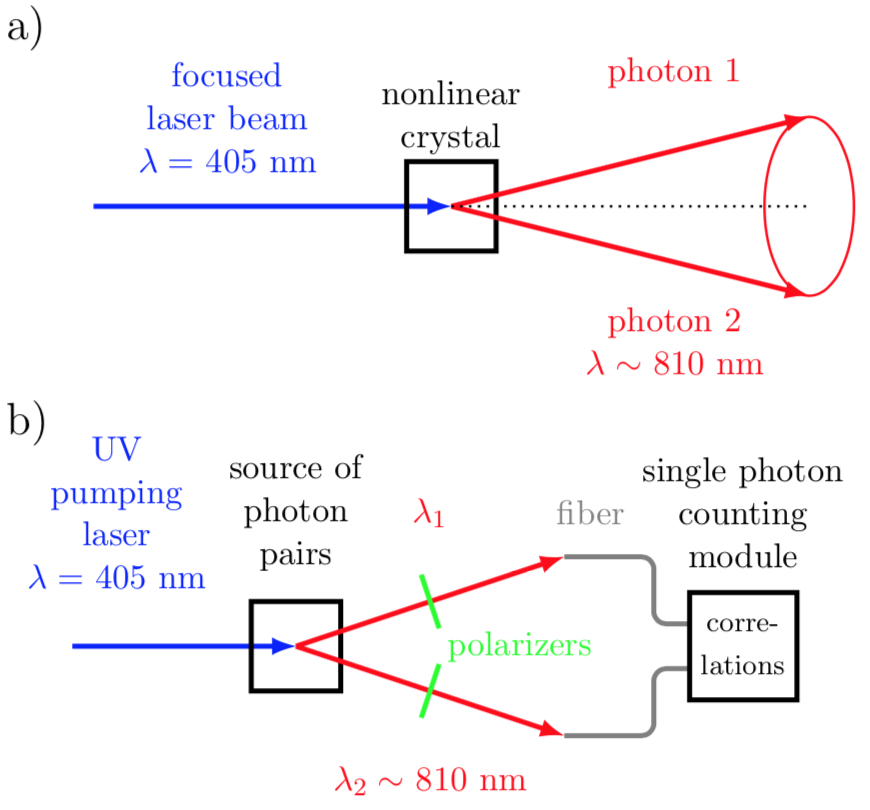
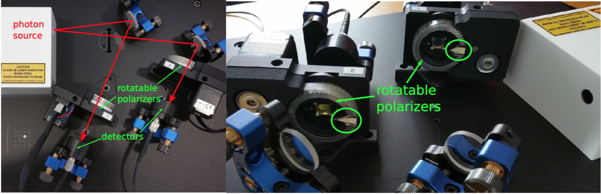
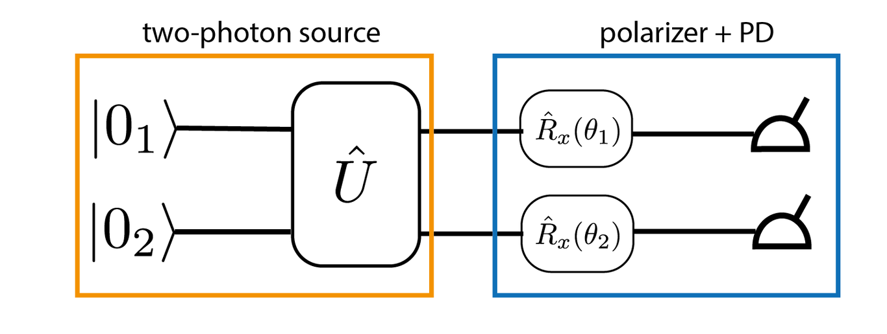
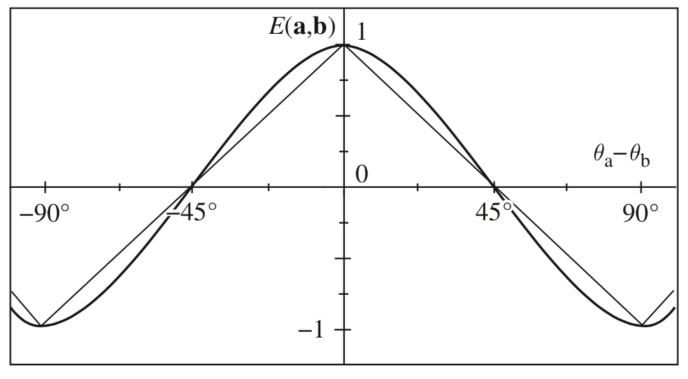

---
author:
  - Fred Jendrzejewski
  - Selim Jochim
  - Matthias Weidemüller
order: 12
title: Lecture 12- Entanglement
---

We will discuss the creation of entangled photons and how they can be
used for the test of Bell's inequalities.

We have previously discussed how complicated gain media allow for the
amplification light. Here we will discuss how it is
used to create entangled photons and then dive into the fundamental test
of the Bell inequalities.

# Parametric down-conversion

<figure id="fig-downcon">

<figcaption>a) The process of spontaneous parametric down-conversion (SPDC).
Inside a nonlinear crystal, two outgoing photons are created from an
incoming photon. Momentum and energy conservation apply, resulting in a
characteristic emission cone. b) Two photons created by SPDC encounter
polarizers. Depending on the polarization, the photons are either
absorbed or transmitted. After passing the polarizers, the photons are
collected with two optical fibers and detected with single photon
counters. The detector indicates a coincidence when both photons arrive
within roughly 30 ns.</figcaption>
</figure>

Fig. [1](#fig-downcon) shows the
schematic setup of an experiment where pairs of entangled photons are
created by a two-photon source. Two polarizers can be used to probe the
polarization of the photons.

## Three-wave mixing

The crystal in the medium is a non-linear crystal, which means that we
can write the polarization is not just linear, but higher order terms
will play a role. We will consider for starters that there are actually
two pump waves in the same direction, which allows us to write:

$$
P_{NL}(z) = 2\epsilon_0 \chi^{(2)}\mathcal{E}_1(z)\mathcal{E}_2(z)e^{i(k_1+k_2)z}
$$

This non-linear polarizability leads to the following
equations of motion [@grynberg]:

$$
\frac{d\mathcal{E}_3}{dz}e^{ik_3 z} = \frac{i\omega_3}{2\epsilon_0n_3c}P_{NL}(z) \\
 \frac{d\mathcal{E}_3}{dz}= \frac{i\omega_3}{n_3c}\chi^{(2)}\mathcal{E}_1(z)\mathcal{E}_2(z)e^{i(k_1+k_2-k_3)z} \\,
$$

where $\omega_3 = \omega_1 + \omega_2$. We can now
additionally assume that:

- The effect of the medium does not change the strong pump to much.

- The amplified field is zero initially.

- The oscillating phase factor $(k_1+k_2-k_3)z$ can be ignored, i.e.
  where we have:

$$
    \vec{k}_3 = \vec{k}_1 + \vec{k}_2

$$

We can then simplify to:

$$
 \frac{d\mathcal{E}_3}{dz}=\frac{i\omega_3 \chi^{(2)}}{n_3c}\mathcal{E}_1\mathcal{E}_2
$$

So the amplitude of the mixed field increases in a
linear fashion in the non-linear medium. However, the typical amplitude
for production is below 1% for commonly used crystals.

# Polarization entangled photons

We will try to observe correlations between the photons. Two optical
fibers are collecting the pairs of photons and transmit them to the
single photon detectors. Finite collection and detection efficiency
causes only one of the two photons to be detected in most cases.
Therefore, a coincidence circuit registers events in which two photons
arrive within 30 ns. As the rate of detected individual photons is about
50 kHz, we assume that photons arriving during such a small time window
were created in the same event.

## Polarization analysis

To study the quantum nature of the correlations, we will employ
polarizers and later dive into Bell's inequalities as well as
entanglement in general. The interested reader will have a great time
reading through the complement 5.C of [Grynberg](https://www.cambridge.org/core/books/introduction-to-quantum-optics/F45DCE785DC8226D4156EC15CAD5FA9A).

The first emitted photon is analyzed by a rotatable polarizers
$\hat{A}(\theta)$, which has two detection paths $\pm1$. The other
polarizer will be called $\hat{B}(\theta)$ the only difference is that
he only acts on photon 2. Basically, we are following the _Alice_ and
_Bob_ notation here.

We can express it then in our basis states of vertical polarization
$\left|V\right\rangle$ and horizontal polarization
$\left|H\right\rangle$. The polarizer aligned with $H$ has
eigenvalues:

$$
\hat{A} \left|H\right\rangle= +\left|H\right\rangle\\
\hat{A} \left|V\right\rangle= -\left|V\right\rangle
$$

To analyse the polarization of each photon in detail we can also rotate
the polarizer by an angle of $\theta$. In this case the transmitted
eigenstates are:

$$
\left|\theta\right\rangle_{+} = \cos(\theta)\left|H\right\rangle +\sin(\theta)\left|V\right\rangle\\
\left|\theta\right\rangle_{-} = -\sin(\theta)\left|H\right\rangle +\cos(\theta)\left|V\right\rangle
$$

Taking as input states
$\left|H\right\rangle$, we simply find Malus law:

$$
P_+(\theta) = \cos(\theta)^2\\
P_-(\theta) = \sin(\theta)^2\\
$$

In the rotated basis we can express the polarization
operator as:

$$
\hat{A}(\theta) = \left(\begin{array}{cc}
\cos(2\theta)& \sin(2\theta)\\
\sin(2\theta)& -\cos(2\theta)
\end{array}\right)
$$

We can now employ the two polarizers to investigate the
two emitted photons as shown in Fig. [2](#fig-polar-anal).

<figure id="fig-polar-anal">

<figcaption>Polarization analysis of correlated photons</figcaption>
</figure>

The possible outcome of our experiments are the four states
$\{HH, HV, VH, VV\}$ and hence we could decompose our full wavefunction
as:

$$
\left|\psi\right\rangle = c_0 \left|HH\right\rangle+ c_1 \left|HV\right\rangle + c_2 \left|VH\right\rangle + c_3\left|VV\right\rangle
$$

Using the two polarizers we can now start to investigate
the prefactors of the full wavefunction. Let us first look into the
results of a polarizer that is not rotated. We find:

$$
\left\langle\psi\right|\hat{A}\left|\psi\right\rangle=|c_0|^2 + |c_1|^2 - |c_2|^2-|c_3|^2
$$

For Bobs polarizer in the same position we would find:

$$
\left\langle\psi\right|\hat{B}\left|\psi\right\rangle=|c_0|^2+ |c_2|^2 - |c_1|^2 -|c_3|^2
$$

## An equivalent 2 qubit circuit

The optics setup handles two independent photons, with two outcomes
each. So we can also see the presented setup as a two qubit system. A
circuit diagram would mostly look the following way.

<figure id="fig-two-qubit">

<figcaption>Realizing the two-photon experiment within a quantum circuit. What are
the correlations the two photons have ?</figcaption>
</figure>

The two photons originate from an unknown source, which is here modelled
by photons propagating through some unitary matrix $\hat{U}$. The
measurement is performed in the last step, projecting the qubit on its
up or down state. The rotation around the x axis $\hat{R}_x$ transforms
a qubit state into a superposition. In strong analogy to the
polarization

## A naive guess

We know that we have two photons in the system. Both can have some
polarization and clearly they are propagation in different directions.
So it does not seems to much of a stretch to guess that the total
wavefunction is the product of two superposition states:

$$

\left|\psi\right\rangle_{p} = (c_{H,1}\left|H\right\rangle +c_{V,1} \left|V\right\rangle)\otimes(c_{H,2}\left|H\right\rangle+c_{V,2}\left|V\right\rangle) \\
= (c_{H,1}c_{H,2}\left|HH\right\rangle + c_{V,1}c_{V,2}\left|VV\right\rangle + c_{V,1}c_{H,2}\left|VH\right\rangle + c_{H,1}c_{V,2}\left|HV\right\rangle)
$$

## The experimental observation of entanglement

- We find a lot of counts if both polarizers are set vertical or
  horizontal. So the state has a $VV$ and a $HH$ component, which
  tells us that $c_0$ and $c_{3}$ are non-zero. The equal rate of
  measuring further tells us that they are roughly similiar in
  amplitude, so we can write for simplicity $|c_0| = |c_3|$

- We find zero correlation if the polarizers are opposite. So the
  mixed terms are zero $c_1 = c_2 = 0$

In summary we can expect the Bell state can to be written as:

$$
\left|\psi_B\right\rangle = \frac{\left|HH\right\rangle +\left|VV\right\rangle}{\sqrt{2}}
$$

This is quite clearly incompatible with our naive guess, which means that we have an entangled state.

# Optional: Quantifying entanglement

We will study the properties of the entangled states later in more
detail. However, we will take a short moment to cite two ways of
quanitfying the entanglement through the density operator:

$$
\hat{\rho} = \sum_i \eta_i \left|i\right\rangle \left\langle i\right|
$$

The reduced density operator, which shows mixed states if there is
entanglement:

$$
    \hat{\rho}_1 = \mathrm{tr}_{2}(\hat{\rho})
$$

In this case, $\hat{\rho}$ is the density operator
of a pure state and $\textrm{tr}_2$ is the trace over the Hilbert
space of particle 2.

The von Neumann entropy, which measures the remaining uncertainty
within a quantum state:

$$
    S=-\mathrm{tr}(\hat{\rho}\ln\hat{\rho})\\
     = - \sum_i \eta_i \ln \eta_i = \sum_i \eta_i \ln \frac{1}{\eta_i}
$$

For the Bell states of we find then:

$$
\hat{\rho_B}_1 = \frac{1}{2} \left( \left|H\right\rangle\left\langle H\right| + \left|V\right\rangle\left\langle V\right| \right)
$$

Its corresponding entropy is $S=\ln 2$, the entropy of a
pure state is $S=0$.

# Back to the correlation between distant photons

In the last sections we performed measurements on joined detection
probabilities between two independent polarizers. Quite importantly we
saw that:

- Each photon is in a superposition of
  $\left|H\right\rangle$ and
  $\left|V\right\rangle$.

- Both photons are always detected in the same polarization state.

- From Fig. [2](#fig-polar-anal) it
  seems as if 1 was a bit closer to the source than 2 [^1]. So 1 is
  detected a bit earlier and projected onto one of the two states.

- Yet, 2 seems to instantaneously on which polarization 1 was
  projected and choses the same one.

For our set-up the distances are small, but the same observations and
arguments hold also for very large distances between the detectors.
Einstein, Podolski and Rosen understood this long distance correlation
and decided that something was funky about quantum mechanics
[@Einstein_1935].

Therefore, the idea of an additional hidden shared parameter can be
introduced to explain the correlations between distant objects. We will
simply assume that the two photons have well-defined polarization with
angle $\lambda$ from the starting point, yet this polarization varies
randomly from pair to pair between 0 and $2\pi$. Hence we have uniform
probability distribution $\rho(\lambda) = \frac{1}{2\pi}$. The
measurement of the polarizers can then simply be modelled through

$$
A_{hv}(\lambda, \theta) =\text{sign}\left(\cos2 (\theta-\lambda)\right)
$$

This model reproduces nicely all the tests that we ran
previously. Namely, maximum detection for HH and VV as well as zero
correlation for $HV$. They can be nicely compared through the
correlation coefficient $E(\theta_1,\theta_2)$. The particularly
perturbing case is that this simple model for hidden parameters works
even perfectly well in the case of $45^\circ$ angles. So is there any
measurable difference between our observations and the hidden variable
models ?

<figure id="fig-corr">

<figcaption>Correlation coefficient as taken from  <a href="https://www.cambridge.org/core/books/introduction-to-quantum-optics/F45DCE785DC8226D4156EC15CAD5FA9A">Grynberg</a>.</figcaption>
</figure>

# Bell's theorem

Bell posed the previous discussion on a more general and quite simple
footing [Bell 1964](http://dx.doi.org/10.1103/physicsphysiquefizika.1.195) and later extended by [Clauser, Horner, Shimony, Holt](http://dx.doi.org/10.1103/physrevlett.23.880). For the hidden parameter we need just a standard
density distribution with:

$$
\rho(\lambda)\geq 0\\
\int d\lambda \rho(\lambda) = 1
$$

We additionally should describe the polarizer by some function that
takes the value $\pm 1$ depending on the angle of the polarizer and the
hidden variable:

$$
|A(\lambda, \theta_1) |= |A(\lambda, \theta_2) | =1
$$

In the experiment we now have two polarizers $A$ for
Alice and $B$ for Bob, which we will allow to be in some position
$\theta$ as visualized in Fig. [5](#fig-bell).

<figure id="fig-bell">

<figcaption>A Bell experiment.</figcaption>
</figure>

We will now calculate the the expectation value for joint detection:

$$
E(\theta_1, \theta_2)=\overline{A(\theta_1)B(\theta_2)}-\overline{A(\theta_1)}~\overline{B(\theta_2)}
$$

We can simplify further for equal probability of having
H or V polarization, which leads too:

$$
E(\theta_1, \theta_2)=\overline{A(\theta_1)B(\theta_2)}\\
 =\int d\lambda  A(\lambda, \theta_1)B(\lambda, \theta_2)
$$

Bells inequalities are then studying the correlations
between photons in four different configuations:

$$
s(\lambda, \theta_1, \theta_1', \theta_2, \theta_2')= A(\lambda, \theta_1)B(\lambda, \theta_2)-A(\lambda, \theta_1)B(\lambda, \theta_2') +A(\lambda, \theta_1')B(\lambda, \theta_2)+A(\lambda, \theta_1')B(\lambda, \theta_2')\\
= A(\lambda, \theta_1)(B(\lambda, \theta_2)-B(\lambda, \theta_2'))+A(\lambda, \theta_1')(B(\lambda, \theta_2)+B(\lambda, \theta_2'))\\
= \pm 2
$$

We actually have no access to the hidden parameter, so
we are looking for its average value:

$$
S = \int d\lambda \rho(\lambda) s(\lambda, \theta_1, \theta_1', \theta_2, \theta_2')\\
-2\leq S\leq 2
$$

And this value can now be measured experimentally as we
can identify:

$$
S = E(\theta_1, \theta_2)-E(\theta_1, \theta_2')+E(\theta_1', \theta_2)+E(\theta_1', \theta_2')
$$

This is known as the Bell--Clauser--Horn--Shimony--Holt
(CHSH) inequalities.

## The inconsistency between hidden parameters and quantum mechanics

We can now go again through the predictions of quantum mechanics and
test if there is a region of interest in which we should observe a
violation of the CHSH inequalities. Actually there is an important
configuration at which we should break them rather violantly namely for:

$$
|\theta_1-\theta_2| =\frac{\pi}{8}(22.5^\circ)\\
|\theta_1'-\theta_2| =\frac{\pi}{8}(22.5^\circ)\\
|\theta_1'-\theta_2'| =\frac{\pi}{8}(22.5^\circ)\\
|\theta_1-\theta_2'| =\frac{3\pi}{8}(67.5^\circ)\\
$$

Here, we expect to have $S= 2\sqrt{2}$. So to test Bells
inequalities we have to measure the joint probabilities in rather
unusual angles. This also explains why quantum mechanics and local
hidden variables seem so similiar in this kind of experiments, the
biggest differences are hard to see accidentally.

## The experimental test

We can now study the correlations for the following configuration.

$$
\theta_1 = 0 \text{ and }\theta_1' = \frac{\pi}{4}\\
\theta_2 = \frac{\pi}{8} \text{ and }\theta_2' = \frac{3\pi}{8}\\
$$

<figure id="fig-measure">

<figcaption>Correlation measurements.</figcaption>
</figure>

In the figure above we present correlation measurement between the two photons measured with the
setup shown in the second figure. One of the rotatable polarizers stays at an angle
$\gamma \in \{ 0^\circ, 45^\circ, 90^\circ, 135^\circ \}$ while the
other polarizer is rotated counter-clockwise in small steps between
$0^{\circ}$ and $360^{\circ}$. Experimentally we observe quite frequently values above 2. However,
please be aware that there are a lot of loopholes in our test. The most
obvious ones are:

1.  Position of the polarizers is not random.

2.  The detectors are not well separated.

Other loopholes exist, but all realistically known loopholes have been
closed over the course of the last three decades with examples from [Gustina et al.](http://dx.doi.org/10.1103/physrevlett.115.250401), [Shalm et al.](http://dx.doi.org/10.1103/physrevlett.115.250402) and [Hensen et al.](http://dx.doi.org/10.1038/nature15759).

[^1]:
    The exact order does not matter, but they are most certainly not
    at exactly the same distance from the source
