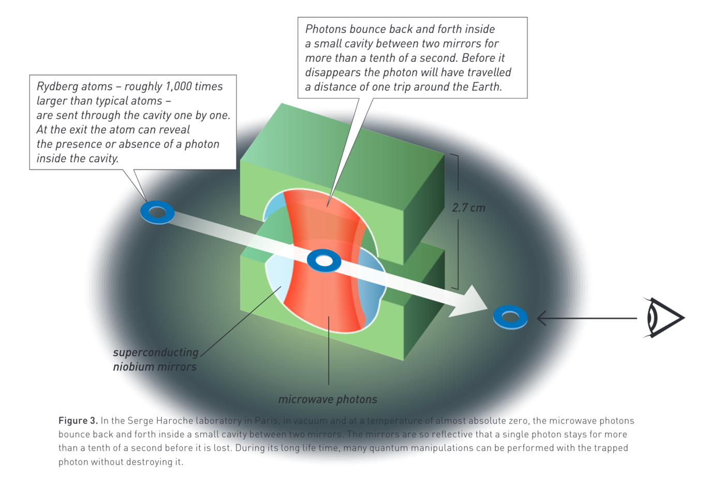
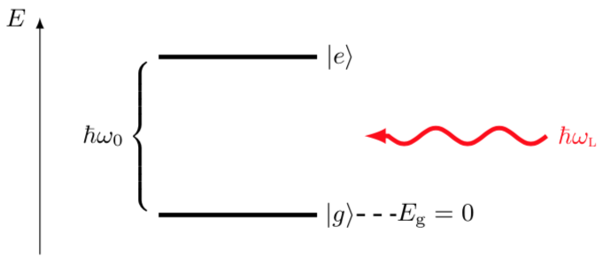
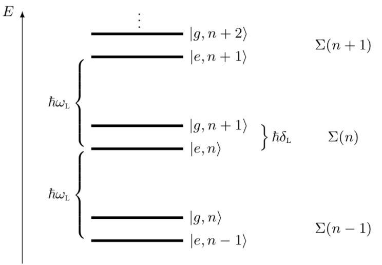
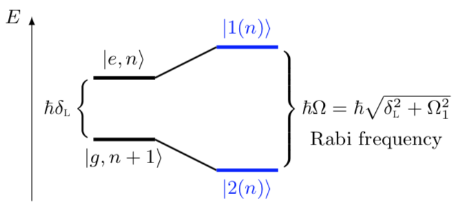
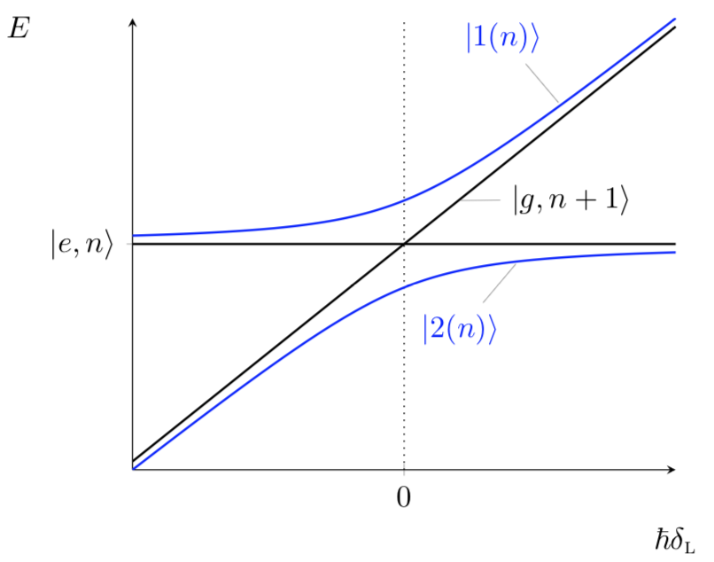
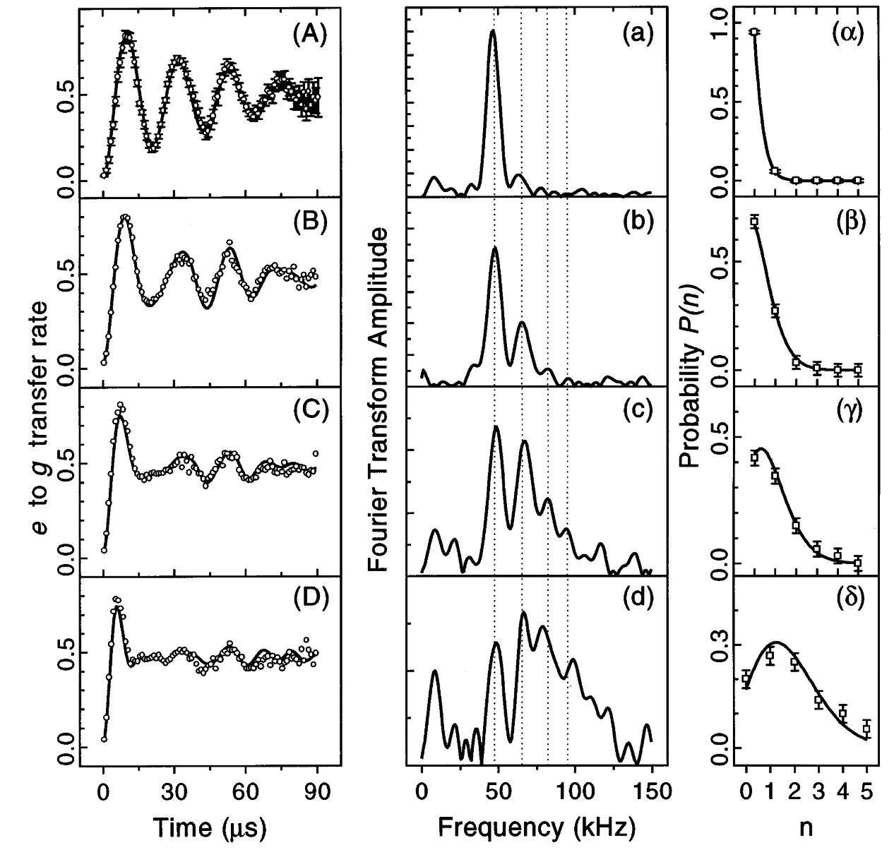

---
author:
  - Fred Jendrzejewski
  - Selim Jochim
  - Matthias Weidemüller
order: 19
title: Lecture 19 - Atom-Light Interactions and Dressed States
---

import { MyFigure } from "../../components/MyFigure";

We have seen that we can understand matter with increasing complexity
from the simple two-level system up to molecules. We further studied,
how they can be control by classical electromagnetic fields to a very
high accuracy.

In the last lecture we also studied how we can understand the
electromagnetic field as an ensemble of quantum mechanical photon modes.
So in today's lecture we will focus on the interaction between atoms and
light, which is in a particularly clean set-up, namely cavity quantum
electrodynamics. The fundamental ingredients are sketched in Fig.
[1](#fig-rydberg).

<figure id="fig-rydberg">

<figcaption>Rydberg atoms interacting with the photons confined in a high quality
cavity. Picture taken from the Nobel prize announcement for Serge
Haroche <a href="https://www.nobelprize.org/prizes/physics/2012/popular-information/">here</a>  </figcaption>
</figure>

They are:

- The electric field confined in a high finesse cavity. It will
  bescribed by $\hat{H}_\textrm{f}$.

- An atom transversing the cavity, described by $\hat{H}_\textrm{a}$.

- The interaction between the atomic charge and the electric field of
  the cavity described by $\hat{H}_\textrm{af}$.

The Hamiltonian reads:

$$

\hat{H}_0 = \hat{H}_\textrm{a} + \hat{H}_\textrm{f} + \hat{H}_\textrm{af}
$$

# The qubit system

The first ingredient of the Hamiltonian is the qubit system. Several
widely studied system that we will come back to exist. The most widely
studied are:

1.  The internal qubit states of ions.

2.  The transmon qubit in superconducting systems.

Another approach are well isolated states in atoms, namely **Rydberg**
states.

## Rydberg atoms

The Rydberg states are highly excited states of Alkali atoms, which have
only one electron on the outer shell. As such they are similiar to the
hydrogen atom and hence they can be well described within atomic
physics. In the hydrogen atom the energy states are described by the
principle quantum number $n$:

$$
E_n = -E_I \frac{1}{n^2} \text{ with }E_I = 13.6 eV
$$

The typically employed Rydberg states are then in the
order of $n\approx 50$, such that the energy difference between two
neighboring states is in the order of a few 50 GHz. Focusing only on two
of those states we can write the Hamiltonian as:

$$
\hat{H}_\textrm{a} = \frac{\hbar\omega_0}{2} \left(\left|e\right\rangle\left\langle e\right|-\left|g\right\rangle\left\langle g\right| \right)
$$

Through the remainder of the lecture we will frequently
switch notations between the spin language and the two-level system:

$$
\hat{\sigma}_z = \left|e\right\rangle\left\langle e\right|-\left|g\right\rangle\left\langle g\right|\\
\hat{\sigma}_+ = \left|e\right\rangle\left\langle g\right|\\
\hat{\sigma}_- = \left|g\right\rangle\left\langle e\right|
$$

Using these highly excited states has several advantages:

- The energy spacing of a few GHz falls into the regime of microwaves,
  which are extremely precisely controlled.

- Given the high quantum number, the electron is typically far away
  from the nucleus and the induced dipole moments can be rather
  large.As a such a strong coupling between light-field and qubit
  seems achievable.

- The lifetime of the Rydberg states is in the order of a few
  microseconds, which can be long compared to most other time scales
  within the experiments.

The next step is to couple qubit to a suitable cavity.

# The cavity field

The atom has be coupled to a suitable electric field. The electric field
reads in general:

$$
\hat{E}(\vec{r})= i \int \frac{d\vec{k}}{(2\pi)^{3/2}}\sum_i \left(\frac{\hbar\omega}{2\epsilon_0}\right)\vec{e}_i\left(\hat{a}_i(\vec{k})e^{i\vec{k}\vec{r}}-\hat{a}^\dag_i(\vec{k})e^{-i\vec{k}\vec{r}}\right)
$$

We can simplify it a lot by working in a suitable
cavity. The most important properties of the cavity are the:

- The resonant frequency $\omega_L$ of the light trapped in the
  cavity.

- The quality factor $Q$, which describes the number of round trips
  the photon makes within the cavity.

The cavities employed for cavity electrodynamics in Paris are made of
superconducting material and feature quality factors of up to $10^{10}$.
For such high quality factors the electric field can be well reduced to
a single relevant mode [^1]:

$$
\hat{E} \sim (\hat{a} + \hat{a}^\dag)
$$

The full Hamiltonian of the electromagnetic field reads
then [^2]:

$$
\hat{H}_\textrm{f} = \hbar\omega_L \hat{a}^\dag \hat{a}
$$

The $\hat{a}$ is the raising operator for the
electro-magnetic field. We typcially describe the electric field in the
Fock basis of $\left|n\right\rangle$.

$$
\hat{n} \left|n\right\rangle = n \left|n\right\rangle
$$

While is the natural choice for the given Hamiltonian,
this is obviously not the natural basis of the raising and lowering
operators:

$$
\hat{a} \left|n\right\rangle = \sqrt{n} \left|n-1\right\rangle\\
\hat{a}^\dag \left|n\right\rangle = \sqrt{n+1} \left|n+1\right\rangle
$$

From those we can construct any Fock state as:

$$
\left|n\right\rangle = \frac{\left(\hat{a}^\dag\right)^n}{n!}\left|0\right\rangle
$$

But experimentally we rarely manipulate the Hamiltonian
directly, we much rather control the electric field, which is
proportional to the raising and lowering operators. As such, photon
states are widely described in the basis of **coherent** states:

$$
\hat{a}\left|\alpha\right\rangle= \alpha\left|\alpha\right\rangle
$$

So the eigenvalues are complex numbers corresponding to
the complex electric field amplitudes we know from classical optics. To
make a connection to the Fock space we can then use the above
definitions to write:

$$
\left|\alpha\right\rangle =e^{-|\alpha|^2/2}\sum_n \frac{\alpha^n}{\sqrt{n!}}\left|n\right\rangle
$$

A very useful visualization of the coherent states
happens in phase space $X = \frac{a+a^\dag}{2}$ and
$P = i\frac{a-a^\dag}{2}$. They are Gaussian wave packages displaced by
an amplitude $|\alpha|$ and rotating at speed $\omega_L$.

# The atom-field interaction

Finally, we have to describe interaction between the atoms and the
field. Interactions between the atoms and the light field are governed
by the electric dipole interaction between the atom and the light

$$
\hat{H}_\textrm{af}= -\hat{\vec{D}} \cdot \hat{\vec{E}}
$$

We can expand the dipole operator over the two levels of
the atom:

$$
\hat{\vec{D}} = \vec{d}\left(\left|g\right\rangle\left\langle e\right|+\left|e\right\rangle\left\langle g\right|\right)\\
\hat{\vec{D}} = \vec{d}\left(\hat{\sigma}_- + \hat{\sigma}_+\right)
$$

We can now write:

$$
\hat{H}_\textrm{af}= \frac{\hbar \Omega_0}{2} \left(\left|g\right\rangle\left\langle e\right|+\left|e\right\rangle\left\langle g\right|\right)\left(\hat{a}+\hat{a}^\dag\right)
$$

Multiplying out the different the two brackets leads to two processes of
the type:

- $\hat{\sigma}_- \hat{a}^\dag$, which describes the emission of a
  photon by deexcitation of the atom.

- $\hat{\sigma}_+ \hat{a}$, which describes the absorption of a photon
  by excitation of the atom.

The other two processes are strongly off-resonant and we can typically
ignore them. This approximation consists in the rotating wave
approximation, discussed in lecture 4. The coupling
hamiltonian reads then:

$$
\hat{H}_\textrm{af}= \frac{\hbar \Omega_0}{2} \left(\hat{\sigma}_- a^\dag +\hat{\sigma}_+ a\right)
$$

We can put the full Hamiltonian together to obtain the Jaynes-Cummings
model:

$$
H_{JC}=\hbar\omega_0 \left|e\right\rangle\left\langle e\right| +\hbar\omega_L \hat{a}^\dag \hat{a} +\frac{\hbar \Omega_0}{2} \left(\hat{\sigma}_- a^\dag +\hat{\sigma}_+ a\right)
$$

# Dressed Atom Picture

We can now analyze the Hamiltonian step-by-step in the dressed atom
picture.

## Optional: Bare States

Let us first look at the unperturbed (\"bare\") states, ignoring
$H_\textrm{af}$ and depict the ground and excited state
$\left|g\right\rangle$ and
$\left|e\right\rangle$ of the atom on an energy scale, as
shown in below.

<figure id="fig-rydberg">

</figure>

The ground and excited state $\left|g\right\rangle$
and $\left|e\right\rangle$ of the atom on an energy scale. Here, the
energy of the ground state is $E_g\ =\ 0$. The energy difference between
the two states is $\hbar\omega_0$. A photon of the surrounding light
field has an energy $\hbar\omega_L$. The Hamiltonian of the system then reads

$$
\hat{H} = \hat{H}_\textrm{a} + \hat{H}_\textrm{f} = \hbar \omega_0 \left|e\right\rangle \left\langle e\right| + \hbar \omega_\textrm{L} \hat{a}^\dag \hat{a}
$$

The Hilbert space of this Hamiltonian contains both the state of the
atom and the state of the field. We can write them as product states of
the form

$$
\left|g/e, n\right\rangle = \left|g/e\right\rangle \otimes \left|n\right\rangle
$$

The left substate of the tensor product denotes the
state of the atom and the right substate is defined by the number of
photons in the external field. We then have:

$$
\hat{H}\left|g/e, n\right\rangle = \left(\hbar\omega_0 \delta_{g/e,e}+\hbar\omega_L n\right)\left|g/e, n\right\rangle
$$

We will assume that there is a very small detuning $\delta_\textrm{l}$
between the atom and the light field:

$$
|\delta_\textrm{l}| = |\omega_\textrm{L}- \omega_0 | \ll \omega_0
$$

<figure id="fig-bare-diagram">

<figcaption>An energy diagram of the bare states. Note that the interaction
between atom and light field has not yet been introduced!</figcaption>
</figure>

We can draw another energy diagram (see
[3](#fig-bare-diagram)), where the state
of the atom and the state of the light field are contained in one "bare"
state. It does _not_ yet include the interaction between the atom and
the light field. From the diagram one can see that the states forming
the manifold

$$
\Sigma (n) = \left\{ \left|g,n+1\right\rangle, \left|e,n\right\rangle \right\}
$$

are almost degenerate.

## Dressed States

$\hat{H}_\textrm{af}$ couples now only the two states within each
manifold
$\Sigma(n)= \left\{ \left|g,n+1\right\rangle, \left|e,n\right\rangle \right\}$.
We thus obtain a two-state system (see lecture 3) for
which we can write:

$$
\left( \begin{array}{c} c_1 \\ c_2 \end{array} \right) \equiv c_1 \left|g,n+1\right\rangle + c_2 \left|e,n\right\rangle
$$

The off-diagonal matric element reads:

$$
h_n = \left\langle e,n|\hat{H_\textrm{af}|g,n+1}\right\rangle = \frac{\hbar \Omega_0}{2} \sqrt{n+1}.
$$

Note that the square of the matrix element is
proportional to $I \propto (n+1) \approx n$ for large $n$. The three
Hamiltonians can then be written in matrix notation and the
total Hamiltonian can be constructed:

$$
H_\textrm{a} = \left( \begin{array}{cc} 0 & 0 \\ 0 & \hbar \omega_0 \end{array} \right),\\
H_\textrm{f} = \left( \begin{array}{cc} (n+1)\hbar \omega_\textrm{l} & 0 \\ 0 & n \hbar \omega_\textrm{l} \end{array} \right) =  \left( \begin{array}{cc} \hbar \omega_\textrm{l} & 0 \\ 0 & 0 \end{array} \right) + n \hbar \omega_\textrm{l} \cdot \mathbb{1},\\
H_\textrm{af} = \left( \begin{array}{cc} 0 & h_n \\ h_n & 0 \end{array} \right), \qquad \text{where} \qquad h_n = \hbar \frac{\Omega_0}{2}\sqrt{n+1},\\
\hat{H} = \left( \begin{array}{cc} \hbar \omega_\textrm{l} & h_n \\ h_n & \hbar \omega_0 \end{array} \right) + n \hbar \omega_\textrm{l} \cdot \mathbb{1},
$$

The "dressed states" are obtained by diagonalizing
$\hat{H}$ within $\Sigma(n)$, which es effectively once again a two
level system [4](#fig-dressed-diagram) shows
an energy diagram including the bare and the dressed states. The energy
difference between the states $\left|1(n)\right\rangle$ and
$\left|2(n)\right\rangle$ is

$$
\hbar \Omega = \hbar \sqrt{\delta_\textrm{l}^2 + \Omega_0^2}
$$

with the effective Rabi frequency $\Omega$.

<figure id="fig-dressed-diagram">

<figcaption>An energy diagram showing the bare and the dressed states.</figcaption>
</figure>

The corresponding eigenvectors are then a mixture of atom and light as
visualized in the figure below.

<figure id="fig-dressed-energies">

<figcaption>Energies of the bare and dressed states as a function of
the detuning.</figcaption>
</figure>

# Quantum Rabi oscillations

In the resonant case, the Jaynes-Cummings model simply describes a
two-level system that is coupled by a quantized Rabi coupling strength

$$
\Omega_n = \Omega_0 \sqrt{n+1}
$$

So even for an empty cavity the vacuum is predicted to
induce Rabi coupling, if it is switched on and off. If more than one
photon is in the cavity the oscillation is simply a superposition of
several coupling strength:

$$
P_e(t)=\sum_n p_n\frac{1+\cos\left[\Omega_n t\right]}{2}
$$

This effect has been observed in Ref. [Brune 1996](http://dx.doi.org/10.1103/physrevlett.76.1800) as
summarized in Fig. [6](#fig-coherence).

<figure id="fig-coherence">

<figcaption>Observation of quantum Rabi oscillations in <a href="http://dx.doi.org/10.1038/22275"> Brune 1996</a>.</figcaption>
</figure>

# Making Schrödingers kitten

In the previous section the cavity was tuned exactly on resonance with
the incoming Rydberg atoms, such that coherent oscillations where
possible. On the other hand it is possible to work in the regime, where
$\delta_L$ is much larger than the Rabi coupling. In this 'dispersive'
regime the atom does not change its internal state, but it only picks up
a phase $\Phi_0 =  \frac{\delta_L^2}{4\Omega} T_R$. The inverse of the
phase is then imprinted onto the electric field in the cavity. To create
a kitten state the experiment goes as follows:

1.  The cavity is filled by a coherent state $\alpha$.

2.  The Rydberg atom is prepare in a superposition state
    $\frac{\left|e\right\rangle+\left|g\right\rangle}{\sqrt{2}}$

3.  The atom now interacts with the cavity for the time $T_R$. At the
    end, the entangled state is created:

$$
\left|\Psi\right\rangle_1= \frac{e^{-i\Phi_0}\left|e, \alpha e^{-i\Phi_0}\right\rangle+\left|g,\alpha e^{i\Phi_0}\right\rangle}{\sqrt{2}}
$$

This is the typical situation of Scrödingers cat.
Pushing to the extreme case $\Phi_0 = \frac{\pi}{2}$ we entangled the
atom with the state $\left|\pm i\alpha\right\rangle$. As
$\alpha$ is a complex number we entangled a single atom with a large
'cat' state. As the atom is detected it projects the full Schrödinger
cat onto the dead or alive state. This projection can be avoided by
adding a second Ramsey pulse, which mixes once again the states
$\left|e\right\rangle$ and
$\left|g\right\rangle$:

$$
\left|e\right\rangle\rightarrow\frac{\left|e\right\rangle+e^{i\varphi}\left|g\right\rangle}{\sqrt{2}}\\
\left|g\right\rangle\rightarrow\frac{\left|g\right\rangle-e^{-i\varphi}\left|e\right\rangle}{\sqrt{2}}
$$

The field now becomes:

$$
\left|\Psi_2\right\rangle = \frac{1}{2}\left|e\right\rangle\otimes\left[e^{-i\Phi_0}\left|\alpha e^{-i\Phi_0}\right\rangle-e^{-i\varphi}\left|\alpha e^{i\Phi_0}\right\rangle\right]+\frac{1}{2}\left|g\right\rangle\otimes\left[e^{i(\varphi-\Phi_0)}\left|\alpha e^{-i\Phi_0}\right\rangle+\left|\alpha e^{i\Phi_0}\right\rangle\right]
$$

The final read-out is then given by:

$$
P_e = \frac{1}{2}\left(1- e^{-n(1-\cos(2\Phi_0))}\cos(\varphi-\Phi_0-n\sin(2\Phi_0))\right)
$$

So the presence of the cat leads to a phase shift and a
decrease in fringe contrast. This was observed in the experiments

# Making Schrödingers kitten

In the previous section the cavity was tuned exactly on resonance with
the incoming Rydberg atoms, such that coherent oscillations where
possible. On the other hand it is possible to work in the regime, where
$\delta_L$ is much larger than the Rabi coupling. In this 'dispersive'
regime the atom does not change its internal state, but it only picks up
a phase $\Phi_0 =  \frac{\delta_L^2}{4\Omega} T_R$. The inverse of the
phase is then imprinted onto the electric field in the cavity. To create
a kitten state the experiment goes as follows:

1.  The cavity is filled by a coherent state $\alpha$.

2.  The Rydberg atom is prepare in a superposition state
    $\frac{\left|e\right\rangle+\left|g\right\rangle}{\sqrt{2}}$

3.  The atom now interacts with the cavity for the time $T_R$. At the
    end, the entangled state is created:

$$
\left|\Psi\right\rangle_1= \frac{e^{-i\Phi_0}\left|e, \alpha e^{-i\Phi_0}\right\rangle+\left|g,\alpha e^{i\Phi_0}\right\rangle}{\sqrt{2}}
$$

This is the typical situation of Scrödingers cat.
Pushing to the extreme case $\Phi_0 = \frac{\pi}{2}$ we entangled the
atom with the state $\left|\pm i\alpha\right\rangle$. As
$\alpha$ is a complex number we entangled a single atom with a large
'cat' state. As the atom is detected it projects the full Schrödinger
cat onto the dead or alive state. This projection can be avoided by
adding a second Ramsey pulse, which mixes once again the states
$\left|e\right\rangle$ and
$\left|g\right\rangle$:

$$
\left|e\right\rangle\rightarrow\frac{\left|e\right\rangle+e^{i\varphi}\left|g\right\rangle}{\sqrt{2}}\\
\left|g\right\rangle\rightarrow\frac{\left|g\right\rangle-e^{-i\varphi}\left|e\right\rangle}{\sqrt{2}}
$$

The field now becomes:

$$
\left|\Psi_2\right\rangle = \frac{1}{2}\left|e\right\rangle\otimes\left[e^{-i\Phi_0}\left|\alpha e^{-i\Phi_0}\right\rangle-e^{-i\varphi}\left|\alpha e^{i\Phi_0}\right\rangle\right]+\frac{1}{2}\left|g\right\rangle\otimes\left[e^{i(\varphi-\Phi_0)}\left|\alpha e^{-i\Phi_0}\right\rangle+\left|\alpha e^{i\Phi_0}\right\rangle\right]
$$

The final read-out is then given by:

$$
P_e = \frac{1}{2}\left(1- e^{-n(1-\cos(2\Phi_0))}\cos(\varphi-\Phi_0-n\sin(2\Phi_0))\right)
$$

So the presence of the cat leads to a phase shift and a
decrease in fringe contrast.

Nowadays the entangled states have become an interesting platform to
create increasingly large Schrödinger cats. A common example is here the
creation of a GHZ state:

$$
\left|\psi\right\rangle = \frac{\left|0 \cdots 0\right\rangle+ \left|1\cdots 1\right\rangle}{\sqrt{2}}
$$

A interesting demonstration for up to 14 ions was performed in
[Monz 2011](https://journals.aps.org/prl/abstract/10.1103/PhysRevLett.106.130506). Importantly it also highlights the extremely fast decoherence of larger cat states. We will go into more detail on how to
create increasingly larger cats in the next lecture. However, I would
like to finish the lecture with the discussion of quantum non-demolition
measurements.

As of the time of writing cold atom systems systems [rOmran 2019](https://arxiv.org/abs/1905.05721) cold
the record of the largest cat with 20 atoms.

# Seeing a photon without destroying it

The tool of the Rabi oscillations has been extend to observe photons
without destroying them as detailed in great detail in the book by
[Raymond and Haroche](https://academic.oup.com/book/7346). The underlying principle is the
following:

- The atom is supposed to be in the ground state and the cavity is
  filled with one photon.

- The interaction time is tuned such that the atom undergoes exactly
  one Rabi oscillation.

- The initial and final state are therefore exactly the same, but the
  atom has picked up a phase $\pi$.

If the cavity was empty at the atom does not acquire a phase shift.

Finally, the phase is read out through a Ramsey sequence between the
state $g$ and some unaffected independent state $i$ . This was implemented in Ref. [Nogues 1999](http://dx.doi.org/10.1038/22275). Based on this technique,
the team later observed quantum jumps [Gleyzes 2007](http://dx.doi.org/10.1038/nature05589) and even the
stabilization of a Fock state through quantum feedback [Sayrin 2011](http://dx.doi.org/10.1038/nature10376).

[^1]:
    We chose the phase of the electric field such that we can
    eliminate the minus sign in the Hamiltonian

[^2]:
    We ignore the energy of the quantum vacuum as it is not relevant
    for the following discussions
