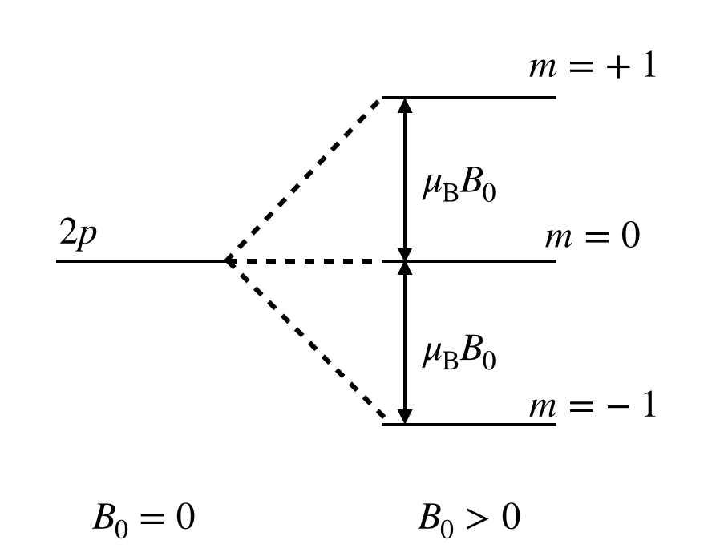
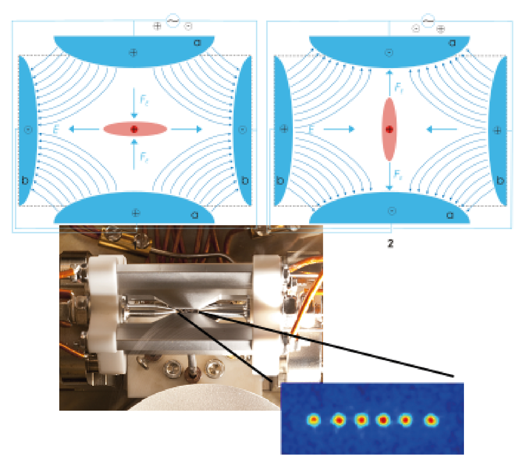

---
author:
  - Fred Jendrzejewski
  - Selim Jochim
order: 7
title: Lecture 7 - Beyond the 'boring' hydrogen atom
---

In this lecture we will use the hydrogen atom to study static
perturbations in form of external magnetic fields and relativistic
effects, leading to the fine structure splitting.

We spend quite some time on the properties of the hydrogen atom in the
previous lectures [@Jendrzejewski; @atom]. However, we completely
neglected any effects of quantum-electrodynamics and relativistic
physics. In this lecture we will study, why this is a good approximation
for the hydrogen atom and then investigate in a perturbative fashion the
terms. Most importantly, we will introduce that coupling between the
orbital angular momentum and the spin of the electron, which leads to
the fine splitting.

## Perturbation theory

Up to now have studied the hydrogen atom to find its eigensystem and
then studied how it evolves under the presence of oscillating electric
fields. This allowed us to understand in more detail the idea of
eigenstates and then of time-dependent perturbation theory. However, one
of the most important concepts that can be introduced very nicely on the
hydrogen atom is stationnary perturbation theory in form of external
magnetic fields or relativistic corrections. We will remind you of
perturbation theory here and then apply it to some simple cases.

We can now simply write down the problem as:

$$
\left(\hat{H}_0+\lambda \hat{W}\right)\left|\psi_m\right\rangle = E_m\left|\psi_m\right\rangle
$$

$\lambda$ is a very small parameter and $\hat{H}_0$ is
describing the hydrogen atom system. We will note the eigenvalues and
eigenstates of this system as:

$$

\hat{H}_0\left|\varphi_n\right\rangle = \epsilon_n \left|\varphi_n\right\rangle
$$

While, we do not know the exact solution of
$\left|\psi_m\right\rangle$ and the energy $E_m$, we decide
to decompose them in the following expansion of the small parameter
$\lambda$:

$$
\left|\psi_m\right\rangle = \left|\psi_m^{(0)}\right\rangle + \lambda\left|\psi_m^{(1)}\right\rangle+\lambda^2\left|\psi_m^{(2)}\right\rangle+O(\lambda^3)\\
E_m = E_m^{(0)} +\lambda E_m^{(1)} + \lambda^2 E_m^{(2)}+O(\lambda^3)\,
$$

To zeroth order in $\lambda$ we obtain:

$$
\hat{H}_0\left|\psi_m^{(0)}\right\rangle = E_m^{(0)}\left|\psi_m^{(0)}\right\rangle
$$

So it is just the unperturbed system and we can
identify:

$$
\left|\psi_m^{(0)}\right\rangle = \left|\varphi_m\right\rangle~~E_m^{(0)} = \epsilon_m
$$

For the first order we have to solve

$$

(\hat{H}_0-E_m^{(0)}) \left|\psi_m^{(1)}\right\rangle + (\hat{W}-E_m^{(1)})\left|\psi_m^{(0)}\right\rangle= 0\\
(\hat{H}_0-\epsilon_m) \left|\psi_m^{(1)}\right\rangle + (\hat{W}-E_m^{(1)})\left|\varphi_m\right\rangle= 0
$$

We can multiply the whole equation by
$\left\langle\varphi_m\right|$ from the right. As
$\left\langle\varphi_m\right|\hat{H}_0= \epsilon_m\left\langle\varphi_m\right|$,
the first term cancels out. Hence, we obtain:

$$

\boxed{E_m^{(1)} = \left\langle\varphi_m\right|\hat{W}\left|\varphi_m\right\rangle}
$$

We now also need to obtain the correction to the
eigenstate. For that, we put the solution for the energy into the Ansatz to obain:

$$
(\hat{H}_0-\epsilon_m) \left|\psi_m^{(1)}\right\rangle + (\hat{W}\left|\varphi_m\right\rangle-\left|\varphi_m\right\rangle\left\langle\varphi_m\right|\hat{W}\left|\varphi_m\right\rangle)= 0
$$

We can now multiply the whole equation by
$\left\langle\varphi_i\right|$ from the right and obtain:

$$
(\epsilon_i-\epsilon_m)\left\langle\varphi_i\right|\left|\psi_m^{(1)}\right\rangle+\left\langle\varphi_i\right|\hat{W}\left|\varphi_m\right\rangle = 0
$$

By rewriting the above equation, this directly gives us
the decompositon of the $\left|\psi_m^{(1)}\right\rangle$
onto the original eigenstates and have:

$$

\boxed{\left|\psi_m^{(1)}\right\rangle = \sum_{i\neq m} \frac{\left\langle\varphi_i\right|\hat{W}\left|\varphi_m\right\rangle}{(\epsilon_m-\epsilon_i)}\left|\varphi_i\right\rangle}
$$

And we end the calculation with second order pertubation
in $\lambda$

$$
(\hat{H}_0-E_m^{(0)}) \left|\psi_m^{(2)}\right\rangle + (\hat{W}-E_m^{(1)})\left|\psi_m^{(1)}\right\rangle-E_m^{(2)} \left|\psi_m^{(0)}\right\rangle= 0\\
(\hat{H}_0-\epsilon_m) \left|\psi_m^{(2)}\right\rangle + (\hat{W}-E_m^{(1)})\left|\psi_m^{(1)}\right\rangle-E_m^{(2)} \left|\varphi_m\right\rangle= 0\\
$$

We can multiply once again whole equation by
$\left\langle\varphi_m\right|$ from the right, which
directly drops the first term. The term
$E_m^{(1)}\left\langle\varphi_m\right|\left|\psi_m^{(1)}\right\rangle$
drops out as the first order perturbation does not contain a projection
onto the initial state. So we can write:

$$
E_m^{(2)}= \left\langle\varphi_m\right|\hat{W}\left|\psi_m^{(1)}\right\rangle
$$

Plugging in our solution, we obtain:

$$
\boxed{E_m^{(2)} = \sum_{i\neq m} \frac{|\left\langle\varphi_i\right|\hat{W}\left|\varphi_m\right\rangle|^2}{(\epsilon_m-\epsilon_i)}}
$$

## Static external magnetic fields

A first beautiful application of perturbation theory is the study of
static magnetic fields (see Ch 1.9 and Ch. 2.7.1 of [@Hertel_2015] for
more details). The motion of the electron around the nucleus implies a
magnetic current

$$
I = \frac{e}{t} = \frac{ev}{2\pi r}
$$

and this implies a magnetic moment $M = I A$, with the
enclosed surface $A=\pi r^2$. It may be rewritten as:

$$
\vec{M}_L = -\frac{e}{2m_e}\vec{L} =-\frac{\mu_B}{\hbar} \vec{L} \\
\mu_B = \frac{\hbar e}{2m_e}
$$

where $\mu_B$ is the **Bohr magneton**. Its potential
energy in a magnetic field $\vec{B} = B_0 \vec{e}_z$ is then:

$$
V_B = -\vec{M}_L\cdot \vec{B}\\
= \frac{\mu_B}{\hbar} L_z B_0
$$

Its contribution is directly evaluated from the expression on first oder pertubation theory to be:

$$
E_{Zeeman} = \mu_B m B_0
$$

This is the Zeeman splitting of the different magnetic
substates. It is visualized below

The Zeeman effect in the hydrogen atom.

## Trapping with electric or magnetic fields

We have now investigated the structure of the hydrogen atom and seen how
its energy gets shifted in external magnetic fields. We can combine this
understanding to study conservative traps for atoms and ions. Neutral
atoms experience the external field:

$$
E_{mag}(x,y) = \mu_B m B_0(x,y)
$$

For ions on the other hand we have fully charged
particles. So they simply experience the external electric field
directly:

$$
E_{el}(x,y) = -q E(x,y)
$$

Trapping atoms and ions has to be done under very good vacuum such that
they are well isolate from the enviromnent and high precision
experiments can be performed.

However, the trap construction is not trivial given Maxwells equation
$\text{div} \vec{E} = 0$ and $\text{div} \vec{B} = 0$. So, the
experimentalists have to play some tricks with oscillating fields. We
will not derive in detail how a resulting **Paul trap** works, but the
[linked video](https://youtu.be/Xb-zpM0UOzk) gives a very nice
impression of the idea behind it. A sketch is presented in Fig.

The upper stage shows the phases of The two phases of the oscillating
electric field of a Paul trap. Taken
from [wikipedia](https://en.wikipedia.org/wiki/Quadrupole_ion_trap).
Below we can see a linear ion (Paul) trap containing six calcium 40
ions. Taken
from [here](https://quantumoptics.at/en/research/lintrap.html).

This work on trapping ions dates back to the middle of the last century
(!!!) and was recognized by the[ Nobel prize in
1989](https://www.nobelprize.org/prizes/physics/1989/summary/) for
[Wolfgang Paul](http://dx.doi.org/10.1103/revmodphys.62.531) and[Hans Dehmelt](http://dx.doi.org/10.1103/revmodphys.62.525). They shared
the prize with Norman Ramsey, who developped extremely precise
spectroscopic methods, now known [as Ramsey spectroscopy](http://dx.doi.org/10.1103/revmodphys.62.541).

For atoms we can play similiar games with magnetic traps. Again we have
to solve the problem of the zero magnetic fields. Widely used
configurations are the Ioffe-Pritchard trap, where quadrupole fields are
superposed [with a bias field](http://dx.doi.org/10.1103/physrevlett.51.1336), or [TOP-traps](http://dx.doi.org/10.1103/physrevlett.74.3352).

Ion traps are now the basis of ionic quantum computers and
magnetic traps paved the way for quantum simulators with cold atoms as will see later on.

### What we missed from the Dirac equation

Until now we have completely neglected relativistic effects, i.e. we
should have really solved the Dirac equation instead of the Schrödinger
equation. However, this is is major task, which we will not undertake
here. But what were the main approximations ?

1.  We neglected the existance of the electron spin.

2.  We did not take into account the relativistic effects.

So, how does relativity affect the hydrogen spectrum? In a first step,
we should actually introduce the magnetic moment of the spin:

$$
\vec{M}_S = -g_e \mu_B \frac{\vec{S}}{\hbar}
$$

The spin of the electron is $1/2$, making it a fermion
and the _g factor of the electron_ reads

$$
g_e \approx 2.0023
$$

Further discussions of the g-factor might be found in
[Chapter 6.6 of Hertel](http://dx.doi.org/10.1007/978-3-642-54322-7).

#### Amplitude of the relativistic effects

We saw in the previous lectures, that the
energy levels of hydrogenlike atoms are given by:

$$

E_n = \frac{Z^2 R_{y,\infty}}{n^2}\\
R_{y,\infty} = \frac{m_e e^4}{32 \pi^2 \epsilon_0^2 \hbar^2}
$$

We can now use the fine-structure constant, which
measures the coupling strength of the electric charges to the
electromagnetic field:

$$

\alpha = \frac{e^2}{4\pi\epsilon_0\hbar c}\\
= \frac{1}{137.035999139(31)}
$$

We can now rewrite the energies of the hydrogen atom as:

$$
E_n = \frac{1}{2} \underbrace{m_e c^2}_{\text{rest mass energy}} Z^2 \alpha^2 \frac{1}{n^2}
$$

Here, $m_e c^2\approx 511\textrm{k eV}$ is the rest
mass energy of the electron. $E_n \approx 10\text{eV}$ on the other hand
is the energy of the bound state and therefore in the order of the
kinetic energy of the electron. As long as it is much smaller than the
rest-mass of the electron, we can neglect the relativistic effects. A
few observations:

- Relativistic effects are most pronounced for deeply bound states of
  small quantum number $n$.

- Relativistic effects effects will become important once
  $(Z\alpha)\approx 1$, so they will play a major role in heavy
  nuclei.

For the hydrogen atom we can thus treat the relativistic effects in a
perturbative approach.But the most important consequence of the
relativistic terms is actually the existance of the electron spin.

### The relativistic mass and Darwin term

1.  "Relativistic mass": The relativistic relation between energy and
    momentum reads:

$$
    E_\text{rel} = \sqrt{(mc^2)^2+(\vec{p}c)^2}\\
    \approx mc^2 + \frac{p^2}{2m}- \frac{\vec{p}^{\,4}}{8m^3c^2} + \cdots
$$

The first two terms of the expansion are the
nonrelativistic limit and the third term is the first correction.
Therefore, the corresponding Hamiltonian is:

$$
    \hat{H}_\text{rm} = - \frac{\hat{\vec{p}}^{\,4}}{8m^3c^2}.
$$

2.  Darwin term: If $r=0$, the potential $V(r)$ diverges to $-\infty$.
    We get:

$$
    \hat{H}_\text{Darwin} = \frac{\pi \hbar^2}{2m^2c^2}\left( \frac{Ze^2}{4\pi\epsilon_0}\right) \delta(\hat{\vec{r}})
$$

If we perform a first correction to the energy of the eigenstates
$\left\langle n,l,m\right\rangle$ by calculating

$$
\left\langle n,l,m|\hat{H'|n,l,m}\right\rangle,
$$

we find that it works perfectly for case (1) and (2)
which is due to degeneracy. $\hat{H}_\text{rm}$ and
$\hat{H}_\text{Darwin}$ commute with all observables forming the
complete set of commuting observables (CSCO) for $\hat{H}_0$

$$
\hat{H}_0,\hat{\vec{L}}^2, \hat{L}_z,
$$

with states described by $\left|n,l,m\right\rangle$.
